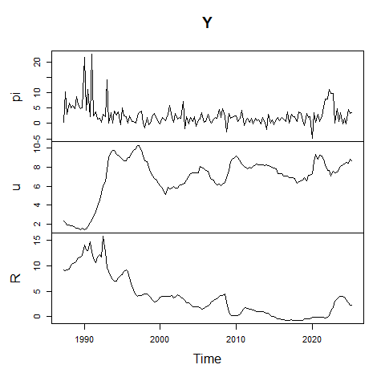
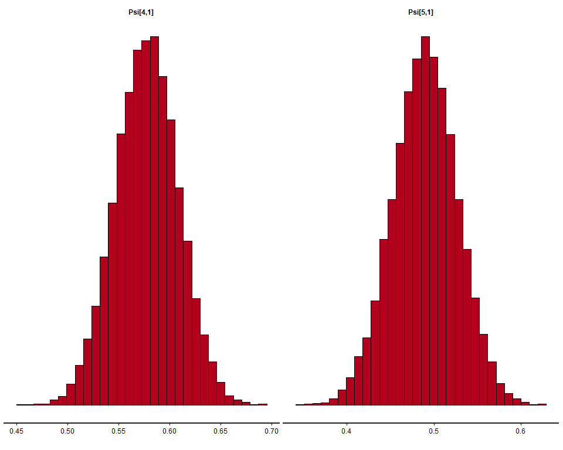
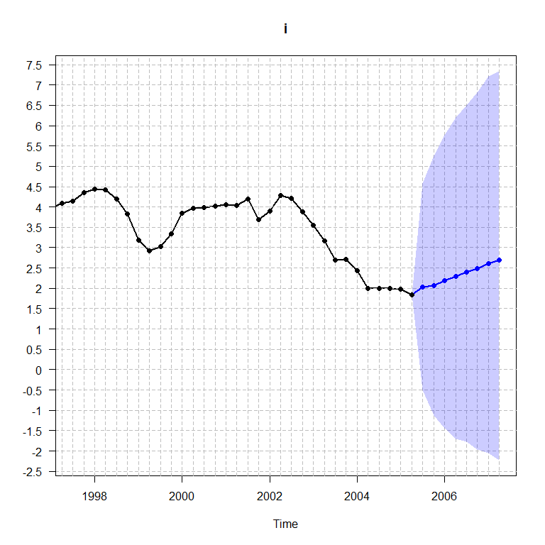
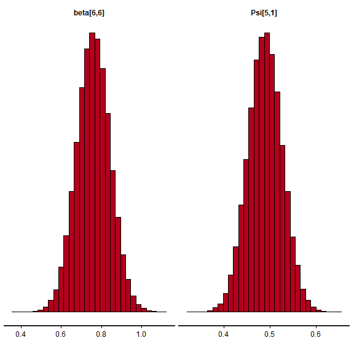
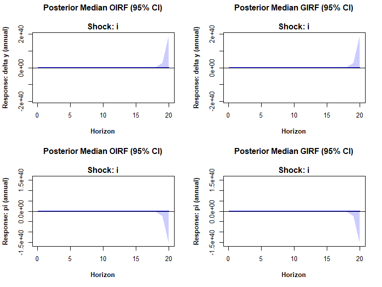
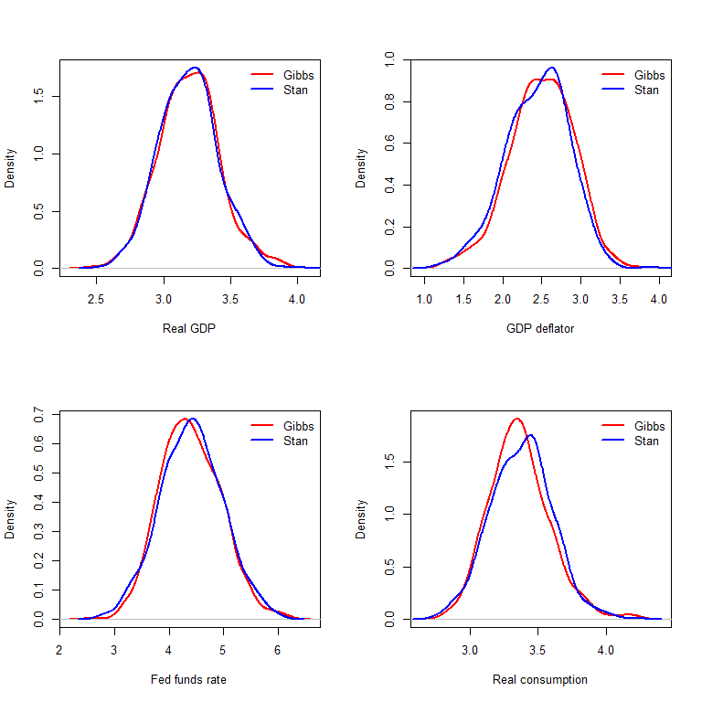
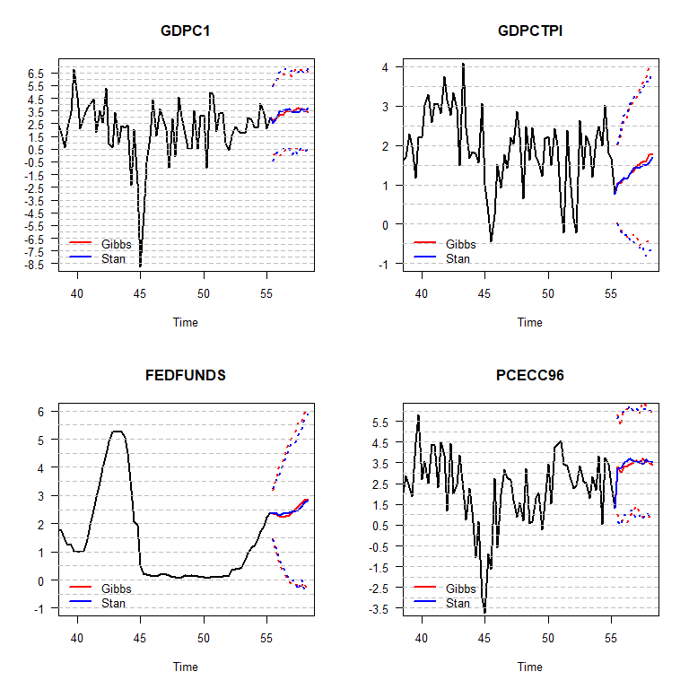

- [SteadyStateBVAR](#steadystatebvar)
  - [Installation](#installation)
  - [Introduction](#introduction)
  - [Example 1 (Villani, 2009)](#example-1-villani-2009)
  - [Example 2 (Gustafsson and Villani,
    2025)](#example-2-gustafsson-and-villani-2025)
  - [References](#references)

<!-- README.md is generated from README.Rmd. Please edit that file -->

# SteadyStateBVAR

<!-- badges: start -->
<!-- badges: end -->

With this package the user can estimate the Steady-State BVAR(p) model
by Mattias Villani.

## Installation

You can install the development version of SteadyStateBVAR with:

``` r
remotes::install_github("markjwbecker/SteadyStateBVAR", force = TRUE, upgrade = "never")
```

## Introduction

The Steady State BVAR($p$) model (Villani, 2009) is

$$
y_t = \Psi x_t + A_1(y_{t-1}-\Psi x_{t-1})+\dots+A_p(y_{t-p}-\Psi x_{t-p})+u_t
$$

where $y_t$ is a $k$-dimensional vector of (endogenous) time series at
time $t$, and $x_t$ is a $q$-dimensional vector of
deterministic/exogenous variables at time $t$, and
$u_t \sim N_k(0,\Sigma_u)$ with independence between time periods. Also,
$A_\ell$ for $\ell=1,\dots,p$ is $(k \times k)$, and $\Psi$ is
$(k \times q)$. Note here that

$$
E(y_t)=\mu_t=\Psi x_t
$$

is the **steady state**. Note that the current version of this package
only allows for $x_t$ to either just contain a constant, or a constant
and a dummy variable. We can stack the $A$ matrices in the
$(kp \times k)$ matrix $\beta$

$$
\beta=
\begin{bmatrix}
A'_1 \\ 
\vdots  \\
A'_p
\end{bmatrix}
$$

We can then rewrite the model as a nonlinear regression (Karlsson, 2013)

$$
y_t' =x_t'\Psi' + \left[w_t'-q_t'(I_p \otimes \Psi') \right]\beta +u_t'
$$

where $w_t'=(y_{t-1}',\dots,y_{t-p}')$ is a $kp$-dimensional vector of
lagged endogenous variables, and $q_t'=(x_{t-1}',\dots,x_{t-p}')$ is a
$qp$-dimensional vector of lagged exogenous (deterministic) variables,
$I_p$ is the $(p \times p)$ identity matrix and $\otimes$ denotes the
Kronecker product. This is how the likelihood is written in the Stan
code. The goal is to estimate $\beta, \Psi$ and $\Sigma_u$, therefore
priors are needed. Starting with $\beta$, we use the Minnesota prior
where

$$
\textrm{vec}(\beta) \sim N_{kpk}\left[\theta_\beta,\Omega_\beta\right]
$$

First for $\theta_\beta$, the Minnesota prior sets all prior means for
the elements in $\beta$ to $0$, except for the elements that relate to
the first own lags of the variables, which are often set to $0.9$ or $1$
for level variables or also to $0$ for growth rate variables. Further,
$\Omega_\beta$ is a diagonal matrix containing the prior variances for
the elements in $\beta$. The prior is constructed such that for the
autoregressive coefficient $A_{\ell}^{(i,j)}$ which is element
$\left(i,j\right)$ of $A_{\ell}$ for $\ell=1,\dots,p,$ the prior
variance is given by

$$
\textrm{Var}\left(A_{\ell}^{(i,j)}\right)=
\begin{cases}
\left(\frac{\lambda_1}{\ell^{\lambda_3}}\right)^2 & \text{if } i = j \\
\left(\frac{\lambda_1 \lambda_2}{\ell^{\lambda_3}}\right)^2 \frac{\sigma_i^2}{\sigma_j^2}& \text{if } i \neq j
\end{cases}
$$

Here $\lambda_1$, $\lambda_2$ and $\lambda_3$ are scalar hyperparameters
known as the overall tightness, the cross-equation tightness and the lag
decay rate. Furthermore, $\sigma_i^2$ is the $(i,i)$:th element of
$\Sigma_u$, which we do not know, and therefore replace with an
estimate. In this package, it is replaced by the least squares residual
variance from a univariate autoregression for variable $i$ with $p$ lags
(including the constant and dummy variable if applicable). Moving on to
$\Psi$ the prior we use is

$$
\textrm{vec}(\Psi) \sim N_{kq}\left[\theta_\Psi,\Omega_\Psi\right]
$$

This is really the core of the Steady State BVAR model. In $\theta_\Psi$
we specify our prior beliefs of the location of the steady state, and in
$\Omega_\Psi$, which we assume to be a diagonal matrix, we specify our
degree of certainty in those prior beliefs. At last, the prior for
$\Sigma_u$ is

$$
\Sigma_u \sim IW(V_0,m_0)
$$

Here $V_0$ is the scale matrix and $m_0\geq k+2$ are the degrees of
freedom. We will specify an uninformative prior by setting
$V_0=(m_0-k-1)\hat{\Sigma}_u$ where $\hat{\Sigma}_u$ is the least
squares estimate from the VAR($p$) (including the constant and dummy
variable if applicable), and $m_0=k+2$. However if the user wants, the
usual noninformative Jeffreys prior

$$
p(\Sigma_u) \propto\left|\Sigma_u \right|^{-(k+1)/2}
$$

can be used instead for $\Sigma_u$.

## Example 1 (Villani, 2009)

We will now replicate the model in the empirical analysis in Section 4.1
in Villani (2009). First let us load the library and also load the data

``` r
library(SteadyStateBVAR)
data("villani2009")
yt <- villani2009
```

The data set contains quarterly data for Sweden over the time period
1980Q1–2005Q4. The seven variables are: trade-weighted measures of
foreign GDP growth $(\Delta y_f)$, CPI inflation $(\pi_f)$ and the
3-month interest rate $(i_f)$, the corresponding domestic variables
($\Delta y$, $\pi$ and $i$), and the level of the real exchange rate
defined as $q=s+p_f-p$, where $p_f$ and $p$ are the foreign and domestic
CPI levels (in logs) and $s$ is the (log of the) trade weighted nominal
exchange rate. As such we have

$$
y_t=
\begin{pmatrix}
\Delta y_f \\
\pi_f \\
i_f \\
\Delta y \\
\pi \\
i \\
q
\end{pmatrix}
$$

Also, we will leave out the last two observations, so the user can
compare the forecasts produced here to the last forecasts seen in Figure
1-3 in Villani (2009), to verify that this implementation works
correctly.

``` r
yt <- ts(yt[1:102, ], start = start(yt), frequency = frequency(yt))
plot.ts(yt)
```



Also, let us create the bvar object which we will use throughout here.

``` r
bvar_obj <- bvar(data = yt)
```

To model the Swedish financial crisis at the beginning of the 90s and
the subsequent shift in monetary policy to inflation targeting and
flexible exchange rate, $x_t$ (deterministic variables at time $t$)
includes a constant term and a dummy for the pre-crisis period, i.e.

$$
x_{t}' =
\begin{cases}
\begin{pmatrix}1 & 1\end{pmatrix} & \text{if } t \le 1992Q4 \\
\begin{pmatrix}1 & 0\end{pmatrix} & \text{if } t > 1992Q4
\end{cases}
$$

``` r
bp = 52 #breakpoint at 1992Q4
dum_var <- c(rep(1,bp), rep(0,nrow(yt)-bp)) #1 if t<=1992Q4, 0 if t>1992Q4
```

To formulate a prior on $\Psi$, note that the specification of $x_t$
implies the following parametrization of the steady state:

$$
\mu_t =
\begin{cases}
\psi_1 + \psi_2 & \text{if } t \le 1992Q4 \\
\psi_1 & \text{if } t > 1992Q4
\end{cases}
$$

where $\psi_i$ is the $i$:th column of $\Psi$. Now to setup the model.
Although it is not mentioned which lag length is used in Villani (2009)
we assume it is $p=4$.

``` r
bvar_obj <- setup(bvar_obj,
                  p=4,
                  deterministic = "constant_and_dummy",
                  dummy = dum_var)
```

Now let us specify the priors. We first consider $\beta$. We choose the
same values for the hyperparameters as in Villani (2009), i.e. overall
tightness $\lambda_1=0.2$, cross equation tightness $\lambda_2=0.5$ and
lag decay rate $\lambda_3=1$. We then specify the prior means for the
first own lags of the variables. For variables in growth rates, we set
the prior mean to $0$, for variables in levels, we set the prior mean to
0.9.

``` r
lambda_1 <- 0.2
lambda_2 <- 0.5
lambda_3 <- 1.0

fol_pm=c(0,   #delta y_f
         0,   #pi_f
         0.9, #i_f
         0,   #delta y
         0,   #pi
         0.9, #i
         0.9  #q
         )
```

Now moving on to $\Psi$ for the steady state priors, we set them
according to the 95% prior probability intervals in Table I in Villani
(2009). We first note that for our data here, the growth rate variables
($\Delta y_f, \pi_f, \Delta y, \pi$) are specified in terms of quarterly
rates of change, i.e. for a variable $z$, the quarterly growth rate is
$100 \left(\ln z_t - \ln z_{t-1}\right)$. The 95% prior probability
intervals in Table I are specified in terms of annualized quarterly
growth rates $400 \left(\ln z_t - \ln z_{t-1}\right)$.

So we need to specify the prior probability intervals for the steady
states which correspond to the intervals on the annualized scale. As an
example, for domestic inflation ($\pi$) the 95% prior probability
interval (normal distribution) is $(1.7, 2.3)$.

The ‘ppi()’ function is useful here. Simply input the desired 95% prior
probability interval on the annualized scale with
‘annualize_growthrate=TRUE’ and we get the corresponding prior mean and
variance in terms of quarterly rate of change. Of course we could also
just annualize our data before, and set ‘annualized_growthrate=’FALSE’.
Below I try to illustrate how the function works

``` r
(interval_pi_annualized <- ppi(1.7, 2.3,
                               annualized_growthrate=TRUE,
                               alpha=0.05)) #95% prior probability interval
#> $mean
#> [1] 0.5
#> 
#> $var
#> [1] 0.001464287

prior_mean <- interval_pi_annualized$mean
prior_var  <- interval_pi_annualized$var

#Lets do a sanity check

lower_mean_upper <- c(
  lower = qnorm(0.025, prior_mean, sd = sqrt(prior_var)),
  mean  = prior_mean,
  upper = qnorm(0.975, prior_mean, sd = sqrt(prior_var)))


cat("Prior probability interval (95%):\n",lower_mean_upper)
#> Prior probability interval (95%):
#>  0.425 0.5 0.575
cat("\nAnnualized prior probability interval (95%):\n", 4 * lower_mean_upper)
#> 
#> Annualized prior probability interval (95%):
#>  1.7 2 2.3
```

So now we do this for all steady state coefficients. Again, see Table I
in Villani (2009).

``` r
#psi_1 = Psi col 1
#psi_2 = Psi col 2

theta_Psi <- 
  c(
  ppi(2, 3,      annualized_growthrate=TRUE)$mean,   #psi_1: delta y_f
  ppi(1.5, 2.5,  annualized_growthrate=TRUE)$mean,   #psi_1: pi_f
  ppi(4.5, 5.5,  annualized_growthrate=FALSE)$mean,  #psi_1: i_f
  ppi(2, 2.5,    annualized_growthrate=TRUE)$mean,   #psi_1: y
  ppi(1.7, 2.3,  annualized_growthrate=TRUE)$mean,   #psi_1: pi
  ppi(4, 4.5,    annualized_growthrate=FALSE)$mean,  #psi_1: i
  ppi(3.85, 4,   annualized_growthrate=FALSE)$mean,  #psi_1: q
  ppi(-1, 1,     annualized_growthrate=TRUE)$mean,   #psi_2: delta y_f
  ppi(1.5, 2.5,  annualized_growthrate=TRUE)$mean,   #psi_2: pi_f
  ppi(1.5, 2.5,  annualized_growthrate=FALSE)$mean,  #psi_2: i_f
  ppi(-1, 1,     annualized_growthrate=TRUE)$mean,   #psi_2: y
  ppi(4.3, 5.7,  annualized_growthrate=TRUE)$mean,   #psi_2: pi
  ppi(3, 5.5,    annualized_growthrate=FALSE)$mean,  #psi_2: i
  ppi(-0.5, 0.5, annualized_growthrate=FALSE)$mean   #psi_2: q
  )

Omega_Psi <- 
  diag(
  c(
  ppi(2, 3,      annualized_growthrate=TRUE)$var,   #psi_1: delta y_f
  ppi(1.5, 2.5,  annualized_growthrate=TRUE)$var,   #psi_1: pi_f
  ppi(4.5, 5.5,  annualized_growthrate=FALSE)$var,  #psi_1: i_f
  ppi(2, 2.5,    annualized_growthrate=TRUE)$var,   #psi_1: y
  ppi(1.7, 2.3,  annualized_growthrate=TRUE)$var,   #psi_1: pi
  ppi(4, 4.5,    annualized_growthrate=FALSE)$var,  #psi_1: i
  ppi(3.85, 4,   annualized_growthrate=FALSE)$var,  #psi_1: q
  ppi(-1, 1,     annualized_growthrate=TRUE)$var,   #psi_2: delta y_f
  ppi(1.5, 2.5,  annualized_growthrate=TRUE)$var,   #psi_2: pi_f
  ppi(1.5, 2.5,  annualized_growthrate=FALSE)$var,  #psi_2: i_f
  ppi(-1, 1,     annualized_growthrate=TRUE)$var,   #psi_2: y
  ppi(4.3, 5.7,  annualized_growthrate=TRUE)$var,   #psi_2: pi
  ppi(3, 5.5,    annualized_growthrate=FALSE)$var,  #psi_2: i
  ppi(-0.5, 0.5, annualized_growthrate=FALSE)$var   #psi_2: q
  )
  )
```

Finally for $\Sigma_u$ we will use the noninformative Jeffreys prior
$\left|\Sigma_u \right|^{-(k+1)/2}$, as done in Villani (2009). We just
input everything to the priors function. Note here that the function
automatically creates $\theta_\beta$ and $\Omega_\beta$.

``` r
bvar_obj <- priors(bvar_obj,
                   lambda_1,
                   lambda_2,
                   lambda_3,
                   fol_pm,
                   theta_Psi, 
                   Omega_Psi,
                   Jeffrey=TRUE)
```

Like in Villani (2009), to incorporate that Sweden is a small economy
and therefore not likely to affect the foreign economy, we restrict the
upper right submatrix in each $A_\ell$ for $\ell =1,\dots,k$ or
equivalently restricting the bottom left $A_\ell'$ for
$\ell =1,\dots,k$, to the zero matrix.

``` r
p <- bvar_obj$setup$p
k <- bvar_obj$setup$k
k1 <- 3 #first 3 variables are foreign in yt
k2 <- 4 #the other 4 are domestic

restriction_matrix <- matrix(1, k*p, k)

for(i in 1:p){
  rows <- ((i-1)*k + k1 + 1) : (i*k)
  cols <- 1:k1
  restriction_matrix[rows, cols] <- 0
}
restriction_matrix
#>       [,1] [,2] [,3] [,4] [,5] [,6] [,7]
#>  [1,]    1    1    1    1    1    1    1
#>  [2,]    1    1    1    1    1    1    1
#>  [3,]    1    1    1    1    1    1    1
#>  [4,]    0    0    0    1    1    1    1
#>  [5,]    0    0    0    1    1    1    1
#>  [6,]    0    0    0    1    1    1    1
#>  [7,]    0    0    0    1    1    1    1
#>  [8,]    1    1    1    1    1    1    1
#>  [9,]    1    1    1    1    1    1    1
#> [10,]    1    1    1    1    1    1    1
#> [11,]    0    0    0    1    1    1    1
#> [12,]    0    0    0    1    1    1    1
#> [13,]    0    0    0    1    1    1    1
#> [14,]    0    0    0    1    1    1    1
#> [15,]    1    1    1    1    1    1    1
#> [16,]    1    1    1    1    1    1    1
#> [17,]    1    1    1    1    1    1    1
#> [18,]    0    0    0    1    1    1    1
#> [19,]    0    0    0    1    1    1    1
#> [20,]    0    0    0    1    1    1    1
#> [21,]    0    0    0    1    1    1    1
#> [22,]    1    1    1    1    1    1    1
#> [23,]    1    1    1    1    1    1    1
#> [24,]    1    1    1    1    1    1    1
#> [25,]    0    0    0    1    1    1    1
#> [26,]    0    0    0    1    1    1    1
#> [27,]    0    0    0    1    1    1    1
#> [28,]    0    0    0    1    1    1    1
```

We can look at the restriction matrix for $\beta$ to see which elements
we restrict to zero. Since the priors means for these elements are zero,
we do the restriction by setting the relevant prior variances in
$\Omega_\beta$ to be very small, in this case $0.00001$.

``` r
zero_indices <- which(c(restriction_matrix) == 0)
diag(bvar_obj$priors$Omega_beta[zero_indices, zero_indices]) <- 0.00001
```

Now we supply our forecast horizon $H$, and also the deterministic
variables for the future periods and then we fit the model.

``` r
bvar_obj$H <- 8
bvar_obj$X_pred <- cbind(rep(1, bvar_obj$H), 0)

bvar_obj <- fit_stan(bvar_obj,
                     iter=10000,
                     warmup=5000,
                     chains=4)
```

Let us look at the posterior mean of $\beta$, $\Psi$ and $\Sigma_u$

``` r
summary_bvar(bvar_obj, estimation = "stan")
#> $beta_posterior_mean
#>        
#>          [,1]  [,2]  [,3]  [,4]  [,5]  [,6]  [,7]
#>    [1,]  0.18  0.03 -0.01  0.12  0.07 -0.12  0.00
#>    [2,] -0.02  0.31  0.25  0.12 -0.07  0.00  0.00
#>    [3,] -0.01  0.04  0.92 -0.04  0.06  0.05  0.00
#>    [4,]  0.00  0.00  0.00  0.23 -0.09 -0.10  0.00
#>    [5,]  0.00  0.00  0.00  0.00  0.08  0.06  0.00
#>    [6,]  0.00  0.00  0.00  0.00  0.02  0.76  0.00
#>    [7,]  0.00  0.00  0.00  1.21  3.96  0.76  0.93
#>    [8,]  0.03 -0.01  0.09  0.02 -0.02  0.09  0.00
#>    [9,]  0.01  0.02  0.04  0.00 -0.03 -0.15  0.00
#>   [10,] -0.02 -0.01 -0.01  0.00  0.04  0.07  0.00
#>   [11,]  0.00  0.00  0.00  0.11 -0.01  0.15  0.00
#>   [12,]  0.00  0.00  0.00  0.01 -0.05 -0.05  0.00
#>   [13,]  0.00  0.00  0.00 -0.01  0.01  0.04  0.00
#>   [14,]  0.00  0.00  0.00  0.56 -0.38  0.29 -0.04
#>   [15,]  0.01 -0.01  0.00  0.02 -0.01  0.00  0.00
#>   [16,] -0.02  0.06 -0.01  0.00  0.08  0.02  0.00
#>   [17,]  0.00  0.00  0.02  0.00  0.00  0.03  0.00
#>   [18,]  0.00  0.00  0.00  0.06  0.01 -0.02  0.00
#>   [19,]  0.00  0.00  0.00  0.00  0.02 -0.02  0.00
#>   [20,]  0.00  0.00  0.00  0.01  0.00  0.00  0.00
#>   [21,]  0.00  0.00  0.00 -0.14 -0.02 -0.59  0.00
#>   [22,]  0.03 -0.01  0.00  0.00  0.03  0.02  0.00
#>   [23,]  0.00  0.16 -0.03  0.00  0.01  0.02  0.00
#>   [24,]  0.00  0.00 -0.02  0.00  0.00  0.03  0.00
#>   [25,]  0.00  0.00  0.00 -0.08  0.01  0.03  0.00
#>   [26,]  0.00  0.00  0.00  0.00  0.06 -0.01  0.00
#>   [27,]  0.00  0.00  0.00  0.00 -0.01  0.00  0.00
#>   [28,]  0.00  0.00  0.00 -0.15 -0.07 -0.16 -0.01
#> 
#> $Psi_posterior_mean
#>       
#>        [,1]  [,2]
#>   [1,] 0.58  0.08
#>   [2,] 0.51  0.46
#>   [3,] 4.94  2.02
#>   [4,] 0.58 -0.03
#>   [5,] 0.49  1.14
#>   [6,] 4.29  4.45
#>   [7,] 3.92 -0.10
#> 
#> $Sigma_u_posterior_mean
#>       
#>         [,1]  [,2] [,3]  [,4]  [,5]  [,6]  [,7]
#>   [1,]  0.15 -0.01 0.01  0.07 -0.01  0.00  0.00
#>   [2,] -0.01  0.09 0.05  0.01  0.12  0.04  0.00
#>   [3,]  0.01  0.05 0.51  0.01  0.18  0.11  0.00
#>   [4,]  0.07  0.01 0.01  0.19 -0.05 -0.01  0.00
#>   [5,] -0.01  0.12 0.18 -0.05  0.59  0.11  0.00
#>   [6,]  0.00  0.04 0.11 -0.01  0.11  1.56 -0.01
#>   [7,]  0.00  0.00 0.00  0.00  0.00 -0.01  0.00
```

Lets plot the forecasts. Lets select a 95% prediction interval and the
mean of the posterior as the point forecast. For variables in quarter on
quarter growth rates, we transform the historical data and predictions
to yearly growth rates with ‘growth_rate_idx’ where we specify the index
of the growth rate variables in $y_t$.

``` r
bvar_obj <- forecast(bvar_obj,
              ci = 0.95,
              fcst_type = "mean",
              growth_rate_idx = c(1,2,4,5),
              plot_idx = c(4,5,6),
              estimation="stan")
```



We can also do some impulse response analysis. We can choose between the
orthogonalized impulse response function (OIRF) and the generalized
impulse response function (GIRF).

``` r
par(mfrow=c(2,2))
irf <- IRF(bvar_obj,
           lag=20,
           response=4,
           shock=6,
           method="OIRF",
           ci=0.68,
           estimation="stan")

irf <- IRF(bvar_obj,
           lag=20,
           response=4,
           shock=6,
           method="GIRF",
           ci=0.68,
           estimation="stan")

irf <- IRF(bvar_obj,
           lag=20,
           response=5,
           shock=6,
           method="OIRF",
           ci=0.68,
           estimation="stan")

irf <- IRF(bvar_obj,
           lag=20,
           response=5,
           shock=6,
           method="GIRF",
           ci=0.68,
           estimation="stan")
```



If desired, the user can estimate the model with a Gibbs sampler instead
and then repeat the analysis above.

``` r
# bvar_obj <- fit_gibbs(bvar_obj,
#                       iter = 10000,
#                       warmup = 5000)

# summary_bvar(bvar_obj, estimation = "gibbs")

# bvar_obj <- forecast(bvar_obj,
#               ci = 0.95,
#               fcst_type = "mean",
#               growth_rate_idx = c(1,2,4,5),
#               plot_idx = c(4,5,6),
#               estimation="gibbs")


# irf <- IRF(bvar_obj,
#            lag=20,
#            response=4,
#            shock=6,
#            method="OIRF",
#            ci=0.68,
#            estimation="gibbs")
```

It will give very similar results (as it should be). We will test if
they give similar results in the following section.

## Example 2 (Gustafsson and Villani, 2025)

Now I will estimate the same model in Section 3.3 in Gustafsson and
Villani (2025), and “replicate” Figure 10-11. But now instead of blue =
Variational inference, I will do blue = Stan (NUTS sampler), and red =
Gibbs sampling. The data used in Gustafsson and Villani (2025) is the
same as in Gustafsson, Villani and Stockhammar (2023), from which I
obtained the data.

``` r
rm(list = ls())
data("GustafssonVillaniStockhammar2023")
yt <- GustafssonVillaniStockhammar2023
plot.ts(yt)
```



Create the object

``` r
bvar_obj <- bvar(data = yt)
```

Only a constant this time, thus $q=1$. The lag order $p$ is not
specified, but looking at Gustafsson, Villani and Stockhammar (2023) we
can sort of infer that they use $p=2$.

``` r
bvar_obj <- setup(bvar_obj,
                  p=2,
                  deterministic = "constant",
                  dummy = NULL)
```

The hyperparameters are from Gustafsson, Villani and Stockhammar (2023),
and are $\lambda_1=0.27$, $\lambda_2=0.43$ and $\lambda_3=0.76$. The
prior means on the first own lag of the GDP-deflator and Fed funds rate
are set to 0.6.

``` r
lambda_1 <- 0.27
lambda_2 <- 0.43
lambda_3 <- 0.76

fol_pm=c(0,   #GDPC1
         0.6, #GDPCTPI
         0.6, #FEDFUNDS
         0,   #PCECC96
         0,   #GPDIC1
         0,   #HOANBS
         0    #AHETPIx
         )
```

For the steady state coefficients, the prior probability intervals are
mean plus/minus one standard deviation, so we set $\alpha=0.3173105$.

``` r
alpha = 2*(1-pnorm(1))
```

Note that we only have a constant now, so then $q=1$ and $\Psi$ only has
one column $\psi_1$.

``` r

theta_Psi <- c(
  ppi(2.5, 3.5, alpha)$mean,   #psi_1: GDPC1
  ppi(1.5, 2.5, alpha)$mean,   #psi_1: GDPCTPI
  ppi(4.3, 5.7, alpha)$mean,   #psi_1: FEDFUNDS
  ppi(2.3, 3.7, alpha)$mean,   #psi_1: PCECC96
  ppi(1.5, 4.5, alpha)$mean,   #psi_1: GPDIC1
  ppi(2.5, 3.5, alpha)$mean,   #psi_1: HOANBS
  ppi(1.5, 2.5, alpha)$mean    #psi_1: AHETPIx
)

Omega_Psi <- diag(
  c(
  ppi(2.5, 3.5, alpha)$var,    #psi_1: GDPC1
  ppi(1.5, 2.5, alpha)$var,    #psi_1: GDPCTPI
  ppi(4.3, 5.7, alpha)$var,    #psi_1: FEDFUNDS
  ppi(2.3, 3.7, alpha)$var,    #psi_1: PCECC96
  ppi(1.5, 4.5, alpha)$var,    #psi_1: GPDIC1
  ppi(2.5, 3.5, alpha)$var,    #psi_1: HOANBS
  ppi(1.5, 2.5, alpha)$var     #psi_1: AHETPIx
  )
)
```

Lets put everything into the ‘priors function’

``` r
bvar_obj <- priors(bvar_obj,
                   lambda_1,
                   lambda_2,
                   lambda_3,
                   fol_pm,
                   theta_Psi, 
                   Omega_Psi,
                   Jeffrey=TRUE)
```

We supply our forecast horizon and then estimate the model. We do it
both with Stan and with the Gibbs sampler.

``` r
bvar_obj$H <- 12
bvar_obj$X_pred <- matrix(rep(1, bvar_obj$H))

bvar_obj <- fit_gibbs(bvar_obj,
                     iter=50000,
                     warmup=10000)

bvar_obj <- fit_stan(bvar_obj,
                     iter=50000,
                     warmup=10000,
                     chains=4)
```

Now lets do Figure 10

``` r
Psi_draws_gibbs  <- bvar_obj$fit$gibbs$Psi_draws
Psi_draws_stan <- rstan::extract(bvar_obj$fit$stan)$Psi

par(mfrow=c(2,2))

# Real GDP
dens1 <- density(Psi_draws_gibbs[1,,])
dens2 <- density(Psi_draws_stan[,1,])
plot(dens1, xlab="Real GDP", main="", col="red", lwd=2, ylim=c(0,max(dens1$y,dens2$y)))
lines(dens2, col="blue", lwd=2)
legend("topright", legend=c("Gibbs", "Stan"), col=c("red", "blue"), lwd=2, bty="n")

# GDP deflator
dens1 <- density(Psi_draws_gibbs[2,,])
dens2 <- density(Psi_draws_stan[,2,])
plot(dens1, xlab="GDP deflator", main="", col="red", lwd=2, ylim=c(0,max(dens1$y,dens2$y)))
lines(dens2, col="blue", lwd=2)
legend("topright", legend=c("Gibbs", "Stan"), col=c("red", "blue"), lwd=2, bty="n")

# Fed funds rate
dens1 <- density(Psi_draws_gibbs[3,,])
dens2 <- density(Psi_draws_stan[,3,])
plot(dens1, xlab="Fed funds rate", main="", col="red", lwd=2, ylim=c(0,max(dens1$y,dens2$y)))
lines(dens2, col="blue", lwd=2)
legend("topright", legend=c("Gibbs", "Stan"), col=c("red", "blue"), lwd=2, bty="n")

# Real consumption
dens1 <- density(Psi_draws_gibbs[4,,])
dens2 <- density(Psi_draws_stan[,4,])
plot(dens1, xlab="Real consumption", main="", col="red", lwd=2, ylim=c(0,max(dens1$y,dens2$y)))
lines(dens2, col="blue", lwd=2)
legend("topright", legend=c("Gibbs", "Stan"), col=c("red", "blue"), lwd=2, bty="n")
```



And Figure 11

``` r
par(mfrow=c(2,2))
forecast2(bvar_obj, ci=0.6826895, fcst_type="mean", plot_idx=c(1), xlim=c(39.25,58), ylim=c(-8.5,7))
forecast2(bvar_obj, ci=0.6826895, fcst_type="mean", plot_idx=c(2), xlim=c(39.25,58), ylim=c(-1,4))
forecast2(bvar_obj, ci=0.6826895, fcst_type="mean", plot_idx=c(3), xlim=c(39.25,58), ylim=c(-1,6.5))
forecast2(bvar_obj, ci=0.6826895, fcst_type="mean", plot_idx=c(4), xlim=c(39.25,58), ylim=c(-3.5,6.5))
```



## References

Gustafsson, O., Villani, M., and Stockhammar, Pär. (2023). Bayesian
optimization of hyperparameters from noisy marginal likelihood
estimates. *Journal of Applied Econometrics*. 38(4), pp. 577–595.

Gustafsson, O., and Villani, M. (2025). Variational inference for
steady-state BVARs. \* arXiv preprint arXiv:2506.09271\*.

Karlsson, S. (2013). Forecasting with Bayesian Vector Autoregression.
In: Elliott, G. and Timmerman, A. (eds) *Handbook of Economic
Forecasting*. Elsevier B.V. Vol 2, Part B., pp. 791-897.

Villani, M. (2009). Steady-state priors for vector autoregressions.
*Journal of Applied Econometrics*. 24(4), pp. 630-650.
