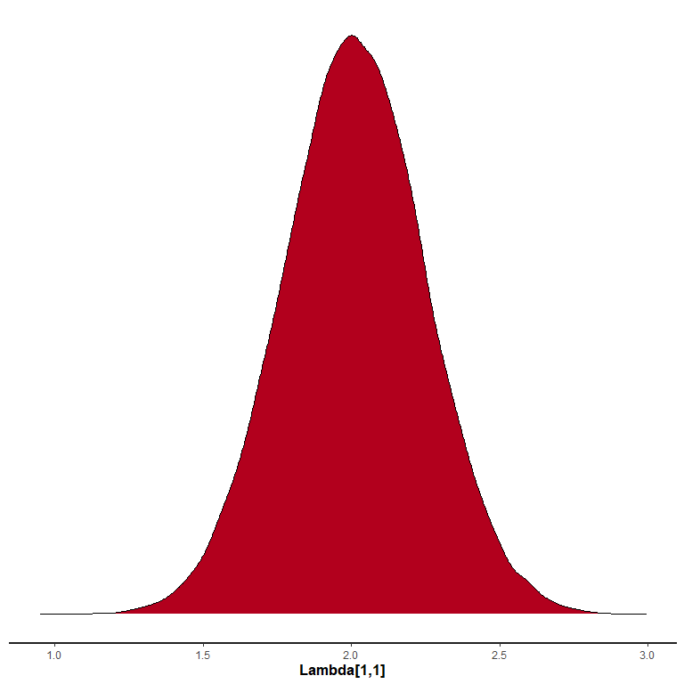
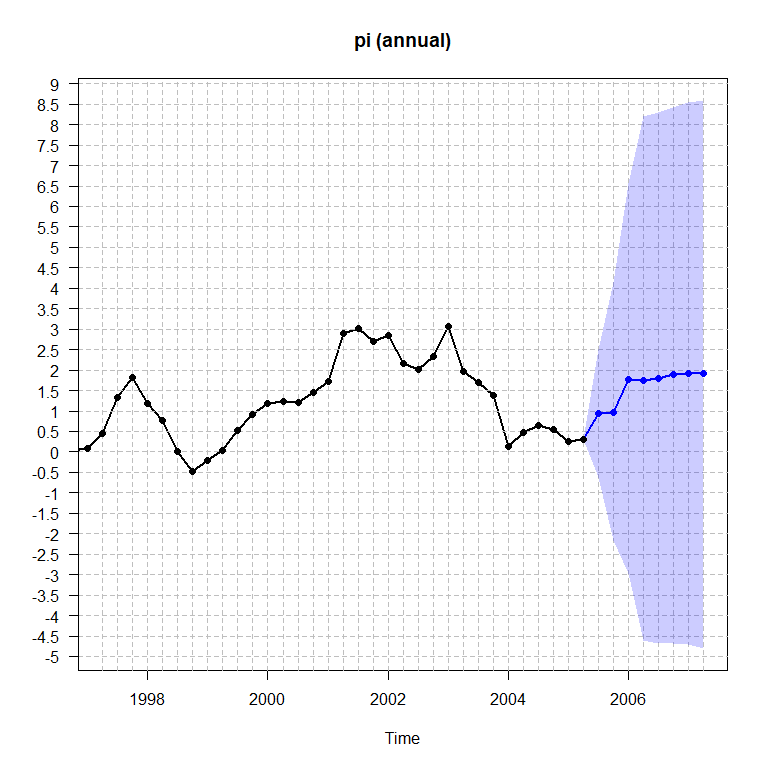

<!-- README.md is generated from README.Rmd. Please edit that file -->

# SteadyStateBVAR

<!-- badges: start -->
<!-- badges: end -->

With this package the user can estimate the Steady-State BVAR(p) model
by Mattias Villani.

## Installation

You can install the development version of SteadyStateBVAR with:

``` r
#remotes::install_github("markjwbecker/SteadyStateBVAR", force = TRUE, upgrade = "never")
```

## Introduction

The Steady State BVAR($p$) model is

$$
y_t = \Psi x_t + A_1(y_{t-1}-\Psi x_{t-1})+\dots+A_p(y_{t-p}-\Psi x_{t-p})+u_t
$$

where $y_t$ is a $k$-dimensional vector of time series at time $t$, and
$x_t$ is a $q$-dimensional vector of deterministic variables at time
$t$, and $u_t \sim N_k(0,\Sigma_u)$ with independence between time
periods. Also, $A_i$ for $i=1,\dots,p$ is $(k \times k)$, and $\Psi$ is
$(k \times q)$. Note here that

$$
E(y_t)=\mu_t=\Psi x_t
$$

is the **steady state**. We can stack the $A$’s in the $(kp \times k)$
matrix $\beta$

$$
\beta=
\begin{bmatrix}
A'_1 \\ 
\vdots  \\
A'_p
\end{bmatrix}
$$

We can then rewrite the model as a nonlinear regression

$$
y_t' =x_t'\Psi' + \left[w_t'-q_t'(I_p \otimes \Psi') \right]\beta +u_t'
$$

where $w_t'=(y_{t-1}',\dots,y_{t-p}')$ is a $kp$-dimensional vector of
lagged endogenous variables, and $q_t'=(x_{t-1}',\dots,x_{t-p}')$ is a
$qp$-dimensional vector of lagged exogenous (deterministic) variables,
$I_p$ is the $(p \times p)$ identity matrix and $\otimes$ denotes the
Kronecker product. This is how the likelihood is written in the Stan
code. The goal is to estimate $\beta, \Psi$ and $\Sigma_u$, therefore
priors are needed. Starting with $\beta$, we use the Minnesota prior
where

$$
\textrm{vec}(\beta) \sim N_{kpk}\left[\theta_\beta,\Omega_\beta\right]
$$

First for $\theta_\beta$, the Minnesota prior sets all prior means for
the elements in $\beta$ to $0$, except for the elements that relate to
the first own lags of the variables, which are often set to $0.9$ or $1$
for level variables or also to $0$ for growth rate variables. Further,
$\Omega_\beta$ is a diagonal matrix containing the prior variances for
the elements in $\beta$. The prior is constructed such that for the
autoregressive coefficient $A_{\ell}^{(i,j)}$ which is element
$\left(i,j\right)$ of $A_{\ell}$ for $\ell=1,\dots,p,$ the prior
variance is given by

$$
\textrm{Var}\left(A_{l}^{(i,j)}\right)=
\begin{cases}
\left(\frac{\lambda_1}{\ell}\right)^2 & \text{if } i = j \\
\left(\frac{\lambda_1 \lambda_2}{\ell}\right)^2 \frac{\sigma_i^2}{\sigma_j^2}& \text{if } i \neq j
\end{cases}
$$

Here $\lambda_1$ and $\lambda_2$ are scalar hyperparameters where the
former is known as the overall tightness, and the latter as the
cross-equation tightness. Furthermore, $\sigma_i^2$ is the $(i,i)$:th
element of $\Sigma_u$, which we do not know, and therefore replace with
an estimate. In this package, it is replaced by the least squares
residual variance from a univariate autoregression for variable $i$ with
$p$ lags (including the constant and dummy variable if applicable).
Moving on to $\Psi$ the prior we use is

$$
\textrm{vec}(\Psi) \sim N_{kq}\left[\theta_\Psi,\Omega_\Psi\right]
$$

This is really the core of the Steady State BVAR model. In $\theta_\Psi$
we specify our prior beliefs of the location of the steady state, and in
$\Omega_\Psi$, which we assume to be a diagonal matrix, we specify our
degree of certainty in those prior beliefs. At last, the prior for
$\Sigma_u$ is

$$
\Sigma_u \sim IW(V_0,m_0)
$$

Here $V_0$ is the scale matrix and $m_0\geq k+2$ are the degrees of
freedom. We will specify an uninformative prior by setting
$V_0=(m_0-k-1)\hat{\Sigma}_u$ where $\hat{\Sigma}_u$ is the least
squares estimate from the VAR($p$) (including any potential
deterministic regressors), and $m_0=k+2$. However if the user wants, the
usual noninformative Jeffreys prior

$$
p(\Sigma_u) \propto\left|\Sigma_u \right|^{-(k+1)/2}
$$

can be used instead for $\Sigma_u$.

## Example

We will now replicate the model in the empirical analysis in Section 4.1
in Villani (2009). First let us load the library and also load the data

``` r
#remotes::install_github("markjwbecker/SteadyStateBVAR", force = TRUE, upgrade = "never")
library(SteadyStateBVAR)
source("R/setup.R")
source("R/priors.R")
source("R/bvar.R")
source("R/estimate_gibbs.R")
source("R/fit_gibbs.R")
source("R/fit_stan.R")
source("R/plot.R")
source("R/summary.R")
data("villani2009")
```

The data set contains quarterly data for Sweden over the time period
1980Q1–2005Q4. The seven variables are: trade-weighted measures of
foreign GDP growth $(\Delta y_f)$, CPI inflation $(\pi_f)$ and the
3-month interest rate $(i_f)$, the corresponding domestic variables
($\Delta y$, $\pi$ and $i$), and the level of the real exchange rate
defined as $q=s+p_f-p$, where $p_f$ and $p$ are the foreign and domestic
CPI levels (in logs) and $s$ is the (log of the) trade weighted nominal
exchange rate. As such we have

$$
y_t=
\begin{pmatrix}
\Delta y_f \\
\pi_f \\
i_f \\
\Delta y \\
\pi \\
i \\
q
\end{pmatrix}
$$

The growth rate variables are specified in terms of quarterly rates of
change, i.e. for a variable $z$, we have
$100 \ln \left(\frac{z_t}{z_{t-1}}\right)$. To simplify the prior
selection for the steady states later, we can multiply the growth rate
series by $4$ to instead get annualized quarterly rates of change. We do
that and then we can plot the data. Also, we will leave out the last two
observations, so the user can compare the forecasts produced here to the
last forecasts seen in Figure 1-3 in Villani (2009), to verify that this
implementation works correctly.

``` r
growth_idx <- c(1, 2, 4, 5)
yt[, growth_idx] <- yt[, growth_idx] * 4
yt <- ts(yt[1:102, ], start = start(yt), frequency = frequency(yt))
plot.ts(yt)
```


``` r
bvar_obj <- bvar(data = yt)
```

To model the Swedish financial crisis at the beginning of the 90s and
the subsequent shift in monetary policy to inflation targeting and
flexible exchange rate, $x_t$ (deterministic variables at time $t$)
includes a constant term and a dummy for the pre-crisis period, i.e.

$$
x_{t}' =
\begin{cases}
\begin{pmatrix}1 & 1\end{pmatrix} & \text{if } t \le 1992Q4 \\
\begin{pmatrix}1 & 0\end{pmatrix} & \text{if } t > 1992Q4
\end{cases}
$$

``` r
bp = 52 #breakpoint at 1992Q4
dum_var <- c(rep(1,bp), rep(0,nrow(yt)-bp)) #1 if t<=1992Q4, 0 if t>1992Q4
```

To formulate a prior on $\Psi$, note that the specification of $x_t$
implies the following parametrization of the steady state:

$$
\mu_t =
\begin{cases}
\psi_1 + \psi_2 & \text{if } t \le 1992Q4 \\
\psi_1 & \text{if } t > 1992Q4
\end{cases}
$$

where $\psi_i$ is the $i$:th column of $\Psi$. Now to setup the model.
Although it is not mentioned which lag length is used in Villani (2009)
we assume it is $p=4$. Then we do some setup.

``` r
bvar_obj <- setup(bvar_obj, p=4, deterministic = "constant_and_dummy", dummy = dum_var)
```

Now let us specify the priors. First we choose overall tightness
$\lambda_1=0.2$ and cross equation tightness $\lambda_2=0.5$. We then
specify the prior means for the first own lags of the variables. For
variables in growth rates, we set the prior mean to $0$, for variables
in levels, we set the prior mean to 0.9.

``` r
fol_pm=c(0,   #delta y_f
         0,   #pi_f
         0.9, #i_f
         0,   #delta y
         0,   #pi
         0.9, #i
         0.9  #q
         )

lambda_1 <- 0.2
lambda_2 <- 0.5
```

Now for the steady state priors, we set them according to the 95% prior
probability intervals in Villani (2009). The ‘ppi()’ function is useful
here, simply input the 95% prior probability interval and then the
function outputs the prior mean and variance.

``` r
theta_Psi <- c(
  ppi(2,3)$mean,
  ppi(1.5,2.5)$mean,
  ppi(4.5,5.5)$mean, 
  ppi(2,2.5)$mean,
  ppi(1.7,2.3)$mean,
  ppi(4,4.5)$mean,
  ppi(3.85,4)$mean,
  ppi(-1,1)$mean,
  ppi(1.5,2.5)$mean,
  ppi(1.5,2.5)$mean,
  ppi(-1,1)$mean,
  ppi(4.3,5.7)$mean,
  ppi(3,5.5)$mean,
  ppi(-0.5,0.5)$mean
)

Omega_Psi <- diag(c(
  ppi(2,3)$var,
  ppi(1.5,2.5)$var,
  ppi(4.5,5.5)$var, 
  ppi(2,2.5)$var,
  ppi(1.7,2.3)$var,
  ppi(4,4.5)$var,
  ppi(3.85,4)$var,
  ppi(-1,1)$var,
  ppi(1.5,2.5)$var,
  ppi(1.5,2.5)$var,
  ppi(-1,1)$var,
  ppi(4.3,5.7)$var,
  ppi(3,5.5)$var,
  ppi(-0.5,0.5)$var
))
```

Now lets input everything to the ‘priors’ function and then append that
to ‘stan_data’. We also need to attach the dummy variable. Note here
that $\theta_\beta$ and $\Omega_\beta$ are automatically created, we
just need to input the prior means for the first own lags and then the
hyperparameters $\lambda_1$ and $\lambda_2$.

``` r
bvar_obj <- priors(bvar_obj,
                   lambda_1,
                   lambda_2,
                   fol_pm,
                   theta_Psi, 
                   Omega_Psi)
```

Like in Villani (2009), to incorporate that Sweden is a small economy
and therefore not likely to affect the foreign economy, we restrict the
upper right submatrix in each $A_i, i =1,\dots,k$, to the zero matrix.

``` r
k1 <- 3 #first 3 variables are foreign in yt
k2 <- 4 #the other 4 are domestic
k <- bvar_obj$setup$k
p <- bvar_obj$setup$p

tmp <- matrix(1, k*p, k)

for(i in 1:p){
  rows <- ((i-1)*k + k1 + 1) : (i*k)
  cols <- 1:k1
  tmp[rows, cols] <- 0
}
tmp
#>       [,1] [,2] [,3] [,4] [,5] [,6] [,7]
#>  [1,]    1    1    1    1    1    1    1
#>  [2,]    1    1    1    1    1    1    1
#>  [3,]    1    1    1    1    1    1    1
#>  [4,]    0    0    0    1    1    1    1
#>  [5,]    0    0    0    1    1    1    1
#>  [6,]    0    0    0    1    1    1    1
#>  [7,]    0    0    0    1    1    1    1
#>  [8,]    1    1    1    1    1    1    1
#>  [9,]    1    1    1    1    1    1    1
#> [10,]    1    1    1    1    1    1    1
#> [11,]    0    0    0    1    1    1    1
#> [12,]    0    0    0    1    1    1    1
#> [13,]    0    0    0    1    1    1    1
#> [14,]    0    0    0    1    1    1    1
#> [15,]    1    1    1    1    1    1    1
#> [16,]    1    1    1    1    1    1    1
#> [17,]    1    1    1    1    1    1    1
#> [18,]    0    0    0    1    1    1    1
#> [19,]    0    0    0    1    1    1    1
#> [20,]    0    0    0    1    1    1    1
#> [21,]    0    0    0    1    1    1    1
#> [22,]    1    1    1    1    1    1    1
#> [23,]    1    1    1    1    1    1    1
#> [24,]    1    1    1    1    1    1    1
#> [25,]    0    0    0    1    1    1    1
#> [26,]    0    0    0    1    1    1    1
#> [27,]    0    0    0    1    1    1    1
#> [28,]    0    0    0    1    1    1    1

zero_indices <- which(c(tmp) == 0)
diag(bvar_obj$priors$Omega_beta[zero_indices, zero_indices]) <- 0.00001
```

Now we supply our forecast horizon $H$, and also the deterministic
variables for the future periods and then we fit the model. Note that
for $\Sigma_u$ we will use the noninformative Jeffreys prior
$\left|\Sigma_u \right|^{-(k+1)/2}$, as done in Villani (2009).

``` r
bvar_obj$H <- 8
bvar_obj$X_pred <- cbind(rep(1, bvar_obj$H), 0)

bvar_obj <- fit_stan(bvar_obj,
                     iter=10000,
                     warmup=5000,
                     Jeffrey = TRUE)
```

Let us look at the posterior mean of $\beta$, $\Psi$ and $\Sigma_u$

``` r
summary_bvar(bvar_obj, method = "stan")
#> $beta_posterior_mean
#>        
#>                  [,1]          [,2]          [,3]          [,4]         [,5]
#>    [1,]  1.811124e-01  3.082742e-02 -3.352719e-03  0.1212639434  0.075182285
#>    [2,] -1.729396e-02  3.175313e-01  6.467435e-02  0.1219422737 -0.072832415
#>    [3,] -2.341020e-02  1.557378e-01  9.216305e-01 -0.1522079967  0.229817429
#>    [4,]  3.860751e-04  5.019569e-05  1.344761e-04  0.2287023183 -0.088886728
#>    [5,]  6.748353e-05  5.063705e-04 -6.393886e-04  0.0033043179  0.078210922
#>    [6,] -1.120862e-05 -2.960894e-04  4.523897e-04  0.0029704857  0.076405487
#>    [7,]  2.704665e-05  1.992929e-06 -9.145277e-06  4.8442612205 15.385941428
#>    [8,]  3.140140e-02 -8.632732e-03  2.411985e-02  0.0233795224 -0.016723319
#>    [9,]  7.751699e-03  2.250925e-02  1.099642e-02 -0.0011155286 -0.029071658
#>   [10,] -6.451002e-02 -2.871392e-02 -6.067971e-03  0.0014357487  0.172138556
#>   [11,]  2.603718e-04  1.660852e-05 -1.355693e-04  0.1124422400 -0.012015322
#>   [12,] -1.098127e-04  6.825453e-05  2.007309e-04  0.0088926580 -0.043790539
#>   [13,]  3.974854e-05 -2.510217e-04  1.363747e-04 -0.0266688902  0.046452868
#>   [14,] -2.432739e-05  2.675215e-05 -3.033383e-05  2.1721529029 -1.333983095
#>   [15,]  9.573621e-03 -1.288476e-02  5.769663e-04  0.0158317529 -0.014218936
#>   [16,] -1.879633e-02  5.727522e-02 -3.120839e-03  0.0015216778  0.086100941
#>   [17,] -1.464610e-02 -3.978167e-03  2.296241e-02  0.0082987385  0.009217744
#>   [18,]  2.933418e-05 -2.250031e-04  2.416409e-04  0.0642575026  0.009276039
#>   [19,] -2.581910e-05 -2.687953e-04  4.008222e-04  0.0005789222  0.017868330
#>   [20,]  6.234594e-05 -2.004756e-04 -3.340243e-04  0.0265555726 -0.014494126
#>   [21,] -1.915355e-05 -1.789021e-05 -5.799762e-06 -0.5248810075 -0.009722941
#>   [22,]  2.919922e-02 -8.708334e-03  3.612595e-04 -0.0055025129  0.025883779
#>   [23,] -3.898218e-03  1.548363e-01 -8.332447e-03  0.0043169683  0.009027421
#>   [24,]  3.689458e-05 -2.740661e-03 -1.844128e-02  0.0091032317 -0.007939706
#>   [25,]  2.013308e-04  1.387921e-04  4.923146e-05 -0.0814029709  0.010969200
#>   [26,]  1.795167e-04  4.286350e-04 -8.818462e-04  0.0000546319  0.058912806
#>   [27,]  1.453808e-05 -2.006345e-04 -1.060932e-04  0.0127614070 -0.020123798
#>   [28,]  1.231454e-05  4.182126e-06 -3.239765e-05 -0.5638926943 -0.249897540
#>        
#>                  [,6]          [,7]
#>    [1,] -0.0324202640 -1.186699e-03
#>    [2,]  0.0040507006  8.292277e-04
#>    [3,]  0.0448604503  1.259591e-03
#>    [4,] -0.0266797544  4.541597e-04
#>    [5,]  0.0155483119 -5.673209e-04
#>    [6,]  0.7598233487 -8.674967e-04
#>    [7,]  0.7562761100  9.315623e-01
#>    [8,]  0.0267034424 -1.805730e-04
#>    [9,] -0.0406816187  1.018501e-03
#>   [10,]  0.0723302610 -8.089594e-05
#>   [11,]  0.0410797901 -1.094093e-04
#>   [12,] -0.0131756970 -2.706409e-04
#>   [13,]  0.0392769455 -7.944964e-05
#>   [14,]  0.3143780132 -3.713236e-02
#>   [15,] -0.0005187179  1.006844e-04
#>   [16,]  0.0063585274 -3.755146e-05
#>   [17,]  0.0292005766 -1.459891e-04
#>   [18,] -0.0053076266 -5.593321e-05
#>   [19,] -0.0046511980 -1.841846e-06
#>   [20,]  0.0041825792 -2.562942e-04
#>   [21,] -0.6011906482  1.426818e-03
#>   [22,]  0.0047281374 -1.903962e-05
#>   [23,]  0.0038480910 -2.480846e-06
#>   [24,]  0.0297480597 -2.341487e-04
#>   [25,]  0.0086156239  8.094059e-05
#>   [26,] -0.0039816992 -1.837139e-04
#>   [27,]  0.0011313709 -4.130585e-04
#>   [28,] -0.1800500172 -7.969390e-03
#> 
#> $Psi_posterior_mean
#>       
#>            [,1]       [,2]
#>   [1,] 2.306025  0.3217976
#>   [2,] 2.016855  1.8574013
#>   [3,] 4.947212  2.0169169
#>   [4,] 2.308004 -0.1477293
#>   [5,] 1.958490  4.5830841
#>   [6,] 4.288225  4.4485887
#>   [7,] 3.917264 -0.0980867
#> 
#> $Sigma_u_posterior_mean
#>       
#>                [,1]         [,2]         [,3]        [,4]        [,5]
#>   [1,]  2.426213177 -0.162100193  0.043836793  1.14224741 -0.10080672
#>   [2,] -0.162100193  1.448793701  0.202363899  0.08610525  2.00323243
#>   [3,]  0.043836793  0.202363899  0.515275814  0.04698213  0.71852077
#>   [4,]  1.142247412  0.086105248  0.046982133  3.10854238 -0.78701901
#>   [5,] -0.100806717  2.003232428  0.718520773 -0.78701901  9.52137518
#>   [6,]  0.011227669  0.171164755  0.111211496 -0.05573102  0.46024097
#>   [7,] -0.002815099 -0.003086436 -0.005001132  0.00223639 -0.01351123
#>       
#>                [,6]          [,7]
#>   [1,]  0.011227669 -0.0028150988
#>   [2,]  0.171164755 -0.0030864356
#>   [3,]  0.111211496 -0.0050011320
#>   [4,] -0.055731020  0.0022363900
#>   [5,]  0.460240969 -0.0135112312
#>   [6,]  1.554543241 -0.0089993027
#>   [7,] -0.008999303  0.0007386696
```

Lets plot the forecasts. Lets select a 95% prediction interval and the
mean of the posterior as the point forecast. For the variables in
annualized quarter on quarter growth rates, we transform the historical
data and predictions to yearly growth rates.

``` r
plot_forecast(bvar_obj,
              ci = 0.95,
              fcst_type = "mean",
              growth_rate_idx = c(1,2,4,5),
              plot_idx = c(4,5,6),
              method="stan")
```



Lets estimate the model with a Gibbs sampler instead.

``` r
bvar_obj <- fit_gibbs(bvar_obj,
                      iter = 10000,
                      warmup = 5000,
                      Jeffrey = TRUE)
```

We can check the posterior means

``` r
summary_bvar(bvar_obj, method = "gibbs")
#> $beta_posterior_mean
#>                [,1]          [,2]          [,3]          [,4]         [,5]
#>  [1,]  1.813857e-01  3.031781e-02 -3.978740e-03  1.214663e-01  0.073039805
#>  [2,] -1.630821e-02  3.159585e-01  6.542546e-02  1.201995e-01 -0.074555823
#>  [3,] -2.081755e-02  1.570241e-01  9.222709e-01 -1.507603e-01  0.245775329
#>  [4,]  3.167052e-04  1.829070e-05  1.662905e-04  2.291425e-01 -0.089776175
#>  [5,]  3.578844e-05  5.475194e-04 -6.098075e-04  4.087915e-03  0.077409377
#>  [6,] -1.697014e-06 -3.076204e-04  4.849347e-04  3.899860e-03  0.075958955
#>  [7,] -2.828889e-06  6.340314e-05  7.015627e-06  4.901053e+00 15.553878836
#>  [8,]  3.360149e-02 -8.404056e-03  2.445273e-02  2.252551e-02 -0.015886375
#>  [9,]  6.339791e-03  2.140987e-02  1.068435e-02 -2.778770e-03 -0.029748872
#> [10,] -6.647955e-02 -2.759889e-02 -7.790638e-03  3.380625e-03  0.171219741
#> [11,]  2.290912e-04  4.759302e-05 -1.564870e-04  1.116689e-01 -0.011733386
#> [12,] -1.462667e-04  4.369653e-05  2.213634e-04  8.711317e-03 -0.044226012
#> [13,]  1.833701e-05 -2.584277e-04  1.437404e-04 -2.798528e-02  0.045890641
#> [14,]  5.740680e-05  7.813642e-05  5.988599e-06  2.100571e+00 -1.345280717
#> [15,]  8.926480e-03 -1.332572e-02  6.234565e-04  1.638903e-02 -0.014525528
#> [16,] -1.869963e-02  5.812524e-02 -2.771503e-03  1.807300e-03  0.084312669
#> [17,] -1.423852e-02 -4.687901e-03  2.367962e-02  8.821324e-03  0.008092076
#> [18,] -1.170820e-05 -2.155748e-04  2.069708e-04  6.543487e-02  0.009011477
#> [19,]  4.008053e-05 -3.319591e-04  4.194837e-04  5.347787e-05  0.018014016
#> [20,]  3.109077e-05 -2.020768e-04 -3.188920e-04  2.642785e-02 -0.013843793
#> [21,]  5.531768e-05  3.106314e-05 -2.526944e-05 -4.950780e-01 -0.021946706
#> [22,]  2.900059e-02 -8.826064e-03  2.918052e-04 -5.332900e-03  0.025804668
#> [23,] -3.999708e-03  1.541124e-01 -7.959989e-03  4.458575e-03  0.009723231
#> [24,]  4.107256e-04 -3.219971e-03 -1.897919e-02  8.771924e-03 -0.010058478
#> [25,]  1.110197e-04  8.378493e-05  6.787259e-06 -8.148900e-02  0.011517218
#> [26,]  1.694239e-04  3.755413e-04 -8.987416e-04 -9.291292e-06  0.060016026
#> [27,] -7.208431e-06 -2.578670e-04 -1.127327e-04  1.250519e-02 -0.018443742
#> [28,]  3.814692e-05  3.777571e-05  3.934606e-05 -5.268513e-01 -0.224544008
#>                [,6]          [,7]
#>  [1,] -0.0311072382 -1.227388e-03
#>  [2,]  0.0016675641  8.700081e-04
#>  [3,]  0.0470389805  1.154454e-03
#>  [4,] -0.0262325883  4.891109e-04
#>  [5,]  0.0157518998 -5.912059e-04
#>  [6,]  0.7608744864 -8.108861e-04
#>  [7,]  0.7730737088  9.332875e-01
#>  [8,]  0.0265716599 -1.765584e-04
#>  [9,] -0.0420434171  1.024748e-03
#> [10,]  0.0716775897 -1.067727e-04
#> [11,]  0.0408442704 -1.149339e-04
#> [12,] -0.0128622040 -2.727596e-04
#> [13,]  0.0375494574 -8.199023e-05
#> [14,]  0.3017314812 -3.724275e-02
#> [15,] -0.0010956286  9.784031e-05
#> [16,]  0.0063544891 -6.927859e-05
#> [17,]  0.0282955177 -1.315327e-04
#> [18,] -0.0049229131 -6.485473e-05
#> [19,] -0.0044527534 -3.305997e-06
#> [20,]  0.0045248824 -2.479488e-04
#> [21,] -0.6150280650  4.573334e-04
#> [22,]  0.0042761601 -1.252910e-05
#> [23,]  0.0048335662 -1.383878e-05
#> [24,]  0.0301214479 -2.181216e-04
#> [25,]  0.0092493446  7.674368e-05
#> [26,] -0.0040895667 -1.818605e-04
#> [27,]  0.0004291684 -4.114948e-04
#> [28,] -0.1750274536 -8.774509e-03
#> 
#> $Psi_posterior_mean
#>          [,1]       [,2]
#> [1,] 2.305980  0.3126921
#> [2,] 2.015093  1.8588341
#> [3,] 4.946029  2.0196701
#> [4,] 2.309366 -0.1545314
#> [5,] 1.953997  4.5790766
#> [6,] 4.289299  4.4656989
#> [7,] 3.916320 -0.0966340
#> 
#> $Sigma_u_posterior_mean
#>              [,1]         [,2]         [,3]         [,4]        [,5]
#> [1,]  2.422386711 -0.160334117  0.043064513  1.141577998 -0.10695569
#> [2,] -0.160334117  1.447610060  0.198511567  0.085205732  1.99711035
#> [3,]  0.043064513  0.198511567  0.513267011  0.048587471  0.71602483
#> [4,]  1.141577998  0.085205732  0.048587471  3.107038416 -0.79747593
#> [5,] -0.106955694  1.997110349  0.716024833 -0.797475931  9.49473121
#> [6,]  0.012816790  0.164918464  0.109536548 -0.050963216  0.45353015
#> [7,] -0.002941032 -0.002854568 -0.004967278  0.002010859 -0.01305135
#>              [,6]          [,7]
#> [1,]  0.012816790 -0.0029410321
#> [2,]  0.164918464 -0.0028545682
#> [3,]  0.109536548 -0.0049672781
#> [4,] -0.050963216  0.0020108589
#> [5,]  0.453530146 -0.0130513459
#> [6,]  1.555933410 -0.0089812235
#> [7,] -0.008981224  0.0007397106
```

Very similar to the stan estimation. Now lets plot the forecasts (which
are also very similar)

``` r
plot_forecast(bvar_obj,
              ci = 0.95,
              fcst_type = "mean",
              growth_rate_idx = c(1,2,4,5),
              plot_idx = c(4,5,6),
              method="gibbs")
```


