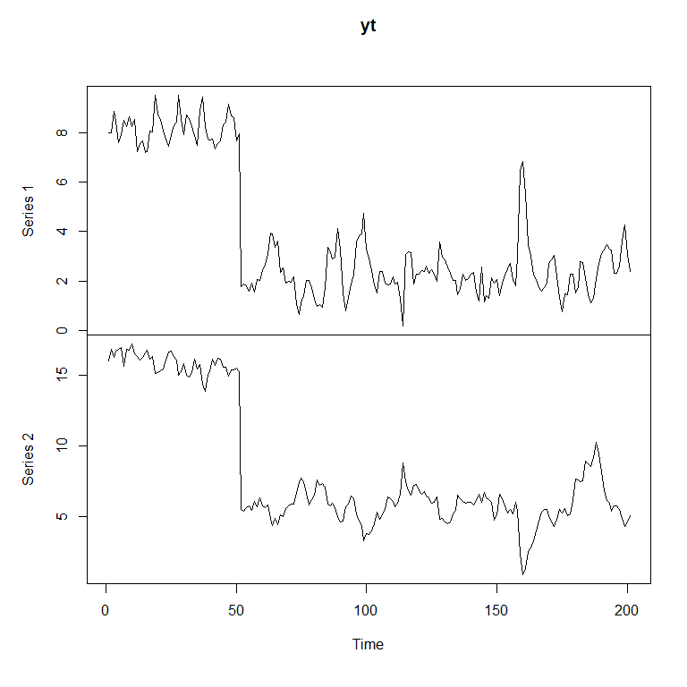

- [SteadyStateBVAR](#steadystatebvar)
  - [Installation](#installation)
  - [Introduction](#introduction)
  - [Example 1 (Villani, 2009)](#example-1-villani-2009)
  - [Example 2 (Gustafsson and Villani,
    2025)](#example-2-gustafsson-and-villani-2025)
  - [Example 3 (Swedish data,
    1987Q2-2025Q3)](#example-3-swedish-data-1987q2-2025q3)
  - [Stochastic volatility - extension of Clark (2011) —
    WIP](#stochastic-volatility---extension-of-clark-2011--wip)
  - [References](#references)

<!-- README.md is generated from README.Rmd. Please edit that file -->

# SteadyStateBVAR

<!-- badges: start -->
<!-- badges: end -->

With this package the user can estimate the Steady-State BVAR(p) model
by Mattias Villani.

## Installation

First, you need to install Rstan:
<https://github.com/stan-dev/rstan/wiki/Rstan-Getting-Started>

Then you can install the development version of SteadyStateBVAR with:

``` r
remotes::install_github("markjwbecker/SteadyStateBVAR", force = TRUE, upgrade = "never")
```

## Introduction

The Steady State BVAR($p$) model (Villani, 2009) is

$$
y_t = \Psi d_t + \Pi_1(y_{t-1}-\Psi d_{t-1})+\dots+\Pi_p(y_{t-p}-\Psi d_{t-p})+u_t
$$

where $y_t$ is a $k$-dimensional vector of endogenous variables (time
series) at time $t$, and $d_t$ is a $q$-dimensional vector of
deterministic/exogenous variables at time $t$, and
$u_t \sim N_k(0,\Sigma_u)$ with independence between time periods. Also,
$A_\ell$ for $\ell=1,\dots,p$ is $(k \times k)$, and $\Psi$ is
$(k \times q)$. Note here that

$$
E(y_t)=\mu_t=\Psi d_t
$$

is the **steady state**. Note that the current version of this package
only allows for $d_t$ to either just contain a constant, or a constant
and a dummy variable. We can stack the (transposed) $\Pi_i$ matrices in
the $(kp \times k)$ matrix $\beta$

$$
\beta=
\begin{bmatrix}
\Pi'_1 \\ 
\vdots  \\
\Pi'_p
\end{bmatrix}
$$

We can then rewrite the model as a nonlinear regression (Karlsson, 2013)

$$
y_t' =d_t'\Psi' + \left[w_t'-q_t'(I_p \otimes \Psi') \right]\beta +u_t'
$$

where $w_t'=(y_{t-1}',\dots,y_{t-p}')$ is a $kp$-dimensional vector of
lagged endogenous variables, and $q_t'=(d_{t-1}',\dots,d_{t-p}')$ is a
$qp$-dimensional vector of lagged exogenous (deterministic) variables,
$I_p$ is the $(p \times p)$ identity matrix and $\otimes$ denotes the
Kronecker product. This is how the likelihood is written in the Stan
code. The goal is to estimate $\beta, \Psi$ and $\Sigma_u$, therefore
priors are needed. Note that we assume prior independence between
$\beta, \Psi$ and $\Sigma_u$. Starting with $\beta$, we use the
Minnesota prior where

$$
\textrm{vec}(\beta) \sim N_{kpk}\left[\theta_\beta,\Omega_\beta\right]
$$

First for $\theta_\beta$, the Minnesota prior sets all prior means for
the elements in $\beta$ to $0$, except for the elements that relate to
the first own lags of the variables, which are often set to $0.9$ or $1$
for level variables or also to $0$ for growth rate variables. Further,
$\Omega_\beta$ is a diagonal matrix containing the prior variances for
the elements in $\beta$. The prior is constructed such that for the
autoregressive coefficient $\Pi_{\ell}^{(i,j)}$ which is element
$\left(i,j\right)$ of $\Pi_{\ell}$ for $\ell=1,\dots,p,$ the prior
variance is given by

$$
\textrm{Var}\left(\Pi_{\ell}^{(i,j)}\right)=
\begin{cases}
\left(\frac{\lambda_1}{\ell^{\lambda_3}}\right)^2 & \text{if } i = j \\
\left(\frac{\lambda_1 \lambda_2\sigma_i}{\ell^{\lambda_3}\sigma_j}\right)^2& \text{if } i \neq j
\end{cases}
$$

Here $\lambda_1$, $\lambda_2$ and $\lambda_3$ are scalar hyperparameters
known as the overall tightness, the cross-equation tightness and the lag
decay rate. Furthermore, $\sigma_i^2$ is the $(i,i)$:th element of
$\Sigma_u$, which we do not know, and therefore replace with an
estimate. In this package, it is replaced by the least squares residual
variance from a univariate autoregression for variable $i$ with $p$ lags
(including the constant and dummy variable if applicable). Moving on to
$\Psi$ the prior we use is

$$
\textrm{vec}(\Psi) \sim N_{kq}\left[\theta_\Psi,\Omega_\Psi\right]
$$

This is really the core of the Steady State BVAR model. In $\theta_\Psi$
we specify our prior beliefs of the location of the steady state, and in
$\Omega_\Psi$, which we assume to be a diagonal matrix, we specify our
degree of certainty in those prior beliefs. At last, the prior for
$\Sigma_u$ is

$$
\Sigma_u \sim IW(V_0,m_0)
$$

Here $V_0$ is the scale matrix and $m_0\geq k+2$ are the degrees of
freedom. We will specify an uninformative prior by setting
$V_0=(m_0-k-1)\hat{\Sigma}_u$ where $\hat{\Sigma}_u$ is the least
squares estimate from the VAR($p$) (including the constant and dummy
variable if applicable), and $m_0=k+2$. However if the user wants, the
usual noninformative Jeffreys prior

$$
p(\Sigma_u) \propto\left|\Sigma_u \right|^{-(k+1)/2}
$$

can be used instead for $\Sigma_u$.

## Example 1 (Villani, 2009)

For a super quick example, please see Example 3, here I go quite deep to
explain each step.

We will now replicate the model in the empirical analysis in Section 4.1
in Villani (2009). First let us load the library and also load the data

``` r
library(SteadyStateBVAR)
data("villani2009")
yt <- villani2009
```

The data set contains quarterly data for Sweden over the time period
1980Q1–2005Q4. The seven variables are: trade-weighted measures of
foreign GDP growth $(\Delta y_f)$, CPI inflation $(\pi_f)$ and the
3-month interest rate $(i_f)$, the corresponding domestic variables
($\Delta y$, $\pi$ and $i$), and the level of the real exchange rate
defined as $q=s+p_f-p$, where $p_f$ and $p$ are the foreign and domestic
CPI levels (in logs) and $s$ is the (log of the) trade weighted nominal
exchange rate. As such we have

$$
y_t=
\begin{pmatrix}
\Delta y_f \\
\pi_f \\
i_f \\
\Delta y \\
\pi \\
i \\
q
\end{pmatrix}
$$

Also, we will leave out the last two observations, so the user can
compare the forecasts produced here to the last forecasts seen in Figure
1-3 in Villani (2009), to verify that this implementation works
correctly.

``` r
yt <- ts(yt[1:102, ], start = start(yt), frequency = frequency(yt))
plot.ts(yt)
```

Also, let us create the bvar object which we will use throughout here.

``` r
bvar_obj <- bvar(data = yt)
```

To model the Swedish financial crisis at the beginning of the 90s and
the subsequent shift in monetary policy to inflation targeting and
flexible exchange rate, $x_t$ (deterministic variables at time $t$)
includes a constant term and a dummy for the pre-crisis period, i.e.

$$
x_{t}' =
\begin{cases}
\begin{pmatrix}1 & 1\end{pmatrix} & \text{if } t \le 1992Q4 \\
\begin{pmatrix}1 & 0\end{pmatrix} & \text{if } t > 1992Q4
\end{cases}
$$

``` r
bp <- which(time(yt) == 1992.75) #breakpoint at 1992Q4
dum_var <- c(rep(1,bp), rep(0,nrow(yt)-bp)) #1 if t<=1992Q4, 0 if t>1992Q4
```

To formulate a prior on $\Psi$, note that the specification of $x_t$
implies the following parametrization of the steady state:

$$
\mu_t =
\begin{cases}
\psi_1 + \psi_2 & \text{if } t \le 1992Q4 \\
\psi_1 & \text{if } t > 1992Q4
\end{cases}
$$

where $\psi_i$ is the $i$:th column of $\Psi$. Now to setup the model.
Although it is not mentioned which lag length is used in Villani (2009)
we assume it is $p=4$.

``` r
bvar_obj <- setup(bvar_obj,
                  p=4,
                  deterministic = "constant_and_dummy",
                  dummy = dum_var)
```

Now let us specify the priors. We first consider $\beta$. We choose the
same values for the hyperparameters as in Villani (2009), i.e. overall
tightness $\lambda_1=0.2$, cross equation tightness $\lambda_2=0.5$ and
lag decay rate $\lambda_3=1$. We then specify the prior means for the
first own lags of the variables. For variables in growth rates, we set
the prior mean to $0$, for variables in levels, we set the prior mean to
$0.9$.

``` r
lambda_1 <- 0.2
lambda_2 <- 0.5
lambda_3 <- 1.0

fol_pm=c(0,   #delta y_f
         0,   #pi_f
         0.9, #i_f
         0,   #delta y
         0,   #pi
         0.9, #i
         0.9  #q
         )
```

Now moving on to $\Psi$ for the steady state priors, we set them
according to the 95% prior probability intervals (normal distribution)
in Table I in Villani (2009). We first note that for our data here, the
growth rate variables ($\Delta y_f, \pi_f, \Delta y, \pi$) are specified
in terms of quarterly rates of change/quarter-on-quarter growth,
i.e. for a variable $z$ which is on a quarterly frequency, the quarterly
growth rate is $100[ \ln (z_t) - \ln (z_{t-1})]$. The 95% prior
probability intervals in Table I are specified in terms of annualized
quarterly growth rates $400 [\ln (z_t) - \ln (z_{t-1})]$.

The ‘ppi()’ function is useful here. Simply input the desired 95% prior
probability interval (normal distribution) on the annualized scale with
‘annualized_growthrate=TRUE’ and we get the corresponding prior mean and
variance in terms of the original scale (quarter-on-quarter growth). Of
course we could also just annualize our data before, and set
‘annualized_growthrate=’FALSE’. So now we do this for all steady state
coefficients. Again, see Table I in Villani (2009) for the 95% prior
probability intervals.

``` r
#psi_1 = Psi col 1
#psi_2 = Psi col 2

theta_Psi <- 
  c(
  ppi( 2.00,  3.00,  annualized_growthrate=TRUE)$mean,   #psi_1: delta y_f
  ppi( 1.50,  2.50,  annualized_growthrate=TRUE)$mean,   #psi_1: pi_f
  ppi( 4.50,  5.50,  annualized_growthrate=FALSE)$mean,  #psi_1: i_f
  ppi( 2.00,  2.50,  annualized_growthrate=TRUE)$mean,   #psi_1: delta y
  ppi( 1.70,  2.30,  annualized_growthrate=TRUE)$mean,   #psi_1: pi
  ppi( 4.00,  4.50,  annualized_growthrate=FALSE)$mean,  #psi_1: i
  ppi( 3.85,  4.00,  annualized_growthrate=FALSE)$mean,  #psi_1: q
  ppi(-1.00,  1.00,  annualized_growthrate=TRUE)$mean,   #psi_2: delta y_f
  ppi( 1.50,  2.50,  annualized_growthrate=TRUE)$mean,   #psi_2: pi_f
  ppi( 1.50,  2.50,  annualized_growthrate=FALSE)$mean,  #psi_2: i_f
  ppi(-1.00,  1.00,  annualized_growthrate=TRUE)$mean,   #psi_2: delta y
  ppi( 4.30,  5.70,  annualized_growthrate=TRUE)$mean,   #psi_2: pi
  ppi( 3.00,  5.50,  annualized_growthrate=FALSE)$mean,  #psi_2: i
  ppi(-0.50,  0.50,  annualized_growthrate=FALSE)$mean   #psi_2: q
  )

Omega_Psi <- 
  diag(
  c(
  ppi( 2.00,  3.00,  annualized_growthrate=TRUE)$var,    #psi_1: delta y_f
  ppi( 1.50,  2.50,  annualized_growthrate=TRUE)$var,    #psi_1: pi_f
  ppi( 4.50,  5.50,  annualized_growthrate=FALSE)$var,   #psi_1: i_f
  ppi( 2.00,  2.50,  annualized_growthrate=TRUE)$var,    #psi_1: delta y
  ppi( 1.70,  2.30,  annualized_growthrate=TRUE)$var,    #psi_1: pi
  ppi( 4.00,  4.50,  annualized_growthrate=FALSE)$var,   #psi_1: i
  ppi( 3.85,  4.00,  annualized_growthrate=FALSE)$var,   #psi_1: q
  ppi(-1.00,  1.00,  annualized_growthrate=TRUE)$var,    #psi_2: delta y_f
  ppi( 1.50,  2.50,  annualized_growthrate=TRUE)$var,    #psi_2: pi_f
  ppi( 1.50,  2.50,  annualized_growthrate=FALSE)$var,   #psi_2: i_f
  ppi(-1.00,  1.00,  annualized_growthrate=TRUE)$var,    #psi_2: delta y
  ppi( 4.30,  5.70,  annualized_growthrate=TRUE)$var,    #psi_2: pi
  ppi( 3.00,  5.50,  annualized_growthrate=FALSE)$var,   #psi_2: i
  ppi(-0.50,  0.50,  annualized_growthrate=FALSE)$var    #psi_2: q
  )
  )
```

Finally for $\Sigma_u$ we will use the noninformative Jeffreys prior
$\left|\Sigma_u \right|^{-(k+1)/2}$, as done in Villani (2009). We just
input everything to the priors function. Note here that the function
automatically creates $\theta_\beta$ and $\Omega_\beta$.

``` r
bvar_obj <- priors(bvar_obj,
                   lambda_1,
                   lambda_2,
                   lambda_3,
                   fol_pm,
                   theta_Psi, 
                   Omega_Psi,
                   Jeffrey=TRUE)
```

Like in Villani (2009), to incorporate that Sweden is a small economy
and therefore not likely to affect the foreign economy, we restrict the
upper right submatrix in each $A_\ell$ for $\ell =1,\dots,k$ or
equivalently restricting the bottom left $A_\ell'$ for
$\ell =1,\dots,k$, to the zero matrix.

``` r
p <- bvar_obj$setup$p
k <- bvar_obj$setup$k
kf <- 3 #first 3 variables are foreign in yt

restriction_matrix <- matrix(1, k*p, k)

for(i in 1:p){
  rows <- ((i-1)*k + kf + 1) : (i*k)
  cols <- 1:kf
  restriction_matrix[rows, cols] <- 0
}
restriction_matrix
```

We can look at the restriction matrix for $\beta$ to see which elements
we restrict to zero. Since the priors means for these elements are zero,
we do the restriction by setting the relevant prior variances in
$\Omega_\beta$ to be very small. We just input our $(kp \times k)$
restriction matrix to the ‘restrict’ function like below:

``` r
bvar_obj <- restrict(bvar_obj, restriction_matrix)
```

At last we need to supply our forecast horizon $H$, and also the
deterministic variables for the future periods.

``` r
bvar_obj$predict$H <- 12
bvar_obj$predict$X_pred <- cbind(rep(1, 12), 0)
```

Then we can fit the model.

``` r
bvar_obj <- fit(bvar_obj,
                iter = 10000,
                warmup = 5000,
                chains = 4)
```

Let us look at the posterior mean of $\beta$, $\Psi$ and $\Sigma_u$

``` r
summary(bvar_obj)
```

Note that ‘bvar_obj\$fit\$stan’ is an object of class ‘stanfit’. So we
can do the usual rstan inference on our fitted model. Lets look at some
examples for the post-crisis steady state coefficients of domestic gdp
growth and inflation (multiply both coefficients by 4 to get on the
annualized scale).

``` r
stanfit <- bvar_obj$fit$stan

rstan::plot(stanfit,
            pars=c("Psi[4,1]", "Psi[5,1]"),
            plotfun="trace")

rstan::plot(stanfit,
            pars=c("Psi[4,1]", "Psi[5,1]"),
            plotfun="hist")
```

We can also look at the model forecasts directly with rstan. Remember
that we left out the last two observations/quarters, so let us look at
our forecasts of the 3-month interest rate, and compare with the actual
true values

``` r
(villani2009[103:104,6]) #true values

rstan::plot(stanfit,
            pars=c("Y_pred[1,6]", "Y_pred[2,6]"),
            show_density = TRUE,
            ci_level = 0.68,
            fill_color = "blue")
```

So the model overshot a bit, but the true values are within the 68%
prediction interval. Now let us plot the forecasts along with the
historical data. We will choose a 95% prediction interval and the mean
of the predictive distribution as the point forecast. For variables in
quarter on quarter growth rates, we transform the historical data and
predictions to yearly growth rates with ‘growth_rate_idx’ where we
specify the index of the growth rate variables in $y_t$. Note that this
is not annualization, but we are now computing
$100 [ \ln (z_t) - \ln (z_{t-4})]$, i.e. the annual growth rate, by
summing up to fourth differences.

``` r
bvar_obj <- forecast(bvar_obj,
                     ci = 0.95,
                     fcst_type = "mean",
                     growth_rate_idx = c(4,5),
                     plot_idx = c(4,5,6))
```

We can also do some impulse response analysis. We can choose between the
orthogonalized impulse response function (OIRF) and the generalized
impulse response function (GIRF).

``` r
par(mfrow=c(2,2))
irf <- IRF(bvar_obj,
           lag=20,
           response=4,
           shock=6,
           method="OIRF",
           ci=0.68)

irf <- IRF(bvar_obj,
           lag=20,
           response=4,
           shock=6,
           method="GIRF")

irf <- IRF(bvar_obj,
           lag=20,
           response=5,
           shock=6,
           method="OIRF",
           ci=0.68)

irf <- IRF(bvar_obj,
           lag=20,
           response=5,
           shock=6,
           method="GIRF",
           ci=0.68)
```

Interestingly, for the response of inflation to the interest rate shock,
we see the price puzzle taking effect.

Even though we can see by the posterior means that the foreign economy
is ““exogenous”” (not really exogenous in the strict sense), we can also
see this by plotting the response of the foreign gdp growth to an
increase in the Swedish interest rate (it should have no effect at all.)

``` r
irf <- IRF(bvar_obj,
           lag=20,
           response=1,
           shock=6,
           method="OIRF",
           ci=0.68)
```

As we predicted, it has virtually no effect.

Now if desired, the user can estimate the model with a Gibbs sampler
instead and then repeat the analysis above.

``` r
bvar_obj <- fit(bvar_obj,
                iter = 10000,
                warmup = 5000,
                chains = 1,
                estimation = "gibbs")

summary(bvar_obj)

bvar_obj <- forecast(bvar_obj,
              ci = 0.95,
              fcst_type = "mean",
              growth_rate_idx = c(4,5),
              plot_idx = c(4,5,6),
              estimation="gibbs")

irf <- IRF(bvar_obj,
           lag=20,
           response=4,
           shock=6,
           method="OIRF",
           ci=0.68,
           estimation="gibbs")
```

It will give very similar results (as it should be). We will test if
they give similar results in the following section.

## Example 2 (Gustafsson and Villani, 2025)

Now I will estimate the same model in Section 3.3 in Gustafsson and
Villani (2025), and “replicate” Figure 10-11. But now instead of blue =
Variational Inference, I will do blue = Stan (NUTS sampler), and red =
Gibbs sampling. The data used in Gustafsson and Villani (2025) is the
same as in Gustafsson, Villani and Stockhammar (2023), from which I
obtained the data.

``` r
rm(list = ls())
data("GustafssonVillaniStockhammar2023")
yt <- GustafssonVillaniStockhammar2023
plot.ts(yt)
```

Create the object

``` r
bvar_obj <- bvar(data = yt)
```

Only a constant this time, thus $q=1$. The lag order $p$ is not
specified, but looking at Gustafsson, Villani and Stockhammar (2023)
(same data etc.) we can sort of infer that they use $p=2$.

``` r
bvar_obj <- setup(bvar_obj,
                  p=2,
                  deterministic = "constant",
                  dummy = NULL)
```

The hyperparameters used in Gustafsson and Villani (2025) are from
Gustafsson, Villani and Stockhammar (2023), and are $\lambda_1=0.27$,
$\lambda_2=0.43$ and $\lambda_3=0.76$. The prior means on the first own
lag of the GDP-deflator and Fed funds rate are set to 0.6.

``` r
lambda_1 <- 0.27
lambda_2 <- 0.43
lambda_3 <- 0.76

fol_pm=c(0,   #GDPC1
         0.6, #GDPCTPI
         0.6, #FEDFUNDS
         0,   #PCECC96
         0,   #GPDIC1
         0,   #HOANBS
         0    #AHETPIx
         )
```

For the steady state coefficients, the prior probability intervals
(normal distribution) are mean plus/minus one standard deviation (i.e. a
roughly 68% prior probability interval)

``` r
pnorm(1)-pnorm(-1)
```

Note that we only have a constant now, so then $q=1$ and $\Psi$ only has
one column $\psi_1$. Also the growth rate variables (everything except
‘FEDFUNDS’) are already in the form $400 [ \ln (z_t) - \ln (z_{t-1}) ]$,
so we can specify all of the intervals ‘as is’. See Gustafsson and
Villani (2025) for the intervals.

``` r
theta_Psi <- 
  c(
  ppi(2.5, 3.5, interval=0.6826895)$mean,   #psi_1: GDPC1
  ppi(1.5, 2.5, interval=0.6826895)$mean,   #psi_1: GDPCTPI
  ppi(4.3, 5.7, interval=0.6826895)$mean,   #psi_1: FEDFUNDS
  ppi(2.3, 3.7, interval=0.6826895)$mean,   #psi_1: PCECC96
  ppi(1.5, 4.5, interval=0.6826895)$mean,   #psi_1: GPDIC1
  ppi(2.5, 3.5, interval=0.6826895)$mean,   #psi_1: HOANBS
  ppi(1.5, 2.5, interval=0.6826895)$mean    #psi_1: AHETPIx
  )

Omega_Psi <- 
  diag(
  c(
  ppi(2.5, 3.5, interval=0.6826895)$var,    #psi_1: GDPC1
  ppi(1.5, 2.5, interval=0.6826895)$var,    #psi_1: GDPCTPI
  ppi(4.3, 5.7, interval=0.6826895)$var,    #psi_1: FEDFUNDS
  ppi(2.3, 3.7, interval=0.6826895)$var,    #psi_1: PCECC96
  ppi(1.5, 4.5, interval=0.6826895)$var,    #psi_1: GPDIC1
  ppi(2.5, 3.5, interval=0.6826895)$var,    #psi_1: HOANBS
  ppi(1.5, 2.5, interval=0.6826895)$var     #psi_1: AHETPIx
  )
  )
```

Lets put everything into the ‘priors function’. They also use Jeffreys
prior for $\Sigma_u$.

``` r
bvar_obj <- priors(bvar_obj,
                   lambda_1,
                   lambda_2,
                   lambda_3,
                   fol_pm,
                   theta_Psi,
                   Omega_Psi,
                   Jeffrey=TRUE)
```

We supply our forecast horizon and the deterministic variables for the
future periods.

``` r
bvar_obj$predict$H <- 12
bvar_obj$predict$X_pred <- matrix(rep(1, 12))
```

Then estimate the model, both with Stan and the Gibbs sampler.

``` r
bvar_obj <- fit(bvar_obj,
                iter = 20000,
                warmup = 5000,
                chains = 1)

bvar_obj <- fit(bvar_obj,
                iter = 20000,
                warmup = 5000,
                chains = 1,
                estimation = "gibbs")
```

Lets check the posterior means (very similar as expected)

``` r
summary(bvar_obj)
```

Now lets do Figure 10

``` r
Psi_draws_gibbs  <- bvar_obj$fit$gibbs$Psi_draws
Psi_draws_stan <- rstan::extract(bvar_obj$fit$stan)$Psi

par(mfrow=c(2,2))

# Real GDP
dens1 <- density(Psi_draws_gibbs[1,,])
dens2 <- density(Psi_draws_stan[,1,])
plot(dens1, xlab="Real GDP", main="", col="red", lwd=2, ylim=c(0,max(dens1$y,dens2$y)))
lines(dens2, col="blue", lwd=2)
legend("topright", legend=c("Gibbs", "Stan"), col=c("red", "blue"), lwd=2, bty="n")

# GDP deflator
dens1 <- density(Psi_draws_gibbs[2,,])
dens2 <- density(Psi_draws_stan[,2,])
plot(dens1, xlab="GDP deflator", main="", col="red", lwd=2, ylim=c(0,max(dens1$y,dens2$y)))
lines(dens2, col="blue", lwd=2)
legend("topright", legend=c("Gibbs", "Stan"), col=c("red", "blue"), lwd=2, bty="n")

# Fed funds rate
dens1 <- density(Psi_draws_gibbs[3,,])
dens2 <- density(Psi_draws_stan[,3,])
plot(dens1, xlab="Fed funds rate", main="", col="red", lwd=2, ylim=c(0,max(dens1$y,dens2$y)))
lines(dens2, col="blue", lwd=2)
legend("topright", legend=c("Gibbs", "Stan"), col=c("red", "blue"), lwd=2, bty="n")

# Real consumption
dens1 <- density(Psi_draws_gibbs[4,,])
dens2 <- density(Psi_draws_stan[,4,])
plot(dens1, xlab="Real consumption", main="", col="red", lwd=2, ylim=c(0,max(dens1$y,dens2$y)))
lines(dens2, col="blue", lwd=2)
legend("topright", legend=c("Gibbs", "Stan"), col=c("red", "blue"), lwd=2, bty="n")
```

And Figure 11 (mean +/- 1 std deviation bands of predictive
distribution)

``` r
GustafssonVillani2025plot <- function(x, plot_idx=NULL, xlim, ylim){
  
  Y_pred <- bvar_obj$fit$gibbs$fcst_draws
  Y_pred_m <- apply(Y_pred, c(1, 2), mean)
  Y_pred_sd <- apply(Y_pred, c(1, 2), sd)
  Y_pred_lower <- Y_pred_m - 1 * Y_pred_sd
  Y_pred_upper <- Y_pred_m + 1 * Y_pred_sd
  
  Y <- bvar_obj$data
  freq <- frequency(Y)
  T <- nrow(Y)
  H <- bvar_obj$predict$H
  m <- ncol(Y)
  time_hist <- as.numeric(time(Y))
  time_fore <- seq(tail(time_hist, 1) + 1/freq, by = 1/freq, length.out = H)
  i = plot_idx
  smply <- Y[, i]
  fcst_m <- Y_pred_m[, i]
  fcst_lower <- Y_pred_lower[, i]
  fcst_upper <- Y_pred_upper[, i]
  
  time_full <- c(tail(time_hist, 1), time_fore)
  m_full <- c(tail(smply, 1), fcst_m)
  lower_full <- c(tail(smply, 1), fcst_lower)
  upper_full <- c(tail(smply, 1), fcst_upper)
  
  ymin <- floor(ylim[1]*2)/2
  ymax <- ceiling(ylim[2]*2)/2
  yticks <- seq(ymin, ymax, by = 1)
  plot.ts(smply, main = colnames(Y)[i],ylab = NULL,
          xlim=xlim,
          ylim=ylim,
          col = "black", lwd = 2, yaxt = "n")
  
  axis(side = 2, at = yticks, labels = yticks, las = 1)
  
  lines(time_full[-1], lower_full[-1], col = "red", lwd = 2,lty=3)
  lines(time_full[-1], upper_full[-1], col = "red", lwd = 2,lty=3)
  lines(time_full, m_full, col = "red", lwd = 2)
  
  posterior_stan <- rstan::extract(x$fit$stan)
  Y_pred2 <- posterior_stan$Y_pred
  Y_pred_m2 <- apply(Y_pred2, c(2, 3), mean)
  Y_pred_sd2 <- apply(Y_pred2, c(2, 3), sd)
  Y_pred_lower2 <- Y_pred_m2 - 1 * Y_pred_sd2
  Y_pred_upper2 <- Y_pred_m2 + 1 * Y_pred_sd2
  
  fcst_m2 <- Y_pred_m2[, i]
  fcst_lower2 <- Y_pred_lower2[, i]
  fcst_upper2 <- Y_pred_upper2[, i]
  
  m_full2 <- c(tail(smply, 1), fcst_m2)
  lower_full2 <- c(tail(smply, 1), fcst_lower2)
  upper_full2 <- c(tail(smply, 1), fcst_upper2)
  lines(time_full[-1], lower_full2[-1], col = "blue", lwd = 2,lty=3)
  lines(time_full[-1], upper_full2[-1], col = "blue", lwd = 2,lty=3)
  lines(time_full, m_full2, col = "blue", lwd = 2)
  
  abline(h = seq(ymin, ymax, by = 0.5), col = "gray", lty = 2)
  legend("bottomleft", legend=c("Gibbs", "Stan"), col=c("red", "blue"), lwd=2, bty="n")
}

par(mfrow=c(2,2))

GustafssonVillani2025plot(bvar_obj, plot_idx=c(1), xlim=c(39.25,58), ylim=c(-8.5,6.75))
GustafssonVillani2025plot(bvar_obj, plot_idx=c(2), xlim=c(39.25,58), ylim=c(-0.7,4))
GustafssonVillani2025plot(bvar_obj, plot_idx=c(3), xlim=c(39.25,58), ylim=c(-0.5,6))
GustafssonVillani2025plot(bvar_obj, plot_idx=c(4), xlim=c(39.25,58), ylim=c(-3.5,6.25))
```

Now just for fun let us see the response of real gdp to a shock in the
fed funds rate

``` r
irf <- IRF(bvar_obj,
           lag=20,
           response=1,
           shock=3,
           method="OIRF",
           ci=0.68)
```

## Example 3 (Swedish data, 1987Q2-2025Q3)

Now a quick last example, using Swedish data up until 2025 for real GDP
growth, where $100 [ \ln( GDP_t) - \ln (GDP_{t-1}) ]$, CPIF inflation,
where $100 [ \ln( CPIF_t) - \ln (CPIF_{t-1}) ]$, the unemployment rate,
and the 3-month interest rate. The CPIF index is originally on a monthly
frequency, as such the CPIF index value of the last month in each
quarter is taken to be the quarterly value. We will do a similar setup
as in the first example, except now we use the uninformative inverse
wishart prior for the covariance matrix ($\Sigma_u$). Note that if you
want to use an informative prior, you are free to do so by changing
‘bvar_obj\$priors\$V_0’ (scale matrix) and ‘bvar_obj\$priors\$m_0’
(degrees of freedom), before you fit the model. For the forecasts, we
use median as the point forecast.

``` r
rm(list = ls())
data("SwedishData_1987_2025")
yt <- SwedishData_1987_2025
plot.ts(yt)
```

``` r
bvar_obj <- bvar(data = yt)
bp <- which(time(yt) == 1992.75)
dum_var <- c(rep(1,bp), rep(0,nrow(yt)-bp))

bvar_obj <- setup(bvar_obj,
                  p=4,
                  deterministic = "constant_and_dummy",
                  dummy = dum_var)

lambda_1 <- 0.20
lambda_2 <- 0.50
lambda_3 <- 1.00

fol_pm=c(0,   #delta y
         0,   #pi
         0.9, #u
         0.9  #i
         )

theta_Psi <- 
   c(
    ppi( 2.00,  2.50,  annualized_growthrate=TRUE)$mean,   #psi_1: delta y
    ppi( 1.70,  2.30,  annualized_growthrate=TRUE)$mean,   #psi_1: pi
    ppi( 6.00,  8.00,  annualized_growthrate=FALSE)$mean,  #psi_1: u
    ppi( 1.00,  2.00,  annualized_growthrate=FALSE)$mean,  #psi_1: i
    ppi(-1.00,  1.00,  annualized_growthrate=TRUE)$mean,   #psi_2: delta y
    ppi( 4.30,  5.70,  annualized_growthrate=TRUE)$mean,   #psi_2: pi
    ppi( 0.00, -2.00,  annualized_growthrate=FALSE)$mean,  #psi_1: u
    ppi( 5.00,  9.00,  annualized_growthrate=FALSE)$mean   #psi_2: i
    )

Omega_Psi <- 
  diag(
     c(
      ppi( 2.00,  2.50,  annualized_growthrate=TRUE)$var,   #psi_1: delta y
      ppi( 1.70,  2.30,  annualized_growthrate=TRUE)$var,   #psi_1: pi
      ppi( 6.00,  8.00,  annualized_growthrate=FALSE)$var,  #psi_1: u
      ppi( 1.00,  2.00,  annualized_growthrate=FALSE)$var,  #psi_1: i
      ppi(-1.00,  1.00,  annualized_growthrate=TRUE)$var,   #psi_2: delta y
      ppi( 4.30,  5.70,  annualized_growthrate=TRUE)$var,   #psi_2: pi
      ppi( 0.00, -2.00,  annualized_growthrate=FALSE)$var,  #psi_1: u
      ppi( 5.00,  9.00,  annualized_growthrate=FALSE)$var   #psi_2: i
      )
      )

bvar_obj <- priors(bvar_obj,
                   lambda_1,
                   lambda_2,
                   lambda_3,
                   fol_pm,
                   theta_Psi, 
                   Omega_Psi,
                   Jeffrey=FALSE) #inverse wishart prior for Sigma_u

bvar_obj$predict$H <- 40
bvar_obj$predict$X_pred <- cbind(rep(1, 40), 0)
bvar_obj <- fit(bvar_obj,
                iter = 10000,
                warmup = 2500,
                chains = 4)
```

``` r
par(mfrow=c(2,2))
bvar_obj <- forecast(bvar_obj,
                     ci = 0.68,
                     fcst_type = "median", #point forecast
                     growth_rate_idx = c(1,2),
                     plot_idx = c(1,2,3,4),
                     show_all = TRUE)
```

## Stochastic volatility - extension of Clark (2011) — WIP

Clark (2011) extends the Steady-State BVAR(p) model (Villani, 2009) to
allow the errors/innovations $u_t$ to have time varying covariance
matrix $\Sigma_{u,t}$. Here we further extend the model of Clark (2011),
by following the setup in Carriero, Clark and Marcellino (2024), which
uses a more flexible version of stochastic volatility for a conventional
BVAR. But here we use it for the steady state BVAR. Our model is on the
surface exactly the same as before

$$
y_t = \Psi d_t + \Pi_1(y_{t-1}-\Psi d_{t-1})+\dots+\Pi_p(y_{t-p}-\Psi d_{t-p})+u_t
$$ but now…

$$
\begin{aligned}
u_t &= A^{-1} \Lambda^{0.5}_t \epsilon_t \\
\epsilon_t &\sim \textrm{N}(0, \textrm{I}_k)\end{aligned}
$$ where

$$
\Lambda_t = \textrm{diag}(\lambda_{1,t},\dots,\lambda_{k,t})
$$ and

$$
\textrm{ln} (\lambda_{i,t}) = \gamma_{0,i} + \gamma_{1,i} \textrm{ln} (\lambda_{i,t-1}) + \nu_{i,t}, \ \ \ \ \, i=1,\dots,k
$$

$$
\nu_{t} = (\nu_{1,t},\dots,\nu_{k,t})'\sim \textrm{N}(0, \Phi), \ \ \ \ \, i=1,\dots,k
$$ Under the foregoing specification, the time varying covariance matrix
is

$$
\Sigma_{u,t} = A^{-1} \Lambda_t (A^{-1})'
$$ The difference to Clark (2011) is: i) for the log volatilities,
$\textrm{ln} (\lambda_{i,t})$), Clark (2011) sets
$\gamma_{0,i}=0  \ \ \forall i$ and $\gamma_{1,i}=1 \ \ \forall i$,
i.e. such that each log volatility process is a random walk (without
drift). We relax this assumption and let the log volatilities follow
(not necessarily stationary) AR(1) processes with constants, ii) we
relax the assumption that the covariance matrix of the vector of
innovations to the log volatilities ($\Phi$) is diagonal, and let the
innovations (to the log volatilities) be correlated across variables.

This time we will simulate our data, and estimate the model and see if
we can recover the true parameters reasonably well. Consider the
following DGP

$$
\begin{aligned}
y_t &= \Psi d_t + \Pi_1(y_{t-1}-\Psi d_{t-1})+u_t \\
u_t &= A^{-1} \Lambda^{0.5}_t \epsilon_t \\
\epsilon_t &\sim \textrm{N}(0, \textrm{I}_k) \\
\Lambda_t &= \textrm{diag}(\lambda_{1,t},\dots,\lambda_{k,t}) \\
\textrm{ln} (\lambda_{i,t}) &= \gamma_{0,i} + \gamma_{1,i} \textrm{ln} (\lambda_{i,t-1}) + \nu_{i,t}, \ \ \ \ \, i=1,\dots,k \\
\nu_{t} &\sim \textrm{N}(0, \Phi)
\end{aligned}
$$ We have $T=500$ observations, $k=2$, $p=1$, and parameters/initial
observations

$$
\begin{aligned}
\Psi &= \begin{bmatrix} 2 & 6 \\
                        6 & 10\end{bmatrix} \\
\Pi_1 &= \begin{bmatrix} 0.80 & 0.15 \\
                         -0.20 & 0.70 \end{bmatrix} \\
A &= \begin{bmatrix} 1 & 0 \\
                         0.7 & 1 \end{bmatrix} \\
\gamma_{0} &= \begin{bmatrix} -0.6  \\
                         -0.2 \end{bmatrix} \\
\gamma_{1} &= \begin{bmatrix} 0.4  \\
                         0.9 \end{bmatrix} \\
\Phi &= \begin{bmatrix} 1.2 & 0.3 \\
                         0.3 & 1.2 \end{bmatrix} \\
\lambda_{0} &= \begin{bmatrix} 0.1  \\
                         0.2 \end{bmatrix} \\
y_0 &= \Psi d_0, \ \ \ d_0 =\begin{pmatrix} 1 \\
                            1 \end{pmatrix} \\
d_{t}' &=
\begin{cases}
\begin{pmatrix}1 & 1\end{pmatrix} & \text{if } t \le 200 \\
\begin{pmatrix}1 & 0\end{pmatrix} & \text{if } t > 200
\end{cases} \\
\end{aligned}
$$

``` r
set.seed(123)

N <- 501

Psi <- matrix(c(2, 6,
                6, 10), 2, 2, byrow = TRUE)

Pi_1 <- matrix(c( 0.80, 0.15,
                 -0.20, 0.70), 2, 2, byrow = TRUE)

A <- matrix(c(1.0, 0.0,
              0.7, 1.0), 2, 2, byrow = TRUE)

gamma0 <- c(-0.60,
            -0.20)

gamma1 <- c(0.4,
            0.9)

Phi <- matrix(c(1.2,0.3,
                0.3,1.2),2,2)

dummy <- c(rep(1,201), rep(0,N-201))
d <- cbind(rep(1, N), dummy)
y <- matrix(NA, N, 2)
y[1,] <- Psi %*% d[1,] #y_0

log_lambda <- matrix(NA, N, 2)
log_lambda[1,] <- c(log(0.1), log(0.2)) #lambda_0


nu <- matrix(NA, N, 2)
Lambda <- array(NA, dim = c(2, 2, N))
epsilon <- matrix(NA, N, 2)
u <- matrix(NA, N, 2)
epsilon <- matrix(NA, N, 2)
Sigma <- array(NA, dim = c(2, 2, N))

for (t in 2:N) {
  nu[t,] <- MASS::mvrnorm(1, mu = c(0,0), Sigma = Phi)
  log_lambda[t,] <- gamma0 + gamma1*log_lambda[t-1,] + nu[t,] 
  Lambda[,,t] <- diag(exp(log_lambda[t,]))
  epsilon[t,] <- MASS::mvrnorm(1, mu = c(0,0), Sigma = diag(2))
  u[t,] <- solve(A) %*% diag(sqrt(exp(log_lambda[t,]))) %*% epsilon[t,]
  y[t, ] = Psi%*%d[t,] + Pi_1 %*% (y[t-1,] - Psi%*%d[t-1,])  + u[t,]
  Sigma[,,t] <- solve(A)%*%Lambda[,,t]%*%t(solve(A))
}
par(mfrow = c(1, 1))
plot.ts(y)
```



*WIP - have written stan code that works*

*See: inst/stochastic_volatility.stan*

## References

Carriero, A., Clark, T. E., and Marcellino, M. (2024). Capturing
Macro‐Economic Tail Risks with Bayesian Vector Autoregressions. *Journal
of Money, Credit and Banking*. 56(5), pp. 1099–1127.

Clark, T. E. (2011). Real-Time Density Forecasts from Bayesian Vector
Autoregressions with Stochastic Volatility. *Journal of Business &
Economic Statistics*. 29(3), pp. 327–341.

Gustafsson, O., Villani, M., and Stockhammar, P. (2023). Bayesian
optimization of hyperparameters from noisy marginal likelihood
estimates. *Journal of Applied Econometrics*. 38(4), pp. 577–595.

Gustafsson, O., and Villani, M. (2025). Variational inference for
steady-state BVARs. *arXiv preprint arXiv:2506.09271*.

Karlsson, S. (2013). Forecasting with Bayesian Vector Autoregression.
In: Elliott, G. and Timmerman, A. (eds) *Handbook of Economic
Forecasting*. Elsevier B.V. Vol 2, Part B., pp. 791-897.

Villani, M. (2009). Steady-state priors for vector autoregressions.
*Journal of Applied Econometrics*. 24(4), pp. 630-650.
