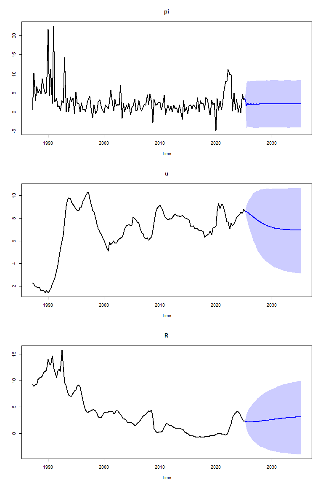

<!-- README.md is generated from README.Rmd. Please edit that file -->

# SteadyStateBVAR

<!-- badges: start -->
<!-- badges: end -->

This package provides estimation and forecasting of the Steady-State
BVAR(p) model by Mattias Villani.

## Installation

You can install the development version of SteadyStateBVAR from
[GitHub](https://github.com/) with:

``` r
#install.packages("devtools")
devtools::install_github("markjwbecker/SteadyStateBVAR")
```

## Example

Let us first load the library and some Swedish macro data.

``` r
devtools::load_all()
print("install complete")
#> [1] "install complete"
data("swe_macro")
```

Lets plot the Swedish macro data consisting of CPIF inflation (pi),
unemployment rate (u) and 3-month interest rate (R).

``` r
plot.ts(Y)
```

 The
estimation period includes the Swedish financial crisis at the beginning
of the 90s and the subsequent shift in monetary policy to inflation
targeting. To accommodate this x_t (exogenos variables at time t)
includes a constant term and a dummy for the pre-crisis period.

``` r
bp = 27 #breakpoint at 1993Q4
dummy <- c(rep(1,bp),rep(0,nrow(Y)-bp)) #1 if t<=1993Q4, 0 if t>1993Q4
```

Now we do some setup. Since this is quarterly data, for simplicity, let
us assume p=4 is a good choice.

``` r
p=4
stan_data <- BVAR_setup(Y, p, det=c("c&d"), dummy=dummy) #c&d = constant and dummy
```

Now for the priors. We need to specify cross equation tightness
(lambda1) and overall tightness (lambda2). Let us choose some common
values lambda1=0.2 and lambda2=0.5. Futhermore, we need to specify the
prior mean for the first own lag of the variables. For variables in
differences, we set to zero (inflation) and for variables in levels
(unemployment and interest rate) we set to 0.9 to reflect a persistent
but stationary

``` r
lambda1=0.2
lambda2=0.2
fol_pm=c(0,0.9,0.9)
```

Now to specify the prior for the steady states. The first column of
Lambda represents the steady state in the latter regime. The second
column of Lambda, determines the difference in steady states between the
first and second regime.

``` r
Lambda_pr_means <- matrix(c(2,4, #inflation
                            7,-3, #unemployment rate
                            3,8),#interest rate
                          nrow=stan_data$m,
                          ncol=stan_data$d,
                          byrow=TRUE)
```

The prior on the constant terms in the steady-state VAR are thus
centered on the perceived post-crisis steady state (column 1) and the
prior on the dummy variable coefficients reflects the higher pre-crisis
inflation and interest rates, and lower pre-crisis unmeployment rate
(column 2).

Now we need to specify the prior variances for the steady state
coefficients. Let us put a strong prior on inflation, since the Swedish
central bank has a 2% inflation target. For the other variables, we can
just put 1 as the variance. We assume prior independence of the steady
states.

``` r
Lambda_pr_vars <- c(0.1,rep(1,5))
```

Now we input the above to the priors function

``` r
priors <- priors(Y,p,lambda1,lambda2,fol_pm,Lambda_pr_means,Lambda_pr_vars)
stan_data <- c(stan_data, priors)
```

At last, we need to specify our forecast horizon, and also provide the
fit function with the future exogenous variables. In this case, x_t for
all future periods will be (1,0)’, since we are not in t \<= 1993Q4.

``` r
H <- 40
X_pred <- cbind(rep(1, H), 1)
```

And now let us estimate the model (this will take some time)

``` r
rstan_options(auto_write = TRUE)
options(mc.cores=parallel::detectCores())
fit <- estimate(stan_data, n_chains=4, iter=4000, warmup=1000, H=H, X_pred=X_pred)
```

And plot the forecasts

``` r
plot_forecast(fit, Y)
```



We can see the forecasts along with the 95% credible interval.
