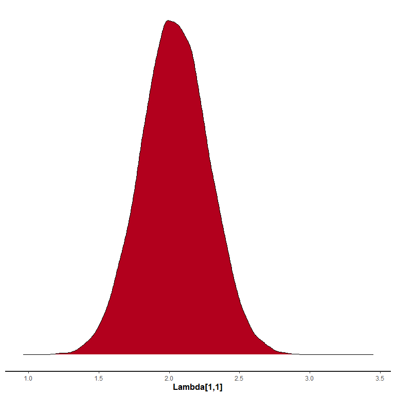

<!-- README.md is generated from README.Rmd. Please edit that file -->

# SteadyStateBVAR

<!-- badges: start -->
<!-- badges: end -->

With this package the user can estimate the Steady-State BVAR(p) model
by Mattias Villani.

## Installation

You can install the development version of SteadyStateBVAR with:

``` r
remotes::install_github("markjwbecker/SteadyStateBVAR", force = TRUE, upgrade = "never")
```

## The model

The model is

$$
y_t = \mathbf{\Lambda} x_t + \mathbf{\phi_1}(y_{t-1}-\mathbf{\Lambda} x_{t-1})+\dots+\mathbf{\phi}_p(y_{t-p}-\mathbf{\Lambda} x_{t-p})+e_t
$$

where $e_t \sim N(0,\Psi)$.

In the stan code the $\mathbf{\phi}$’s are stacked such that $\mathbf{\Gamma}\prime=\begin{bmatrix}\mathbf{\phi}_1,\dots,\mathbf{\phi}_p\end{bmatrix}$.

## Example

Let us load the library and also load a Swedish macro data set.

``` r
library(SteadyStateBVAR)
data("swe_macro")
```

The Swedish macro data set consists of quarterly observations of CPIF
inflation (pi), unemployment rate (u) and 3-month interest rate (R).

``` r
plot.ts(Y)
```

 Note
here that CPIF inflation is the annualized quarterly growth rate, i.e.

$\pi_t=400 \ln(CPIF_t/CPIF_{t-1})$

The estimation period includes the Swedish financial crisis at the
beginning of the 90s and the subsequent shift in monetary policy to
inflation targeting. To accommodate this $x_t$ (exogenous variables at
time $t$) includes a constant term and a dummy for the pre-crisis
period, i.e.

$$
x\prime_{t} =
\begin{cases}
\begin{pmatrix}1,1\end{pmatrix} & \text{if } t \le 1993Q4 \\
\begin{pmatrix}1,0\end{pmatrix} & \text{if } t > 1993Q4
\end{cases}
$$

``` r
bp = 27 #breakpoint at 1993Q4
dummy <- c(rep(1,bp), rep(0,nrow(Y)-bp)) #1 if t<=1993Q4, 0 if t>1993Q4
```

Now we do some setup. Since this is quarterly data, for simplicity, let
us assume $p=4$ is a good choice for the lag length.

``` r
p=4
stan_data <- BVAR_setup(Y, p, det=c("c&d"), dummy=dummy) #c&d = constant and dummy
```

Now for the priors. For the dynamic regression coefficients, we use the
Minnesota prior. For that, we need to specify cross equation tightness
$(\lambda_1)$ and overall tightness $(\lambda_2)$. Let us choose some
common values $\lambda_1=0.2$ and $\lambda_2=0.5$. Furthermore, we need
to specify the prior mean for the first own lag of the variables. For
variables in differences, we set to zero (inflation) and for variables
in levels (unemployment and interest rate) we set to $0.9$ to reflect
persistent but stationary series. For all of the other regression
coefficients, the prior means are zero.

``` r
lambda1=0.2
lambda2=0.5
#first own lag prior means
fol_pm=c(0,   #inflation
         0.9, #unemployment rate
         0.9) #interest rate
```

Now to specify the prior for the steady states. The first column of
Lambda represents the steady state in the latter regime. The second
column of Lambda, determines the difference in steady states between the
first and second regime.

``` r
Lambda <- matrix(c(2, 4, #inflation
                   7,-3, #unemployment rate
                   3, 8),#interest rate
                   nrow=stan_data$m,
                   ncol=stan_data$d,
                   byrow=TRUE)
```

The prior (means) on the constant terms in the steady-state VAR are thus
centered on the perceived post-crisis steady state (column 1) and the
prior (means) on the dummy variable coefficients reflects the higher
pre-crisis inflation and interest rates, and lower pre-crisis
unemployment rate (column 2). Note that the long run forecasts converge
to the unconditional mean

$$
E(y_t)=\mu_t=\mathbf{\Lambda} x_t
$$

Now we need to specify the prior variances for the steady state
coefficients. Let us put a strong prior on inflation $(\textrm{prior variance} = 0.1)$, since the Swedish
central bank has a $2\%$ inflation target. For the other variables, we
can just put unit variances. We assume prior independence of the steady
states. Note that the variances are for the elements in $vec (\mathbf{\Lambda})$.

``` r
Lambda_pr_vars <- c(0.1, rep(1,5))
```

Now we input the above to the priors function and then attach the priors
to the “stan_data”.

``` r
priors <- priors(Y, p, lambda1, lambda2, fol_pm, Lambda, Lambda_pr_vars)
stan_data <- c(stan_data, priors)
```

At last, we need to specify our forecast horizon, and also provide the
fit function with the future exogenous variables. In this case,
$x\prime_t$ for all future periods will be
$\begin{pmatrix}1,0\end{pmatrix}$, since we are not in $t \leq 1993Q4$.

``` r
H <- 40
X_pred <- cbind(rep(1, H), 0)
```

And now let us estimate the model (this will take some time).

``` r
rstan_options(auto_write = TRUE)
options(mc.cores=parallel::detectCores())
fit <- estimate(stan_data, n_chains=4, iter=5000, warmup=2500, H=H, X_pred=X_pred)
```

Note here ‘fit’ is a ‘stanfit’ object, so we can use the plot function
in rstan for ‘stanfit’ objects. Let us plot the posterior distribution
of the (post crisis) steady state of inflation (i.e. the posterior of
the unconditional mean of post crisis inflation).

``` r
stan_dens(fit, pars = "Lambda[1,1]")
```



Now lets plot the forecasts along with a $95\%$ prediction interval.
Here I choose the mean of the posterior distribution as the actual
forecast/point prediction, but the median is also possible.

``` r
plot_forecast(fit, Y, ci=0.95, fcst_type="mean")
```


The Steady-State BVAR model most often contains an inflation variable in
the system, precisely for the reason that we usually have very
informative priors about the steady state values of inflation, since it
is very common for central banks across the world to have inflation
targets. For example the Federal Reserve:

*The inflation rate over the longer run is primarily determined by
monetary policy, and hence the Committee can specify a longer-run goal
for inflation. The Committee reaffirms its judgment that inflation at
the rate of 2 percent, as measured by the annual change in the price
index for personal consumption expenditures, is most consistent over the
longer run with the Federal Reserve’s statutory maximum employment and
price stability mandates.*

As such, the inflation target of the Federal Reserve is a steady state
annual inflation of $2\%$. Similarly, as mentioned, the Swedish Riksbank
has an inflation target of $2\%$ annual CPIF inflation.

Because of the fact that the actual targets are on an annual basis, but
often in macroeconometric models the inflation is specified in terms of
(annualized) quarterly growth rate, the plot function has options to
transform the inflation forecasts to an annual basis, to facilitate
comparison with inflation targets. The transformation is simply done by
summing up forecasts up to fourth differences.

The user just needs to specify “plot_annual_inf” to be “TRUE” and also
specify which index in Y belongs to the inflation variable.

``` r
#the annualized quarterly inflation rate is transformed to annual inflation
plot_forecast(fit, Y, ci=0.95, fcst_type="mean", plot_annual_inf=TRUE, inf_idx=1)
```


Please note that for this to make sense, the inflation variable used in
the model must be the annualized quarterly growth rate of some price
index $P_t$ specified as

$\pi_t=400 \ln(P_t/P_{t-1})$
