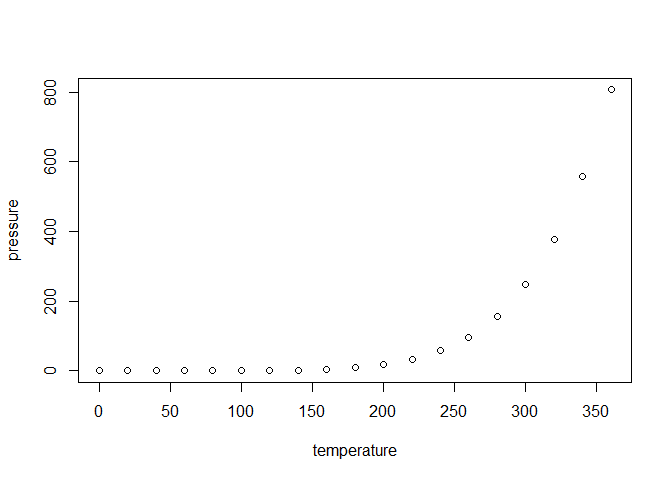

<!-- README.md is generated from README.Rmd. Please edit that file -->

# SteadyStateBVAR

<!-- badges: start -->
<!-- badges: end -->

This package provides estimation and forecasting of the Steady-State
BVAR(p) model by Mattias Villani.

## Installation

You can install the development version of SteadyStateBVAR from
[GitHub](https://github.com/) with:

``` r
#install.packages("devtools")
devtools::install_github("markjwbecker/SteadyStateBVAR")
```

## Example

Let us first load the library and some Swedish macro data.

``` r
library(SteadyStateBVAR)
data("swe_macro")
```

Lets plot the Swedish macro data consisting of CPIF inflation,
unemployment rate and the 3-month interest rate.

``` r
plot.ts(Y)
```

 We now do some
setup

``` r
plot(pressure)
```



In that case, don’t forget to commit and push the resulting figure
files, so they display on GitHub and CRAN.
