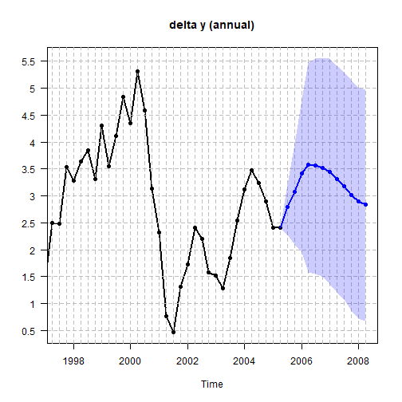

# Homoscedastic steady-state BVAR (Villani, 2009)

Here we estimate the original (homoscedastic - i.e. constant innovation
covariance matrix \\\Sigma\_{u}\\) steady-state BVAR model from Section
4.1 of Villani (2009).

First, let us attach the package and load the data.

``` r

library(SteadyStateBVAR)
data("Villani2009")
yt <- Villani2009
```

The data set contains quarterly data for Sweden over the time period
1980Q1–2005Q4. The seven variables are: trade-weighted measures of
foreign GDP growth \\(\Delta y_f)\\, CPI inflation \\(\pi_f)\\ and the
3-month interest rate \\(i_f)\\, the corresponding domestic variables
(\\\Delta y\\, \\\pi\\ and \\i\\), and the level of the real exchange
rate defined as \\q=s+p_f-p\\, where \\p_f\\ and \\p\\ are the foreign
and domestic CPI levels (in logs) and \\s\\ is the (log of the)
trade-weighted nominal exchange rate. As such, we have

\\ y_t= \begin{pmatrix} \Delta y_f \\ \pi_f \\ i_f \\ \Delta y \\ \pi \\
i \\ q \end{pmatrix} \\

Also, we will leave out the last two observations, so the user can
compare the forecasts produced here to the last forecasts seen in
Figures 1-3 in Villani (2009) to verify that this implementation works
correctly.

``` r

yt <- ts(yt[1:102, ], start = start(yt), frequency = frequency(yt))
plot.ts(yt)
```


plot of chunk Swedish macro data

Also, let us create the bvar object which we will use throughout here.

``` r

bvar_obj <- bvar(data = yt)
```

To model the Swedish financial crisis at the beginning of the 90s and
the subsequent shift in monetary policy to inflation targeting and
flexible exchange rate, \\d_t\\ (deterministic variables at time \\t\\)
includes a constant term and a dummy for the pre-crisis period, i.e.

\\ d\_{t}' = \begin{cases} \begin{pmatrix}1 & 1\end{pmatrix} & \text{if
} t \le 1992Q4 \\ \begin{pmatrix}1 & 0\end{pmatrix} & \text{if } t \>
1992Q4 \end{cases} \\

``` r

bp <- which(time(yt) == 1992.75)
dum_var <- c(rep(1,bp), rep(0,nrow(yt)-bp))
```

To formulate a prior on \\\Psi\\, note that the specification of \\d_t\\
implies the following parametrization of the steady state:

\\ \mu_t = \begin{cases} \psi_1 + \psi_2 & \text{if } t \le 1992Q4 \\
\psi_1 & \text{if } t \> 1992Q4 \end{cases} \\

where \\\psi_i\\ denotes the \\i\\:th column of \\\Psi\\. We are now
ready to set up the model. Although it is not mentioned which lag length
is used in Villani (2009), we assume \\p=4\\.

``` r

bvar_obj <- setup(bvar_obj,
                  p=4,
                  deterministic = "constant_and_dummy",
                  dummy = dum_var)
```

Now let us specify the priors. We first consider \\\beta\\. We choose
the same values for the hyperparameters as in Villani (2009), i.e. an
overall tightness of \\\lambda_1=0.2\\, a cross-equation tightness of
\\\lambda_2=0.5\\, and a lag decay rate of \\\lambda_3=1\\. We then
specify the prior means for the first own lags of the variables. For
variables in growth rates, we set the prior mean to \\0\\, for variables
in levels, we set the prior mean to \\0.9\\.

``` r

lambda_1 <- 0.2
lambda_2 <- 0.5
lambda_3 <- 1.0

#fol_pm = first own lag prior means
fol_pm=c(0,   #delta y_f
         0,   #pi_f
         0.9, #i_f
         0,   #delta y
         0,   #pi
         0.9, #i
         0.9  #q
         )
```

Now moving on to \\\Psi\\ for the steady-state priors, we set them
according to the 95% prior probability intervals (normal distribution)
in Table I in Villani (2009). We first note that for our data here, the
growth rate variables (\\\Delta y_f, \pi_f, \Delta y, \pi\\) are
specified in terms of quarterly rates of change/quarter-on-quarter
growth, i.e. for a variable \\z\\ which is on a quarterly frequency, the
quarterly growth rate is \\100\[ \ln (z_t) - \ln (z\_{t-1})\]\\. The 95%
prior probability intervals in Table I are specified in terms of
annualized quarterly growth rates \\400 \[\ln (z_t) - \ln
(z\_{t-1})\]\\.

The
[`ppi()`](https://markjwbecker.github.io/SteadyStateBVAR/reference/ppi.md)
function is useful here. Simply input the desired 95% prior probability
interval (normal distribution) on the annualized scale with
`annualized_growthrate=TRUE`, and the function returns the corresponding
prior mean and variance on the original scale (quarter-on-quarter
growth). Of course, we could also just annualize our data beforehand,
and set `annualized_growthrate=FALSE`. So now we do this for all
steady-state coefficients. Again, see Table I in Villani (2009) for the
95% prior probability intervals. The default argument for
[`ppi()`](https://markjwbecker.github.io/SteadyStateBVAR/reference/ppi.md)
is ‘interval=0.95’, but if we wanted for example 68% prior probability
intervals we could just set `interval=0.68`.

``` r

#psi_1 = Psi col 1
#psi_2 = Psi col 2

theta_Psi <- 
  c(
  ppi( 2.00,  3.00,  annualized_growthrate=TRUE)$mean,   #psi_1: delta y_f
  ppi( 1.50,  2.50,  annualized_growthrate=TRUE)$mean,   #psi_1: pi_f
  ppi( 4.50,  5.50,  annualized_growthrate=FALSE)$mean,  #psi_1: i_f
  ppi( 2.00,  2.50,  annualized_growthrate=TRUE)$mean,   #psi_1: delta y
  ppi( 1.70,  2.30,  annualized_growthrate=TRUE)$mean,   #psi_1: pi
  ppi( 4.00,  4.50,  annualized_growthrate=FALSE)$mean,  #psi_1: i
  ppi( 3.85,  4.00,  annualized_growthrate=FALSE)$mean,  #psi_1: q
  ppi(-1.00,  1.00,  annualized_growthrate=TRUE)$mean,   #psi_2: delta y_f
  ppi( 1.50,  2.50,  annualized_growthrate=TRUE)$mean,   #psi_2: pi_f
  ppi( 1.50,  2.50,  annualized_growthrate=FALSE)$mean,  #psi_2: i_f
  ppi(-1.00,  1.00,  annualized_growthrate=TRUE)$mean,   #psi_2: delta y
  ppi( 4.30,  5.70,  annualized_growthrate=TRUE)$mean,   #psi_2: pi
  ppi( 3.00,  5.50,  annualized_growthrate=FALSE)$mean,  #psi_2: i
  ppi(-0.50,  0.50,  annualized_growthrate=FALSE)$mean   #psi_2: q
  )

Omega_Psi <- 
  diag(
  c(
  ppi( 2.00,  3.00,  annualized_growthrate=TRUE)$var,    #psi_1: delta y_f
  ppi( 1.50,  2.50,  annualized_growthrate=TRUE)$var,    #psi_1: pi_f
  ppi( 4.50,  5.50,  annualized_growthrate=FALSE)$var,   #psi_1: i_f
  ppi( 2.00,  2.50,  annualized_growthrate=TRUE)$var,    #psi_1: delta y
  ppi( 1.70,  2.30,  annualized_growthrate=TRUE)$var,    #psi_1: pi
  ppi( 4.00,  4.50,  annualized_growthrate=FALSE)$var,   #psi_1: i
  ppi( 3.85,  4.00,  annualized_growthrate=FALSE)$var,   #psi_1: q
  ppi(-1.00,  1.00,  annualized_growthrate=TRUE)$var,    #psi_2: delta y_f
  ppi( 1.50,  2.50,  annualized_growthrate=TRUE)$var,    #psi_2: pi_f
  ppi( 1.50,  2.50,  annualized_growthrate=FALSE)$var,   #psi_2: i_f
  ppi(-1.00,  1.00,  annualized_growthrate=TRUE)$var,    #psi_2: delta y
  ppi( 4.30,  5.70,  annualized_growthrate=TRUE)$var,    #psi_2: pi
  ppi( 3.00,  5.50,  annualized_growthrate=FALSE)$var,   #psi_2: i
  ppi(-0.50,  0.50,  annualized_growthrate=FALSE)$var    #psi_2: q
  )
  )
```

Finally for \\\Sigma_u\\ we will use the noninformative Jeffreys prior
\\\left\|\Sigma_u \right\|^{-(k+1)/2}\\, as done in Villani (2009). We
simply pass everything to the
[`priors()`](https://markjwbecker.github.io/SteadyStateBVAR/reference/priors.md)
function. Note here that the function automatically creates
\\\theta\_\beta\\ and \\\Omega\_\beta\\.

``` r

bvar_obj <- priors(bvar_obj,
                   lambda_1,
                   lambda_2,
                   lambda_3,
                   fol_pm,
                   theta_Psi,
                   Omega_Psi,
                   Jeffrey=TRUE)
```

As in Villani (2009), we incorporate the assumption that Sweden is a
small economy and therefore unlikely to affect the foreign economy by
restricting the upper-right submatrix of \\\Pi\_\ell\\ for \\\ell
=1,\dots,p\\ or equivalently restricting the bottom-left submatrix of
\\\Pi\_\ell'\\ to the zero matrix. This technique is called “block
exogeneity” (Dieppe, Legrand, and van Roye, 2018). In essence we treat
the foreign economy as exogenous to the domestic economy, although it is
not exogenous in the strict sense (Karlsson, 2013).

``` r

p <- bvar_obj$setup$p
k <- bvar_obj$setup$k
kf <- 3 #first 3 variables are foreign in yt

restriction_matrix <- matrix(1, k*p, k)

for(i in 1:p){
  rows <- ((i-1)*k + kf + 1) : (i*k)
  cols <- 1:kf
  restriction_matrix[rows, cols] <- 0
}
restriction_matrix
#>       [,1] [,2] [,3] [,4] [,5] [,6] [,7]
#>  [1,]    1    1    1    1    1    1    1
#>  [2,]    1    1    1    1    1    1    1
#>  [3,]    1    1    1    1    1    1    1
#>  [4,]    0    0    0    1    1    1    1
#>  [5,]    0    0    0    1    1    1    1
#>  [6,]    0    0    0    1    1    1    1
#>  [7,]    0    0    0    1    1    1    1
#>  [8,]    1    1    1    1    1    1    1
#>  [9,]    1    1    1    1    1    1    1
#> [10,]    1    1    1    1    1    1    1
#> [11,]    0    0    0    1    1    1    1
#> [12,]    0    0    0    1    1    1    1
#> [13,]    0    0    0    1    1    1    1
#> [14,]    0    0    0    1    1    1    1
#> [15,]    1    1    1    1    1    1    1
#> [16,]    1    1    1    1    1    1    1
#> [17,]    1    1    1    1    1    1    1
#> [18,]    0    0    0    1    1    1    1
#> [19,]    0    0    0    1    1    1    1
#> [20,]    0    0    0    1    1    1    1
#> [21,]    0    0    0    1    1    1    1
#> [22,]    1    1    1    1    1    1    1
#> [23,]    1    1    1    1    1    1    1
#> [24,]    1    1    1    1    1    1    1
#> [25,]    0    0    0    1    1    1    1
#> [26,]    0    0    0    1    1    1    1
#> [27,]    0    0    0    1    1    1    1
#> [28,]    0    0    0    1    1    1    1
```

We can look at the restriction matrix for \\\beta\\ to see which
elements we restrict to zero. Since the prior means for these elements
are zero, we do the restriction by setting the relevant prior variances
in \\\Omega\_\beta\\ to be very small. We simply pass our \\(kp \times
k)\\ restriction matrix to the
[`restrict_beta()`](https://markjwbecker.github.io/SteadyStateBVAR/reference/restrict_beta.md)
function:

``` r

bvar_obj <- restrict_beta(bvar_obj, restriction_matrix)
```

Now, we need to supply our forecast horizon \\H\\, and also a matrix
containing the deterministic variables (\\d_t\\) for the future periods

\\ d\_{\text{pred}}=\begin{bmatrix}d\_{T+1}' \\ \vdots\\ d\_{T+H}'
\end{bmatrix} \\

Since the deterministic variables are i) a constant and ii) a dummy
indicating whether \\t \leq 1992Q4\\, we simply set

\\ d\_{T+1}'=\ldots=d\_{T+H}'=\begin{pmatrix} 1 & 0 \end{pmatrix} \\

We can now fit the model

``` r

bvar_obj <- fit(bvar_obj,
                H = 12,
                d_pred = cbind(rep(1, 12), 0),
                iter = 500,
                warmup = 100,
                chains = 1,
                cores = 1)
#> 
#> SAMPLING FOR MODEL 'anon_model' NOW (CHAIN 1).
#> Chain 1: 
#> Chain 1: Gradient evaluation took 0.002731 seconds
#> Chain 1: 1000 transitions using 10 leapfrog steps per transition would take 27.31 seconds.
#> Chain 1: Adjust your expectations accordingly!
#> Chain 1: 
#> Chain 1: 
#> Chain 1: WARNING: There aren't enough warmup iterations to fit the
#> Chain 1:          three stages of adaptation as currently configured.
#> Chain 1:          Reducing each adaptation stage to 15%/75%/10% of
#> Chain 1:          the given number of warmup iterations:
#> Chain 1:            init_buffer = 15
#> Chain 1:            adapt_window = 75
#> Chain 1:            term_buffer = 10
#> Chain 1: 
#> Chain 1: Iteration:   1 / 500 [  0%]  (Warmup)
#> Chain 1: Iteration:  50 / 500 [ 10%]  (Warmup)
#> Chain 1: Iteration: 100 / 500 [ 20%]  (Warmup)
#> Chain 1: Iteration: 101 / 500 [ 20%]  (Sampling)
#> Chain 1: Iteration: 150 / 500 [ 30%]  (Sampling)
#> Chain 1: Iteration: 200 / 500 [ 40%]  (Sampling)
#> Chain 1: Iteration: 250 / 500 [ 50%]  (Sampling)
#> Chain 1: Iteration: 300 / 500 [ 60%]  (Sampling)
#> Chain 1: Iteration: 350 / 500 [ 70%]  (Sampling)
#> Chain 1: Iteration: 400 / 500 [ 80%]  (Sampling)
#> Chain 1: Iteration: 450 / 500 [ 90%]  (Sampling)
#> Chain 1: Iteration: 500 / 500 [100%]  (Sampling)
#> Chain 1: 
#> Chain 1:  Elapsed Time: 32.817 seconds (Warm-up)
#> Chain 1:                853.915 seconds (Sampling)
#> Chain 1:                886.732 seconds (Total)
#> Chain 1:
#> Warning: There were 400 transitions after warmup that exceeded the maximum treedepth. Increase max_treedepth above 10. See
#> https://mc-stan.org/misc/warnings.html#maximum-treedepth-exceeded
#> Warning: Examine the pairs() plot to diagnose sampling problems
#> Warning: The largest R-hat is 2.06, indicating chains have not mixed.
#> Running the chains for more iterations may help. See
#> https://mc-stan.org/misc/warnings.html#r-hat
#> Warning: Bulk Effective Samples Size (ESS) is too low, indicating posterior means and medians may be unreliable.
#> Running the chains for more iterations may help. See
#> https://mc-stan.org/misc/warnings.html#bulk-ess
#> Warning: Tail Effective Samples Size (ESS) is too low, indicating posterior variances and tail quantiles may be unreliable.
#> Running the chains for more iterations may help. See
#> https://mc-stan.org/misc/warnings.html#tail-ess
```

Let us look at the posterior mean of \\\beta\\, \\\Psi\\, and
\\\Sigma_u\\.

``` r

summary(bvar_obj)
#> Posterior mean estimates
#> ------------------------
#> 
#> beta
#> ----------------------------------------              
#>                delta y_f  pi_f   i_f delta y    pi     i     q
#>   delta y_f.l1      0.18  0.03 -0.04    0.13  0.07 -0.11  0.00
#>   pi_f.l1          -0.01  0.32  0.29    0.13 -0.06 -0.04  0.00
#>   i_f.l1            0.00  0.04  0.92   -0.04  0.06  0.03  0.00
#>   delta y.l1        0.00  0.00  0.00    0.22 -0.09 -0.05  0.00
#>   pi.l1             0.00  0.00  0.00    0.00  0.08  0.05  0.00
#>   i.l1              0.00  0.00  0.00    0.00  0.02  0.75  0.00
#>   q.l1              0.00  0.00  0.00    1.38  2.45 -2.47  0.94
#>   delta y_f.l2      0.03 -0.01  0.08    0.02 -0.01  0.09  0.00
#>   pi_f.l2           0.01  0.02  0.04    0.00 -0.01 -0.12  0.00
#>   i_f.l2           -0.02 -0.01 -0.01    0.00  0.04  0.07  0.00
#>   delta y.l2        0.00  0.00  0.00    0.12 -0.02  0.16  0.00
#>   pi.l2             0.00  0.00  0.00    0.01 -0.04 -0.04  0.00
#>   i.l2              0.00  0.00  0.00   -0.01  0.01  0.04  0.00
#>   q.l2              0.00  0.00  0.00    0.63  0.90  0.82 -0.03
#>   delta y_f.l3      0.01 -0.01  0.00    0.02 -0.01 -0.01  0.00
#>   pi_f.l3          -0.02  0.06 -0.01    0.00  0.08  0.04  0.00
#>   i_f.l3            0.00  0.00  0.02    0.00  0.00  0.03  0.00
#>   delta y.l3        0.00  0.00  0.00    0.06  0.01 -0.01  0.00
#>   pi.l3             0.00  0.00  0.00    0.00  0.02 -0.02  0.00
#>   i.l3              0.00  0.00  0.00    0.01  0.00  0.01  0.00
#>   q.l3              0.00  0.00  0.00   -0.25 -0.20  0.49  0.00
#>   delta y_f.l4      0.03 -0.01  0.00    0.00  0.03  0.02  0.00
#>   pi_f.l4          -0.01  0.15 -0.03    0.00  0.01  0.03  0.00
#>   i_f.l4            0.00  0.00 -0.02    0.00  0.00  0.03  0.00
#>   delta y.l4        0.00  0.00  0.00   -0.08  0.01  0.03  0.00
#>   pi.l4             0.00  0.00  0.00    0.00  0.06 -0.02  0.00
#>   i.l4              0.00  0.00  0.00    0.00  0.00  0.00  0.00
#>   q.l4              0.00  0.00  0.00   -0.25 -0.17 -0.86 -0.01
#> ----------------------------------------
#> 
#> 
#> Psi
#> ----------------------------------------           
#>             [,1]  [,2]
#>   delta y_f 0.57  0.08
#>   pi_f      0.50  0.46
#>   i_f       4.99  2.07
#>   delta y   0.58 -0.05
#>   pi        0.49  1.15
#>   i         4.28  4.19
#>   q         3.92 -0.09
#> ----------------------------------------
#> 
#> 
#> Sigma_u 
#> 
#>            
#>             delta y_f  pi_f   i_f delta y    pi     i     q
#>   delta y_f      0.15 -0.01  0.01    0.07  0.00  0.02  0.00
#>   pi_f          -0.01  0.09  0.04    0.01  0.12  0.04  0.00
#>   i_f            0.01  0.04  0.55    0.02  0.19  0.07 -0.01
#>   delta y        0.07  0.01  0.02    0.19 -0.05 -0.01  0.00
#>   pi             0.00  0.12  0.19   -0.05  0.61  0.12  0.00
#>   i              0.02  0.04  0.07   -0.01  0.12  1.63 -0.01
#>   q              0.00  0.00 -0.01    0.00  0.00 -0.01  0.00
#> ----------------------------------------
```

We can access the posterior means or medians with
`bvar_obj$fit$posterior_means`/`bvar_obj$fit$posterior_medians` if
needed.

Note that `bvar_obj$fit$stan` is an object of class `stanfit`. So we can
do the usual `rstan` inference on our fitted model. Let’s look at some
examples for i) the first own lag of the domestic interest rate (for
which we set the prior mean to 0.9) and ii) the post-crisis steady-state
coefficient of inflation (multiply the steady-state coefficient by 4 to
obtain the annualized rate).

``` r

stanfit <- bvar_obj$fit$stan

rstan::plot(stanfit,
            pars=c("beta[6,6]", "Psi[5,1]"),
            plotfun="hist")
#> `stat_bin()` using `bins = 30`. Pick better value `binwidth`.
```


plot of chunk posterior histograms

We can also look at the model forecasts directly with `rstan`. Remember
that we left out the last two observations/quarters, so let us look at
our forecasts of the domestic interest rate and compare them with the
actual values.

``` r

(Villani2009[103:104,6]) #true values
#> [1] 1.478503 1.563795

rstan::plot(stanfit,
            pars=c("y_pred[1,6]", "y_pred[2,6]"),
            show_density = TRUE,
            ci_level = 0.68,
            fill_color = "blue")
#> ci_level: 0.68 (68% intervals)
#> outer_level: 0.95 (95% intervals)
```


plot of chunk prediction density plots

So the model overshot a bit, but the true values are within the 68%
prediction interval. Now let us plot the forecasts along with the
historical data. We will choose a 68% prediction interval and the mean
of the predictive distribution as the point forecast. For variables in
quarter-on-quarter growth rates, we transform the historical data and
predictions to yearly growth rates with ‘growth_rate_idx’ where we
specify the index of the growth rate variables in \\y_t\\. Note that
this is not annualization, but we are now computing \\100 \[ \ln (z_t) -
\ln (z\_{t-4})\]\\, i.e. the annual growth rate, by summing up to fourth
differences.

``` r

fcst <- forecast(bvar_obj,
                 ci = 0.68,
                 fcst_type = "mean",
                 growth_rate_idx = c(4,5),
                 plot_idx = c(4,5,6))
```



We can also perform conditional forecasting. We will follow the
implementation used in the BEAR toolbox (see Algorithm 3.3.1 in Dieppe,
Legrand, and van Roye \[2018\]). Note that for the structural shocks,
identification is based on the Cholesky factorisation.

Now suppose we are interested in the forecasts of the domestic GDP
growth \\\Delta y\\ conditional on a scenario for the three-month
domestic interest rate \\i\\.

First we set up our conditions/scenarios, i.e., which variables, which
horizons, and which values the variables will take during those
horizons. Our conditions are that \\i\\ will follow our specified path
(toy example) at forecast horizons \\h=1,\dots,H=12\\.

``` r

conditions <- data.frame(
              var     = rep(6,12),
              horizon = rep(1:12),
              value   = seq(2, 8, length.out = 12)
              )
```

We then do the conditional forecasting. We again select a 68% CI and the
mean of the predictive distribution as the point forecast.

``` r

cond_fcst <- conditional_forecast(bvar_obj,
                                  conditions,
                                  ci=0.68,
                                  fcst_type = "mean",
                                  plot_idx = c(4,6),
                                  growth_rate_idx = c(4))
```


Now for some impulse response analysis. We can choose between the
orthogonalized impulse response function (OIRF) and the generalized
impulse response function (GIRF). Similar to forecasting, we can choose
either the mean or the median (the default is the median), and we can
also transform the IRFs for the quarter-on-quarter growth rate variables
to the annual/yearly scale.

``` r

par(mfrow=c(2,2))

irf <- IRF(bvar_obj,H=20,response=4,shock=6,type="median",method="OIRF",ci=0.95,growth_rate_idx=4)
irf <- IRF(bvar_obj,H=20,response=4,shock=6,type="median",method="GIRF",ci=0.95,growth_rate_idx=4)
irf <- IRF(bvar_obj,H=20,response=5,shock=6,type="median",method="OIRF",ci=0.95,growth_rate_idx=5)
irf <- IRF(bvar_obj,H=20,response=5,shock=6,type="median",method="GIRF",ci=0.95,growth_rate_idx=5)
```


plot of chunk impulse responses

## References

Villani, M. (2009). Steady-state priors for vector autoregressions.
*Journal of Applied Econometrics*. 24(4), pp. 630-650.
