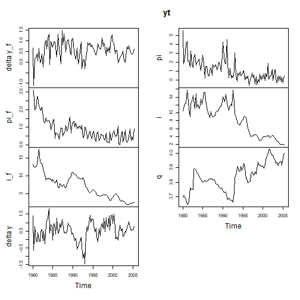
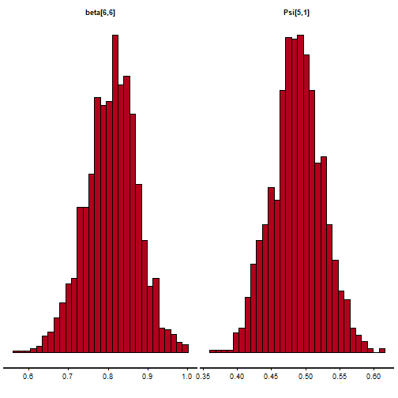
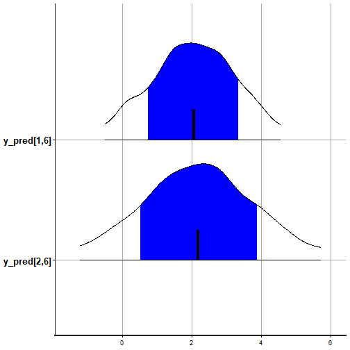
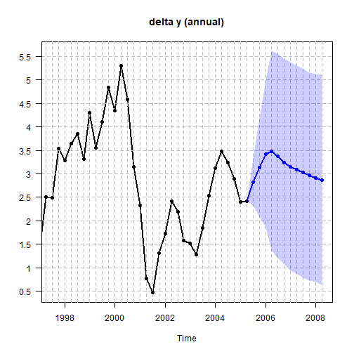
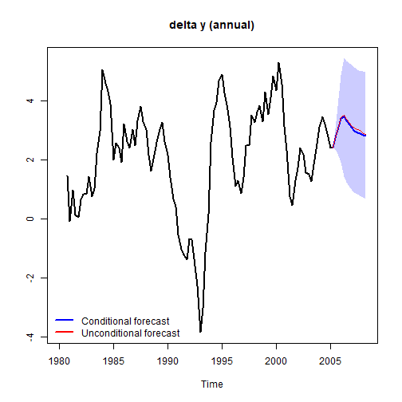
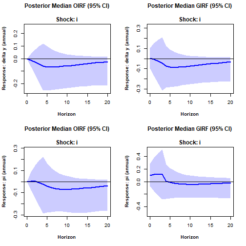

# SteadyStateBVAR: theoretical overview and getting started

With this package, the user can estimate the steady-state BVAR(p) model
of Mattias Villani (Villani, 2009). The goal is to use modern Bayesian
tools (Stan) to: i) estimate the model as specified in the original
paper, and ii) extend the model in many different ways. Back in the day,
extensions of the model seemed to be limited by what Mattias Villani had
time to derive.

See for example, Clark (2011): “*In a methodological sense, this paper
extends the estimator of Villani (2009) to include stochastic
volatility.*” Later on, he writes: “*(Special thanks are due to Mattias
Villani for providing the formulas for posterior means and variances of*
$`\Pi`$*and* $`\Psi`$*, which generalize the constant-variance formulas
of Villani 2009.)*”

For a more recent example of the model being at the mercy of Professor
Villani, we can take a look at the [Technical
Guide](https://github.com/european-central-bank/BEAR-toolbox/blob/master/tbx/doc/Technical%20guide.pdf)
for the BEAR (Bayesian Estimation, Analysis and Regression) toolbox by
the ECB. On page 122, Dieppe, Legrand, and van Roye (2018) write:
“*Villani (2009) only provides derivation in the case of the
normal-diffuse prior distribution, so the incoming analysis will be
restricted to this case.*”

Times are different now, and with the help of Stan, we can basically do
whatever we can imagine. To showcase this, in the last section we build
on the steady-state BVAR model of Clark (2011) \[which itself is an
extension of the original model (Villani, 2009)\], by letting the log
volatilities follow correlated AR(1) processes instead of uncorrelated
driftless random walks. And this is done without asking Professor
Villani for any derivations. I simply wrote down the model equations,
put some priors on the parameters, and Stan did the rest!

## Introduction

The steady-state BVAR($`p`$) model (Villani, 2009) is

``` math
y_t = \Psi d_t + \Pi_1(y_{t-1}-\Psi d_{t-1})+\dots+\Pi_p(y_{t-p}-\Psi d_{t-p})+u_t
```

where $`y_t`$ is a $`k`$-dimensional vector of endogenous variables
(time series) at time $`t`$, $`d_t`$ is a $`q`$-dimensional vector of
deterministic (exogenous) variables at time $`t`$, and the
(reduced-form) innovations are $`u_t \sim N_k(0,\Sigma_u)`$ with
independence between time periods. Here $`\Pi_\ell`$ for
$`\ell=1,\dots,p`$ is a $`(k \times k)`$ matrix, and $`\Psi`$ is a
$`(k \times q)`$ matrix. Now

``` math
\mathrm{E}(y_t)=\mu_t=\Psi d_t
```

is the unconditional mean, or the **steady state**, of the process.
Since long-horizon forecasts from stationary VARs converge to the
unconditional mean (steady state), it is naturally very important from a
forecasting perspective to obtain precise inference on $`\Psi`$.

Note that the current version of this package only allows for $`d_t`$ to
contain either a constant, a constant and a dummy variable, or a
constant and a time trend. We can stack the (transposed) $`\Pi_i`$
matrices in the $`(kp \times k)`$ matrix $`\beta`$

``` math
\beta=
\begin{bmatrix}
\Pi'_1 \\ 
\vdots  \\
\Pi'_p
\end{bmatrix}
```

We can then rewrite the model as a nonlinear regression (Karlsson, 2013)

``` math
y_t' =d_t'\Psi' + \left[w_t'-q_t'(I_p \otimes \Psi') \right]\beta +u_t'
```

where $`w_t'=(y_{t-1}',\dots,y_{t-p}')`$ is a $`kp`$-dimensional vector
of lagged endogenous variables and $`q_t'=(d_{t-1}',\dots,d_{t-p}')`$ is
a $`qp`$-dimensional vector of lagged deterministic (exogenous)
variables, $`I_p`$ is the $`(p \times p)`$ identity matrix and
$`\otimes`$ denotes the Kronecker product. This is how the likelihood is
written in the Stan code. The goal is to estimate $`\beta, \Psi`$, and
$`\Sigma_u`$, so priors are needed. First, prior independence between
$`\beta, \Psi`$ and $`\Sigma_u`$ is assumed. Starting with $`\beta`$, we
use the Minnesota prior

``` math
\mathrm{vec}(\beta) \sim \mathrm{N}_{kpk} \left[\theta_\beta,\Omega_\beta\right]
```

The prior means (the elements of $`\theta_\beta`$) are set to

``` math
\begin{aligned}
\mathrm{E}\left(\Pi_{\ell}^{(i,j)}\right)&=
\begin{cases}
\kappa & \text{if } \ell = 1 \ \mathrm{and} \ i = j \\
0 & \mathrm{otherwise}
\end{cases}\\
\kappa&=
\begin{cases}
\kappa^{level} & \text{if } \mathrm{variable} \ i \ \mathrm{is in level} \\
\kappa^{\Delta} & \text{if }\mathrm{variable} \ i \ \mathrm{is in difference}
\end{cases}\\
\end{aligned}
```

Here, the autoregressive coefficient $`\Pi_{\ell}^{(i,j)}`$ is element
$`\left(i,j\right)`$ of $`\Pi_{\ell}`$ for $`\ell=1,\dots,p`$. As such,
the Minnesota prior sets all prior means for the elements in $`\beta`$
to $`0`$, except for the elements that relate to the first own lags of
the variables, which are set to $`\kappa`$. If variable $`i`$ is in
level (e.g. nominal interest rate), then $`\kappa=\kappa^{level}`$, and
typical choices for $`\kappa^{level}`$ are $`1`$ or $`0.9`$. Evaluating
the equations at their prior means, equation $`i`$ becomes a random walk
if $`\kappa^{level}=1`$ and a persistent stationary AR(1) process if
$`\kappa^{level}=0.9`$. Since the steady state only exists if the
process is stationary, $`0.9`$ is recommended for the steady-state BVAR.
If variable $`i`$ is in difference (e.g. output growth), then
$`\kappa=\kappa^{\Delta}`$, and the most common choice for
$`\kappa^{\Delta}`$ is $`0`$, i.e. equation $`i`$ becomes (when
evaluating it at its prior means) a random walk expressed in first
differences. If a differenced variable still shows some degree of
persistence (can be examined with an ACF plot), a suitable value for
$`\kappa^{\Delta}`$ can be (for example) $`0.6`$ instead of $`0`$.
Moving on to the prior variances, $`\Omega_\beta`$ is a diagonal matrix
containing the prior variances for the elements in $`\beta`$. They are
specified as

``` math
\mathrm{Var}\left(\Pi_{\ell}^{(i,j)}\right)=
\begin{cases}
\left(\frac{\lambda_1}{\ell^{\lambda_3}}\right)^2 & \text{if } i = j \\
\left(\frac{\lambda_1 \lambda_2\sigma_i}{\ell^{\lambda_3}\sigma_j}\right)^2& \text{if } i \neq j
\end{cases}
```

Here $`\lambda_1`$, $`\lambda_2`$, and $`\lambda_3`$ are scalar
hyperparameters known as the overall tightness, the cross-equation
tightness and the lag decay rate. Furthermore, $`\sigma_i^2`$ is the
$`(i,i)`$:th element of $`\Sigma_u`$, which we do not know and therefore
replace with an estimate. In this package, it is replaced by the least
squares residual variance from a univariate autoregression for variable
$`i`$ with $`p`$ lags (including the constant and dummy/trend variable
if applicable). Moving on to $`\Psi`$, the prior we use is

``` math
\mathrm{vec}(\Psi) \sim \mathrm{N}_{kq}\left[\theta_\Psi,\Omega_\Psi\right]
```

This is really the core of the steady-state BVAR model. In
$`\theta_\Psi`$, we specify our prior beliefs about the location of the
steady state, and in $`\Omega_\Psi`$, which we assume to be a diagonal
matrix, we specify our degree of certainty in those prior beliefs.
Finally, the prior for $`\Sigma_u`$ is the usual noninformative Jeffreys
prior

``` math
p(\Sigma_u) \propto\left|\Sigma_u \right|^{-(k+1)/2}
```

However, if the user wants, an inverse Wishart prior can be used instead

``` math
\Sigma_u \sim \mathrm{IW}(V_0,m_0)
```

where $`V_0`$ is the scale matrix and $`m_0\geq k+2`$ is the number of
degrees of freedom. An uninformative prior can be (and is in this
package) specified by setting $`V_0=(m_0-k-1)\hat{\Sigma}_u`$ where
$`\hat{\Sigma}_u`$ is the least squares estimate from the VAR($`p`$)
(including the constant and dummy/trend variable if applicable), and
$`m_0=k+2`$.

This package also allows for stochastic volatility, where we let the
covariance matrix of the innovations vary over time such that we have a
time-varying covariance matrix $`\Sigma_{u,t}`$ (See other vignettes).

## Homoscedastic steady-state BVAR (Villani, 2009)

Here we estimate the original (homoscedastic) steady-state BVAR model
from Section 4.1 of Villani (2009).

First, let us attach the package and load the data.

``` r

library(SteadyStateBVAR)
data("Villani2009")
yt <- Villani2009
```

The data set contains quarterly data for Sweden over the time period
1980Q1–2005Q4. The seven variables are: trade-weighted measures of
foreign GDP growth $`(\Delta y_f)`$, CPI inflation $`(\pi_f)`$ and the
3-month interest rate $`(i_f)`$, the corresponding domestic variables
($`\Delta y`$, $`\pi`$ and $`i`$), and the level of the real exchange
rate defined as $`q=s+p_f-p`$, where $`p_f`$ and $`p`$ are the foreign
and domestic CPI levels (in logs) and $`s`$ is the (log of the)
trade-weighted nominal exchange rate. As such, we have

``` math
y_t=
\begin{pmatrix}
\Delta y_f \\
\pi_f \\
i_f \\
\Delta y \\
\pi \\
i \\
q
\end{pmatrix}
```

Also, we will leave out the last two observations, so the user can
compare the forecasts produced here to the last forecasts seen in
Figures 1-3 in Villani (2009) to verify that this implementation works
correctly.

``` r

yt <- ts(yt[1:102, ], start = start(yt), frequency = frequency(yt))
plot.ts(yt)
```



plot of chunk unnamed-chunk-2

Also, let us create the bvar object which we will use throughout here.

``` r

bvar_obj <- bvar(data = yt)
```

To model the Swedish financial crisis at the beginning of the 90s and
the subsequent shift in monetary policy to inflation targeting and
flexible exchange rate, $`d_t`$ (deterministic variables at time $`t`$)
includes a constant term and a dummy for the pre-crisis period, i.e.

``` math
d_{t}' =
\begin{cases}
\begin{pmatrix}1 & 1\end{pmatrix} & \text{if } t \le 1992Q4 \\
\begin{pmatrix}1 & 0\end{pmatrix} & \text{if } t > 1992Q4
\end{cases}
```

``` r

bp <- which(time(yt) == 1992.75)
dum_var <- c(rep(1,bp), rep(0,nrow(yt)-bp))
```

To formulate a prior on $`\Psi`$, note that the specification of $`d_t`$
implies the following parametrization of the steady state:

``` math
\mu_t =
\begin{cases}
\psi_1 + \psi_2 & \text{if } t \le 1992Q4 \\
\psi_1 & \text{if } t > 1992Q4
\end{cases}
```

where $`\psi_i`$ denotes the $`i`$:th column of $`\Psi`$. We are now
ready to set up the model. Although it is not mentioned which lag length
is used in Villani (2009), we assume $`p=4`$.

``` r

bvar_obj <- setup(bvar_obj,
                  p=1,
                  deterministic = "constant_and_dummy",
                  dummy = dum_var)
```

Now let us specify the priors. We first consider $`\beta`$. We choose
the same values for the hyperparameters as in Villani (2009), i.e. an
overall tightness of $`\lambda_1=0.2`$, a cross-equation tightness of
$`\lambda_2=0.5`$, and a lag decay rate of $`\lambda_3=1`$. We then
specify the prior means for the first own lags of the variables. For
variables in growth rates, we set the prior mean to $`0`$, for variables
in levels, we set the prior mean to $`0.9`$.

``` r

lambda_1 <- 0.2
lambda_2 <- 0.5
lambda_3 <- 1.0

#fol_pm = first own lag prior means
fol_pm=c(0,   #delta y_f
         0,   #pi_f
         0.9, #i_f
         0,   #delta y
         0,   #pi
         0.9, #i
         0.9  #q
         )
```

Now moving on to $`\Psi`$ for the steady-state priors, we set them
according to the 95% prior probability intervals (normal distribution)
in Table I in Villani (2009). We first note that for our data here, the
growth rate variables ($`\Delta y_f, \pi_f, \Delta y, \pi`$) are
specified in terms of quarterly rates of change/quarter-on-quarter
growth, i.e. for a variable $`z`$ which is on a quarterly frequency, the
quarterly growth rate is $`100[ \ln (z_t) - \ln (z_{t-1})]`$. The 95%
prior probability intervals in Table I are specified in terms of
annualized quarterly growth rates $`400 [\ln (z_t) - \ln (z_{t-1})]`$.

The
[`ppi()`](https://markjwbecker.github.io/SteadyStateBVAR/reference/ppi.md)
function is useful here. Simply input the desired 95% prior probability
interval (normal distribution) on the annualized scale with
`annualized_growthrate=TRUE`, and the function returns the corresponding
prior mean and variance on the original scale (quarter-on-quarter
growth). Of course, we could also just annualize our data beforehand,
and set `annualized_growthrate=FALSE`. So now we do this for all
steady-state coefficients. Again, see Table I in Villani (2009) for the
95% prior probability intervals. The default argument for
[`ppi()`](https://markjwbecker.github.io/SteadyStateBVAR/reference/ppi.md)
is ‘interval=0.95’, but if we wanted for example 68% prior probability
intervals we could just set `interval=0.68`.

``` r

#psi_1 = Psi col 1
#psi_2 = Psi col 2

theta_Psi <- 
  c(
  ppi( 2.00,  3.00,  annualized_growthrate=TRUE)$mean,   #psi_1: delta y_f
  ppi( 1.50,  2.50,  annualized_growthrate=TRUE)$mean,   #psi_1: pi_f
  ppi( 4.50,  5.50,  annualized_growthrate=FALSE)$mean,  #psi_1: i_f
  ppi( 2.00,  2.50,  annualized_growthrate=TRUE)$mean,   #psi_1: delta y
  ppi( 1.70,  2.30,  annualized_growthrate=TRUE)$mean,   #psi_1: pi
  ppi( 4.00,  4.50,  annualized_growthrate=FALSE)$mean,  #psi_1: i
  ppi( 3.85,  4.00,  annualized_growthrate=FALSE)$mean,  #psi_1: q
  ppi(-1.00,  1.00,  annualized_growthrate=TRUE)$mean,   #psi_2: delta y_f
  ppi( 1.50,  2.50,  annualized_growthrate=TRUE)$mean,   #psi_2: pi_f
  ppi( 1.50,  2.50,  annualized_growthrate=FALSE)$mean,  #psi_2: i_f
  ppi(-1.00,  1.00,  annualized_growthrate=TRUE)$mean,   #psi_2: delta y
  ppi( 4.30,  5.70,  annualized_growthrate=TRUE)$mean,   #psi_2: pi
  ppi( 3.00,  5.50,  annualized_growthrate=FALSE)$mean,  #psi_2: i
  ppi(-0.50,  0.50,  annualized_growthrate=FALSE)$mean   #psi_2: q
  )

Omega_Psi <- 
  diag(
  c(
  ppi( 2.00,  3.00,  annualized_growthrate=TRUE)$var,    #psi_1: delta y_f
  ppi( 1.50,  2.50,  annualized_growthrate=TRUE)$var,    #psi_1: pi_f
  ppi( 4.50,  5.50,  annualized_growthrate=FALSE)$var,   #psi_1: i_f
  ppi( 2.00,  2.50,  annualized_growthrate=TRUE)$var,    #psi_1: delta y
  ppi( 1.70,  2.30,  annualized_growthrate=TRUE)$var,    #psi_1: pi
  ppi( 4.00,  4.50,  annualized_growthrate=FALSE)$var,   #psi_1: i
  ppi( 3.85,  4.00,  annualized_growthrate=FALSE)$var,   #psi_1: q
  ppi(-1.00,  1.00,  annualized_growthrate=TRUE)$var,    #psi_2: delta y_f
  ppi( 1.50,  2.50,  annualized_growthrate=TRUE)$var,    #psi_2: pi_f
  ppi( 1.50,  2.50,  annualized_growthrate=FALSE)$var,   #psi_2: i_f
  ppi(-1.00,  1.00,  annualized_growthrate=TRUE)$var,    #psi_2: delta y
  ppi( 4.30,  5.70,  annualized_growthrate=TRUE)$var,    #psi_2: pi
  ppi( 3.00,  5.50,  annualized_growthrate=FALSE)$var,   #psi_2: i
  ppi(-0.50,  0.50,  annualized_growthrate=FALSE)$var    #psi_2: q
  )
  )
```

Finally for $`\Sigma_u`$ we will use the noninformative Jeffreys prior
$`\left|\Sigma_u \right|^{-(k+1)/2}`$, as done in Villani (2009). We
simply pass everything to the
[`priors()`](https://markjwbecker.github.io/SteadyStateBVAR/reference/priors.md)
function. Note here that the function automatically creates
$`\theta_\beta`$ and $`\Omega_\beta`$.

``` r

bvar_obj <- priors(bvar_obj,
                   lambda_1,
                   lambda_2,
                   lambda_3,
                   fol_pm,
                   theta_Psi,
                   Omega_Psi,
                   Jeffrey=TRUE)
```

As in Villani (2009), we incorporate the assumption that Sweden is a
small economy and therefore unlikely to affect the foreign economy by
restricting the upper-right submatrix of $`\Pi_\ell`$ for
$`\ell =1,\dots,p`$ or equivalently restricting the bottom-left
submatrix of $`\Pi_\ell'`$ to the zero matrix. This technique is called
“block exogeneity” (Dieppe, Legrand, and van Roye, 2018). In essence we
treat the foreign economy as exogenous to the domestic economy, although
it is not exogenous in the strict sense (Karlsson, 2013).

``` r

p <- bvar_obj$setup$p
k <- bvar_obj$setup$k
kf <- 3 #first 3 variables are foreign in yt

restriction_matrix <- matrix(1, k*p, k)

for(i in 1:p){
  rows <- ((i-1)*k + kf + 1) : (i*k)
  cols <- 1:kf
  restriction_matrix[rows, cols] <- 0
}
restriction_matrix
#>      [,1] [,2] [,3] [,4] [,5] [,6] [,7]
#> [1,]    1    1    1    1    1    1    1
#> [2,]    1    1    1    1    1    1    1
#> [3,]    1    1    1    1    1    1    1
#> [4,]    0    0    0    1    1    1    1
#> [5,]    0    0    0    1    1    1    1
#> [6,]    0    0    0    1    1    1    1
#> [7,]    0    0    0    1    1    1    1
```

We can look at the restriction matrix for $`\beta`$ to see which
elements we restrict to zero. Since the prior means for these elements
are zero, we do the restriction by setting the relevant prior variances
in $`\Omega_\beta`$ to be very small. We simply pass our
$`(kp \times k)`$ restriction matrix to the
[`restrict_beta()`](https://markjwbecker.github.io/SteadyStateBVAR/reference/restrict_beta.md)
function:

``` r

bvar_obj <- restrict_beta(bvar_obj, restriction_matrix)
```

Now, we need to supply our forecast horizon $`H`$, and also a matrix
containing the deterministic variables ($`d_t`$) for the future periods

``` math
d_{\text{pred}}=\begin{bmatrix}d_{T+1}' \\
\vdots\\
d_{T+H}'
\end{bmatrix}
```

Since the deterministic variables are i) a constant and ii) a dummy
indicating whether $`t \leq 1992Q4`$, we simply set

``` math
d_{T+1}'=\ldots=d_{T+H}'=\begin{pmatrix} 1 & 0 \end{pmatrix}
```

``` r

bvar_obj$predict$H <- 12
(bvar_obj$predict$d_pred <- cbind(rep(1, 12), 0))
#>       [,1] [,2]
#>  [1,]    1    0
#>  [2,]    1    0
#>  [3,]    1    0
#>  [4,]    1    0
#>  [5,]    1    0
#>  [6,]    1    0
#>  [7,]    1    0
#>  [8,]    1    0
#>  [9,]    1    0
#> [10,]    1    0
#> [11,]    1    0
#> [12,]    1    0
```

Now we can fit the model.

``` r

bvar_obj <- fit(bvar_obj,
                iter = 2000,
                warmup = 500,
                chains = 1)
#> 
#> SAMPLING FOR MODEL 'anon_model' NOW (CHAIN 1).
#> Chain 1: 
#> Chain 1: Gradient evaluation took 0.001043 seconds
#> Chain 1: 1000 transitions using 10 leapfrog steps per transition would take 10.43 seconds.
#> Chain 1: Adjust your expectations accordingly!
#> Chain 1: 
#> Chain 1: 
#> Chain 1: Iteration:    1 / 2000 [  0%]  (Warmup)
#> Chain 1: Iteration:  200 / 2000 [ 10%]  (Warmup)
#> Chain 1: Iteration:  400 / 2000 [ 20%]  (Warmup)
#> Chain 1: Iteration:  501 / 2000 [ 25%]  (Sampling)
#> Chain 1: Iteration:  700 / 2000 [ 35%]  (Sampling)
#> Chain 1: Iteration:  900 / 2000 [ 45%]  (Sampling)
#> Chain 1: Iteration: 1100 / 2000 [ 55%]  (Sampling)
#> Chain 1: Iteration: 1300 / 2000 [ 65%]  (Sampling)
#> Chain 1: Iteration: 1500 / 2000 [ 75%]  (Sampling)
#> Chain 1: Iteration: 1700 / 2000 [ 85%]  (Sampling)
#> Chain 1: Iteration: 1900 / 2000 [ 95%]  (Sampling)
#> Chain 1: Iteration: 2000 / 2000 [100%]  (Sampling)
#> Chain 1: 
#> Chain 1:  Elapsed Time: 131.483 seconds (Warm-up)
#> Chain 1:                92.804 seconds (Sampling)
#> Chain 1:                224.287 seconds (Total)
#> Chain 1:
```

Let us look at the posterior mean of $`\beta`$, $`\Psi`$, and
$`\Sigma_u`$.

``` r

summary(bvar_obj)
#> beta posterior mean
#>       [,1] [,2] [,3]  [,4]  [,5]  [,6] [,7]
#> [1,]  0.17 0.04 0.01  0.12  0.02 -0.10 0.00
#> [2,] -0.11 0.44 0.16  0.13  0.00 -0.02 0.00
#> [3,] -0.03 0.05 0.93 -0.04  0.12  0.15 0.00
#> [4,]  0.00 0.00 0.00  0.20 -0.10 -0.09 0.00
#> [5,]  0.00 0.00 0.00 -0.02  0.01  0.04 0.00
#> [6,]  0.00 0.00 0.00  0.00  0.02  0.81 0.00
#> [7,]  0.00 0.00 0.00  1.76  3.45  0.90 0.91
#> 
#> Psi posterior mean
#>      [,1]  [,2]
#> [1,] 0.57  0.07
#> [2,] 0.51  0.48
#> [3,] 4.94  2.02
#> [4,] 0.58 -0.04
#> [5,] 0.49  1.13
#> [6,] 4.29  4.45
#> [7,] 3.92 -0.11
#> 
#> Sigma posterior mean
#>       [,1]  [,2] [,3]  [,4]  [,5]  [,6]  [,7]
#> [1,]  0.17 -0.03 0.02  0.10 -0.01  0.01  0.00
#> [2,] -0.03  0.12 0.04 -0.01  0.15  0.04  0.00
#> [3,]  0.02  0.04 0.51  0.02  0.17  0.10  0.00
#> [4,]  0.10 -0.01 0.02  0.24 -0.06  0.01  0.00
#> [5,] -0.01  0.15 0.17 -0.06  0.68  0.13 -0.01
#> [6,]  0.01  0.04 0.10  0.01  0.13  1.61 -0.01
#> [7,]  0.00  0.00 0.00  0.00 -0.01 -0.01  0.00
```

We can access the posterior means with `bvar_obj$posterior_means` if
needed.

Note that `bvar_obj$fit$stan` is an object of class `stanfit`. So we can
do the usual `rstan` inference on our fitted model. Let’s look at some
examples for i) the first own lag of the domestic interest rate (for
which we set the prior mean to 0.9) and ii) the post-crisis steady-state
coefficient of inflation (multiply the steady-state coefficient by 4 to
obtain the annualized rate).

``` r

stanfit <- bvar_obj$fit$stan

rstan::plot(stanfit,
            pars=c("beta[6,6]", "Psi[5,1]"),
            plotfun="hist")
#> `stat_bin()` using `bins = 30`. Pick better value `binwidth`.
```



plot of chunk unnamed-chunk-14

We can also look at the model forecasts directly with `rstan`. Remember
that we left out the last two observations/quarters, so let us look at
our forecasts of the domestic interest rate and compare them with the
actual values.

``` r

(Villani2009[103:104,6]) #true values
#> [1] 1.478503 1.563795

rstan::plot(stanfit,
            pars=c("y_pred[1,6]", "y_pred[2,6]"),
            show_density = TRUE,
            ci_level = 0.68,
            fill_color = "blue")
#> ci_level: 0.68 (68% intervals)
#> outer_level: 0.95 (95% intervals)
```



plot of chunk unnamed-chunk-15

So the model overshot a bit, but the true values are within the 68%
prediction interval. Now let us plot the forecasts along with the
historical data. We will choose a 68% prediction interval and the mean
of the predictive distribution as the point forecast. For variables in
quarter-on-quarter growth rates, we transform the historical data and
predictions to yearly growth rates with ‘growth_rate_idx’ where we
specify the index of the growth rate variables in $`y_t`$. Note that
this is not annualization, but we are now computing
$`100 [ \ln (z_t) - \ln (z_{t-4})]`$, i.e. the annual growth rate, by
summing up to fourth differences.

``` r

fcst <- forecast(bvar_obj,
                 ci = 0.68,
                 fcst_type = "mean",
                 growth_rate_idx = c(4,5),
                 plot_idx = c(4,5,6))
```



We can also perform conditional forecasting. We will follow the
implementation used in the BEAR toolbox (see Algorithm 3.3.1 in Dieppe,
Legrand, and van Roye \[2018\]). Note that for the structural shocks,
identification is based on the Cholesky factorisation.

Now suppose we are interested in the forecasts of the domestic GDP
growth $`\Delta y`$ conditional on a scenario where the three-month
domestic interest rate $`i`$ rises quickly and unexpectedly to 3%, and
then stays there.

First we set up our conditions/scenarios, i.e., which variables, which
horizons, and which values the variables will take during those
horizons. Our conditions are that $`i`$ will follow our specified path
at forecast horizons $`h=1,\dots,H`$.

``` r

conditions <- data.frame(
              var     = rep(6,12),
              horizon = rep(1:12),
              value   = rep(3,12)
              )
```

We then do the conditional forecasting. We again select a 68% CI and the
median of the predictive distribution as the point forecast.

``` r

cond_fcst <- conditional_forecast(bvar_obj,
                                  conditions,
                                  ci=0.68,
                                  fcst_type = "median",
                                  plot_idx = c(4,6),
                                  growth_rate_idx = c(4))
```



Now for some impulse response analysis. We can choose between the
orthogonalized impulse response function (OIRF) and the generalized
impulse response function (GIRF). Similar to forecasting, we can choose
either the mean or the median (the default is the median), and we can
also transform the IRFs for the quarter-on-quarter growth rate variables
to the annual/yearly scale.

``` r

par(mfrow=c(2,2))

irf <- IRF(bvar_obj,H=20,response=4,shock=6,type="median",method="OIRF",ci=0.95,growth_rate_idx=4)
irf <- IRF(bvar_obj,H=20,response=4,shock=6,type="median",method="GIRF",ci=0.95,growth_rate_idx=4)
irf <- IRF(bvar_obj,H=20,response=5,shock=6,type="median",method="OIRF",ci=0.95,growth_rate_idx=5)
irf <- IRF(bvar_obj,H=20,response=5,shock=6,type="median",method="GIRF",ci=0.95,growth_rate_idx=5)
```



plot of chunk unnamed-chunk-19

### References

Clark, T. E. (2011). Real-Time Density Forecasts from Bayesian Vector
Autoregressions with Stochastic Volatility. *Journal of Business &
Economic Statistics*. 29(3), pp. 327–341.

Dieppe, A., Legrand, R., and van Roye, B. (2018). *The Bayesian
Estimation, Analysis and Regression (BEAR) Toolbox Technical guide*.
European Central Bank.

Karlsson, S. (2013). Forecasting with Bayesian Vector Autoregression.
In: Elliott, G. and Timmerman, A. (eds) *Handbook of Economic
Forecasting*. Elsevier B.V. Vol 2, Part B., pp. 791-897.

Villani, M. (2009). Steady-state priors for vector autoregressions.
*Journal of Applied Econometrics*. 24(4), pp. 630-650.
