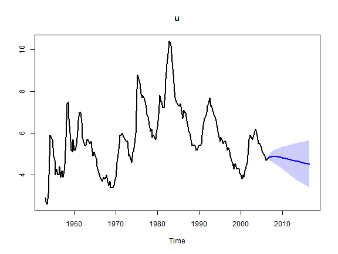
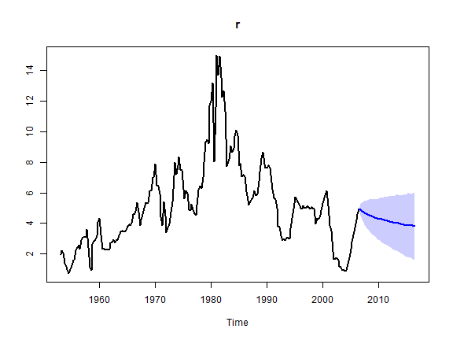
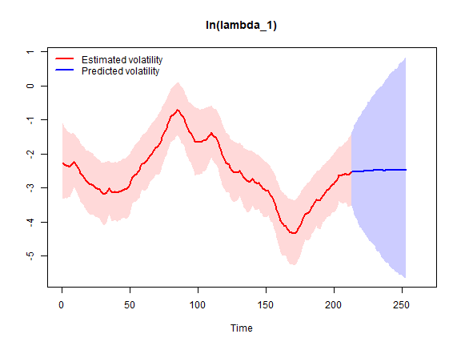
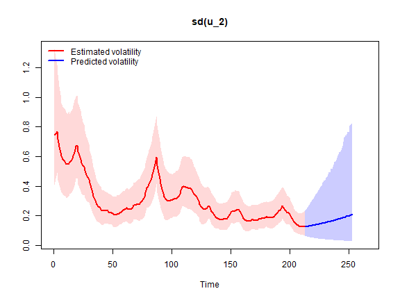
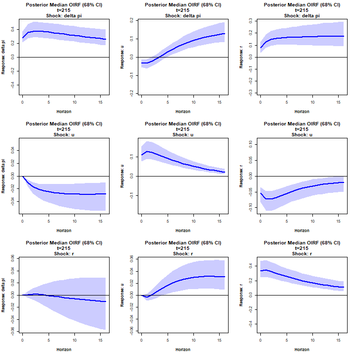

# Random Walk stochastic volatility steady-state BVAR (Clark, 2011)

Here we estimate the steady-state BVAR model with Random Walk stochastic
volatility from Clark (2011), which is an extension of the original
homoscedastic steady-state BVAR model (Villani, 2009). See
[`?bvar`](https://markjwbecker.github.io/SteadyStateBVAR/reference/bvar.md)
for details.

We will estimate the model on a quarterly US data set from Koop and
Korobilis (2010) on the inflation rate \\\Delta \pi_t\\ (the annual
percentage change in a chain-weighted GDP price index), the unemployment
rate \\u_t\\ (seasonally adjusted civilian unemployment rate, all
civilian workers aged 16 years or older) and the interest rate \\r_t\\
(yield on the three-month Treasury bill rate). The sample is
1953Q1-2006Q3 and we have the data vector

\\ y_t = \begin{pmatrix} \Delta \pi_t \\ u_t \\ r_t \end{pmatrix} \\

First, let’s load the package, then import and plot the data.

``` r

library(SteadyStateBVAR)
data("KoopKorobilis2010")
yt <- KoopKorobilis2010
plot.ts(yt)
```


Let’s create the bvar object which we will use throughout here.

``` r

bvar_obj <- bvar(data = yt)
```

We choose 2 lags and only a constant as the deterministic variable.

``` r

bvar_obj <- setup(bvar_obj,
                  p=2,
                  deterministic = "constant")
```

We set the overall tightness to \\\lambda_1 = 0.20\\, cross-equation
tightness to \\\lambda_2 = 0.50\\ and the lag decay rate to \\\lambda_3
= 1.00\\. For the prior means on the first own lags, we set them to
\\0.6\\ for \\\Delta \pi_t\\ and \\0.9\\ for \\u_t\\ and \\r_t\\. Note
that the prior mean on the first own lag of inflation is set to \\0.6\\
instead of \\0\\ to reflect some degree of persistence in the series
(even though it is a growth rate variable).

``` r

lambda_1 <- 0.20
lambda_2 <- 0.50
lambda_3 <- 1.00

fol_pm=c(0.6, # delta pi
         0.9,  #u
         0.9)  #R
```

Now, for the steady-state coefficients we use some toy values (let us
pretend that they are expert based). Remember that we only have a
constant now, so \\q=1\\ and therefore \\\Psi\\ only has one column
\\\psi_1=\Psi\\. Since \\d_t = 1 \\ \forall \\ t\\, we have \\\Psi d_t =
\mu_t\\ which simplifies to \\\Psi = \mu\\ and as such we can directly
interpret \\\Psi\\ as the unconditional mean.

``` r

theta_Psi <- 
  c(
  ppi(1.90, 2.10, interval=0.95)$mean,   #Psi: delta pi
  ppi(3.80, 4.50, interval=0.95)$mean,   #Psi: u
  ppi(2.60, 3.90, interval=0.95)$mean    #Psi: r
  )

Omega_Psi <- 
  diag(
  c(
  ppi(1.90, 2.10, interval=0.95)$var,    #Psi: delta pi
  ppi(3.80, 4.50, interval=0.95)$var,    #Psi: u
  ppi(2.60, 3.90, interval=0.95)$var     #Psi: r
  )
  )
```

Now we need to specify our stochastic volatility priors. See
[`?priors`](https://markjwbecker.github.io/SteadyStateBVAR/reference/priors.md)
for more information about the prior specification.

``` r

k <- bvar_obj$setup$k
n_free_params_A <- bvar_obj$setup$n_free_params_A

SV_priors_RW <- list(
                     theta_A             =  rep(0, n_free_params_A),
                     Omega_A             =  diag(10, n_free_params_A),
                     mu_log_lambda_0     =  rep(0, k),
                     sigma2_log_lambda_0 =  rep(10, k),
                     alpha_phi           =  rep(5, k),
                     beta_phi            = (rep(5, k) - 1) * rep(0.1, k)
                    )
```

Let’s put everything into the
[`priors()`](https://markjwbecker.github.io/SteadyStateBVAR/reference/priors.md)
function.

``` r

bvar_obj <- priors(bvar_obj,
                   lambda_1 = lambda_1,
                   lambda_2 = lambda_2,
                   lambda_3 = lambda_3,
                   first_own_lag_prior_mean =fol_pm,
                   theta_Psi = theta_Psi,
                   Omega_Psi = Omega_Psi,
                   SV = TRUE,
                   SV_type = "RW",
                   SV_priors = SV_priors_RW)
```

Now we can fit the model. Note that we can use arguments from
[`rstan::sampling()`](https://mc-stan.org/rstan/reference/stanmodel-method-sampling.html)
such as `control` where we can tweak `max_treedepth` and `adapt_delta`.

``` r

bvar_obj <- fit(bvar_obj,
                H = 40,
                d_pred = matrix(rep(1, 40)),
                iter = 4000,
                warmup = 1000,
                chains = 2,
                cores = 2,
                control = list(max_treedepth = 14, adapt_delta = 0.95))
```

Now let’s see the posterior means

``` r

summary(bvar_obj, stat="mean", t = 215) #t = 215 for covariance matrix
#> Posterior mean estimates
#> ------------------------
#> 
#> 
#> beta
#> --------------------------------------------------------------------------------             
#>               delta pi     u     r
#>   delta pi.l1     1.26  0.01  0.15
#>   u.l1           -0.09  1.17 -0.16
#>   r.l1            0.00 -0.01  1.04
#>   delta pi.l2    -0.27  0.02 -0.10
#>   u.l2            0.07 -0.23  0.17
#>   r.l2            0.00  0.02 -0.11
#> --------------------------------------------------------------------------------
#> 
#> 
#> Psi
#> --------------------------------------------------------------------------------          
#>            [,1]
#>   delta pi 2.00
#>   u        4.28
#>   r        3.49
#> --------------------------------------------------------------------------------
#> 
#> 
#> Sigma_u,t (t = 215)
#> --------------------------------------------------------------------------------
#>          delta pi     u     r
#> delta pi     0.09 -0.01  0.03
#> u           -0.01  0.02 -0.01
#> r            0.03 -0.01  0.16
#> --------------------------------------------------------------------------------
#> 
#> 
#> A
#> --------------------------------------------------------------------------------          
#>            delta pi   u r
#>   delta pi     1.00 0.0 0
#>   u            0.12 1.0 0
#>   r           -0.22 0.5 1
#> --------------------------------------------------------------------------------
#> 
#> 
#> phi
#> --------------------------------------------------------------------------------
#> delta pi        u        r 
#>     0.06     0.09     0.11 
#> --------------------------------------------------------------------------------
```

You can always look at the `stanfit` object `bvar_obj$fit$stan` directly
if you want. Note that the `z`’s below are not parameters per se, they
are simply used in a reparameterization trick to sample the log
volatilities more efficiently.

``` r

print(bvar_obj$fit$stan)
#> Inference for Stan model: steady_state_bvar_RW_stochastic_volatility.
#> 2 chains, each with iter=4000; warmup=1000; thin=1; 
#> post-warmup draws per chain=3000, total post-warmup draws=6000.
#> 
#>                        mean se_mean    sd  2.5%   25%   50%   75%  97.5% n_eff Rhat
#> beta[1,1]              1.26    0.00  0.06  1.15  1.22  1.26  1.30   1.37  5939    1
#> beta[1,2]              0.01    0.00  0.04 -0.06 -0.01  0.01  0.04   0.09  7756    1
#> beta[1,3]              0.15    0.00  0.08 -0.01  0.09  0.15  0.20   0.31  6437    1
#> beta[2,1]             -0.09    0.00  0.03 -0.16 -0.12 -0.09 -0.07  -0.02  7745    1
#> beta[2,2]              1.17    0.00  0.06  1.06  1.13  1.17  1.20   1.28  7116    1
#> beta[2,3]             -0.16    0.00  0.08 -0.31 -0.21 -0.16 -0.11  -0.01  6650    1
#> beta[3,1]              0.00    0.00  0.02 -0.03 -0.01  0.00  0.01   0.04  7324    1
#> beta[3,2]             -0.01    0.00  0.02 -0.04 -0.02 -0.01  0.00   0.02  7936    1
#> beta[3,3]              1.04    0.00  0.06  0.92  1.00  1.04  1.08   1.16  6641    1
#> beta[4,1]             -0.27    0.00  0.06 -0.38 -0.31 -0.28 -0.24  -0.16  6230    1
#> beta[4,2]              0.02    0.00  0.04 -0.06 -0.01  0.02  0.04   0.09  8012    1
#> beta[4,3]             -0.10    0.00  0.08 -0.26 -0.16 -0.10 -0.05   0.05  6478    1
#> beta[5,1]              0.07    0.00  0.03  0.01  0.05  0.07  0.09   0.14  7981    1
#> beta[5,2]             -0.23    0.00  0.05 -0.34 -0.26 -0.23 -0.19  -0.13  7275    1
#> beta[5,3]              0.17    0.00  0.07  0.03  0.12  0.17  0.22   0.31  7135    1
#> beta[6,1]              0.00    0.00  0.02 -0.03 -0.01  0.00  0.01   0.03  7573    1
#> beta[6,2]              0.02    0.00  0.02 -0.01  0.01  0.02  0.03   0.05  7233    1
#> beta[6,3]             -0.11    0.00  0.06 -0.22 -0.15 -0.11 -0.07   0.01  6555    1
#> Psi[1,1]               2.00    0.00  0.05  1.90  1.96  2.00  2.03   2.10 14332    1
#> Psi[2,1]               4.28    0.00  0.18  3.93  4.16  4.29  4.40   4.62 12896    1
#> Psi[3,1]               3.49    0.00  0.32  2.85  3.28  3.50  3.72   4.11 11724    1
#> z[1,1]                -0.72    0.00  0.18 -1.05 -0.83 -0.72 -0.60  -0.34  8780    1
#> z[1,2]                -0.22    0.00  0.19 -0.57 -0.35 -0.22 -0.09   0.18  8669    1
#> z[1,3]                -0.56    0.00  0.23 -0.99 -0.72 -0.56 -0.41  -0.11  7771    1
#> z[2,1]                -0.20    0.01  0.98 -2.14 -0.87 -0.19  0.45   1.71 11463    1
#> z[2,2]                 0.11    0.01  0.98 -1.83 -0.55  0.12  0.78   2.05 11723    1
#> z[2,3]                 0.06    0.01  0.99 -1.88 -0.61  0.05  0.75   2.02 11022    1
#> z[3,1]                -0.07    0.01  0.97 -1.99 -0.73 -0.07  0.61   1.80 13011    1
#> z[3,2]                 0.18    0.01  0.98 -1.75 -0.49  0.18  0.86   2.08 11525    1
#> z[3,3]                -0.01    0.01  0.97 -1.93 -0.66 -0.02  0.64   1.93 12812    1
#> z[4,1]                -0.13    0.01  0.97 -2.05 -0.78 -0.13  0.53   1.75 14890    1
#> z[4,2]                -0.48    0.01  0.92 -2.24 -1.10 -0.48  0.14   1.35 12724    1
#> z[4,3]                -0.24    0.01  0.97 -2.18 -0.88 -0.24  0.40   1.68 13085    1
#> z[5,1]                -0.01    0.01  0.99 -2.01 -0.68  0.00  0.67   1.90 16109    1
#> z[5,2]                -0.51    0.01  0.96 -2.36 -1.16 -0.51  0.14   1.39 14572    1
#> z[5,3]                -0.20    0.01  0.96 -2.10 -0.84 -0.20  0.44   1.69 12516    1
#> z[6,1]                -0.02    0.01  0.99 -1.96 -0.65 -0.02  0.64   1.94 15084    1
#> z[6,2]                -0.38    0.01  0.95 -2.22 -1.03 -0.39  0.24   1.50 13596    1
#> z[6,3]                -0.09    0.01  0.96 -2.03 -0.72 -0.09  0.55   1.75 12122    1
#> z[7,1]                 0.10    0.01  0.98 -1.82 -0.56  0.10  0.74   2.00 15184    1
#> z[7,2]                -0.25    0.01  0.94 -2.10 -0.87 -0.25  0.38   1.63 13469    1
#> z[7,3]                -0.02    0.01  0.96 -1.91 -0.66 -0.01  0.61   1.90 13896    1
#> z[8,1]                 0.22    0.01  0.95 -1.61 -0.43  0.23  0.87   2.11 13404    1
#> z[8,2]                -0.27    0.01  0.93 -2.10 -0.91 -0.28  0.36   1.53 13028    1
#> z[8,3]                 0.07    0.01  0.94 -1.80 -0.55  0.08  0.69   1.90 16347    1
#> z[9,1]                 0.20    0.01  0.99 -1.76 -0.47  0.21  0.87   2.12 14231    1
#> z[9,2]                -0.14    0.01  0.96 -2.06 -0.76 -0.13  0.49   1.75 11880    1
#> z[9,3]                 0.20    0.01  0.95 -1.64 -0.45  0.20  0.85   2.03 13935    1
#> z[10,1]               -0.19    0.01  0.93 -2.01 -0.83 -0.20  0.44   1.63 13207    1
#> z[10,2]               -0.14    0.01  0.94 -1.98 -0.76 -0.14  0.48   1.69 12554    1
#> z[10,3]               -0.05    0.01  0.96 -1.91 -0.70 -0.05  0.60   1.87 14506    1
#> z[11,1]               -0.16    0.01  0.94 -1.96 -0.82 -0.16  0.49   1.64 13207    1
#> z[11,2]               -0.13    0.01  0.95 -2.02 -0.77 -0.14  0.52   1.75 13150    1
#> z[11,3]               -0.17    0.01  0.96 -2.08 -0.81 -0.18  0.46   1.76 13768    1
#> z[12,1]               -0.35    0.01  0.96 -2.19 -1.01 -0.36  0.31   1.53 14401    1
#> z[12,2]               -0.03    0.01  0.95 -1.86 -0.68 -0.03  0.63   1.83 13191    1
#> z[12,3]               -0.09    0.01  0.98 -2.06 -0.76 -0.09  0.58   1.81 13794    1
#> z[13,1]               -0.28    0.01  0.96 -2.17 -0.92 -0.29  0.35   1.58 13740    1
#> z[13,2]                0.10    0.01  0.96 -1.78 -0.56  0.10  0.73   1.99 14696    1
#> z[13,3]                0.05    0.01  0.97 -1.84 -0.61  0.05  0.70   1.98 16329    1
#> z[14,1]               -0.35    0.01  0.97 -2.24 -1.01 -0.34  0.29   1.58 14011    1
#> z[14,2]                0.15    0.01  0.99 -1.80 -0.52  0.16  0.84   2.07 13918    1
#> z[14,3]                0.04    0.01  0.96 -1.85 -0.60  0.03  0.68   1.92 14095    1
#> z[15,1]               -0.25    0.01  0.95 -2.12 -0.89 -0.25  0.38   1.60 14153    1
#> z[15,2]                0.09    0.01  0.96 -1.80 -0.56  0.09  0.74   2.00 14210    1
#> z[15,3]                0.12    0.01  0.96 -1.75 -0.54  0.12  0.77   1.98 14885    1
#> z[16,1]               -0.18    0.01  0.95 -2.00 -0.83 -0.17  0.46   1.64 14420    1
#> z[16,2]                0.16    0.01  0.98 -1.72 -0.52  0.15  0.82   2.12 14206    1
#> z[16,3]                0.28    0.01  0.98 -1.59 -0.39  0.27  0.95   2.23 14267    1
#> z[17,1]               -0.20    0.01  0.99 -2.13 -0.86 -0.20  0.45   1.72 13269    1
#> z[17,2]                0.19    0.01  0.98 -1.72 -0.46  0.20  0.84   2.14 14046    1
#> z[17,3]                0.32    0.01  0.96 -1.57 -0.33  0.33  0.98   2.18 14579    1
#> z[18,1]               -0.29    0.01  0.96 -2.16 -0.94 -0.28  0.35   1.60 12860    1
#> z[18,2]                0.30    0.01  0.93 -1.57 -0.34  0.31  0.92   2.13 14051    1
#> z[18,3]                0.44    0.01  0.96 -1.44 -0.20  0.43  1.11   2.32 13621    1
#> z[19,1]               -0.17    0.01  0.95 -2.02 -0.81 -0.18  0.47   1.70 13789    1
#> z[19,2]                0.44    0.01  0.96 -1.42 -0.20  0.43  1.10   2.36 13166    1
#> z[19,3]                0.37    0.01  0.97 -1.55 -0.27  0.38  1.02   2.27 14806    1
#> z[20,1]               -0.18    0.01  0.96 -2.04 -0.82 -0.19  0.47   1.77 14922    1
#> z[20,2]                0.06    0.01  0.90 -1.70 -0.54  0.07  0.67   1.81 15525    1
#> z[20,3]                0.32    0.01  0.97 -1.56 -0.32  0.32  0.97   2.22 15202    1
#> z[21,1]               -0.08    0.01  0.98 -1.97 -0.74 -0.08  0.59   1.84 13302    1
#> z[21,2]               -0.44    0.01  0.95 -2.31 -1.08 -0.46  0.19   1.48 14445    1
#> z[21,3]                0.37    0.01  0.96 -1.48 -0.28  0.38  1.04   2.24 13130    1
#> z[22,1]               -0.09    0.01  0.96 -1.97 -0.73 -0.09  0.56   1.82 15001    1
#> z[22,2]               -0.30    0.01  0.94 -2.15 -0.93 -0.31  0.33   1.51 15450    1
#> z[22,3]                0.52    0.01  0.94 -1.32 -0.12  0.52  1.15   2.35 13361    1
#> z[23,1]               -0.02    0.01  0.95 -1.83 -0.65 -0.02  0.61   1.86 12886    1
#> z[23,2]               -0.33    0.01  0.92 -2.13 -0.94 -0.31  0.30   1.51 14678    1
#> z[23,3]               -0.18    0.01  0.95 -2.02 -0.84 -0.18  0.46   1.69 13529    1
#> z[24,1]               -0.17    0.01  0.98 -2.09 -0.83 -0.16  0.49   1.75 12703    1
#> z[24,2]               -0.26    0.01  0.91 -2.06 -0.87 -0.27  0.35   1.56 12970    1
#> z[24,3]               -0.08    0.01  0.98 -1.95 -0.76 -0.08  0.60   1.79 13302    1
#> z[25,1]               -0.18    0.01  0.93 -1.99 -0.81 -0.17  0.45   1.64 15340    1
#> z[25,2]               -0.27    0.01  0.96 -2.14 -0.90 -0.27  0.36   1.58 15999    1
#> z[25,3]                0.08    0.01  0.95 -1.75 -0.57  0.08  0.72   1.94 16803    1
#> z[26,1]               -0.05    0.01  0.95 -1.94 -0.66 -0.04  0.58   1.82 14083    1
#> z[26,2]               -0.13    0.01  0.93 -1.94 -0.75 -0.13  0.52   1.70 10764    1
#> z[26,3]                0.19    0.01  0.94 -1.67 -0.43  0.20  0.82   2.03 12129    1
#> z[27,1]               -0.09    0.01  0.95 -1.93 -0.74 -0.09  0.58   1.75 15491    1
#>  [ reached 'max' / getOption("max.print") -- omitted 3759 rows ]
#> 
#> Samples were drawn using NUTS(diag_e) at Fri Jul 10 18:17:30 2026.
#> For each parameter, n_eff is a crude measure of effective sample size,
#> and Rhat is the potential scale reduction factor on split chains (at 
#> convergence, Rhat=1).
```

We can forecast

``` r

forecast(bvar_obj, pi = 0.68, show_all = TRUE)
```



Let us plot the log volatility estimates and predictions

``` r

stochastic_volatility_plot(bvar_obj, ci = 0.95, vol = "log_lambda")
```



Let us plot the estimates and predictions of the implied innovation
standard deviations

``` r

stochastic_volatility_plot(bvar_obj, vol = "sd")
```



We can also produce orthogonalized IRFs

``` r

IRF(bvar_obj, method = "OIRF", t=215, ci=0.68) #latest t
```



## References

Clark, T. E. (2011). Real-time density forecasts from Bayesian vector
autoregressions with stochastic volatility. *Journal of Business &
Economic Statistics*, 29(3), pp. 327-341.

Koop, G. and Korobilis, D. (2010). Bayesian multivariate time series
methods for empirical macroeconomics. *Foundations and Trends in
Econometrics*, 3(4), pp. 267-358.

Villani, M. (2009). Steady-state priors for vector autoregressions.
*Journal of Applied Econometrics*, 24(4), pp. 630-650.
