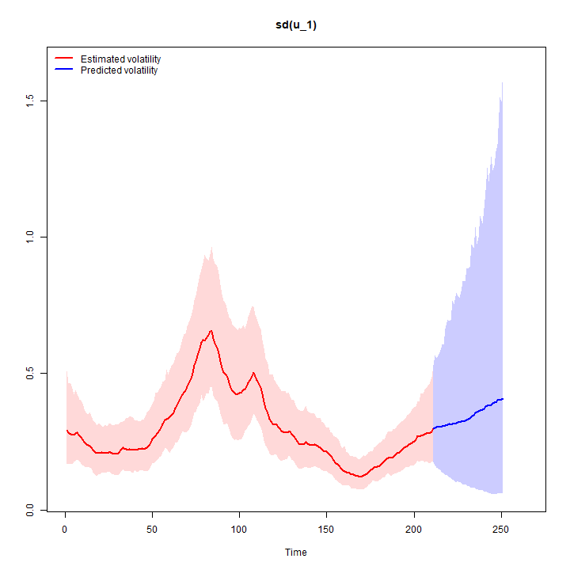

# Random Walk stochastic volatility steady-state BVAR (Clark, 2011)

Here we estimate the Random Walk stochastic volatility steady-state BVAR
from Clark (2011), which is an extension of the original homoscedastic
steady-state BVAR model (Villani, 2009). See
[`?bvar`](https://markjwbecker.github.io/SteadyStateBVAR/reference/bvar.md)
for details.

We will use a quarterly US data set from Koop and Korobilis (2010) on
the inflation rate \\\Delta \pi_t\\ (the annual percentage change in a
chain-weighted GDP price index), the unemployment rate \\u_t\\
(seasonally adjusted civilian unemployment rate, all civilian workers
aged 16 years or older) and the interest rate \\r_t\\ (yield on the
three-month Treasury bill rate). The sample is 1953Q1-2006Q3 and we have

\\ y_t = \begin{pmatrix} \Delta \pi_t \\ u_t \\ r_t \end{pmatrix}. \\

First, let us attach the package and load the data.

``` r

library(SteadyStateBVAR)
data("KoopKorobilis2010")
yt <- KoopKorobilis2010
```

Let us create the bvar object which we will use throughout here.

``` r

bvar_obj <- bvar(data = yt)
```

We choose 4 lags and only a constant as the deterministic variable.

``` r

bvar_obj <- setup(bvar_obj,
                  p=4,
                  deterministic = "constant")
```

The overall tightness is set to \\\lambda_1 = 0.20\\, cross-equation
tightness is set to \\\lambda_2 = 0.50\\ and the lag decay rate to
\\\lambda_3 = 1.00\\. For the prior means on the first own lags, we set
them to \\0.6\\ for \\\Delta \pi_t\\ and \\0.9\\ for \\u_t\\ and
\\r_t\\. Note that the prior mean on the first own lag of inflation is
set to \\0.6\\ instead of \\0\\ to reflect some degree of persistence in
the series (even though it is a growth rate variable).

``` r

lambda_1 <- 0.27
lambda_2 <- 0.43
lambda_3 <- 0.76

fol_pm=c(0.6, # delta pi
         0.9,  #u
         0.9)  #R
```

Now, for the steady-state coefficients we use some toy values (lets
pretend that they are expert based). Remember that we only have a
constant now, so \\q=1\\ and therefore \\\Psi\\ only has one column
\\\psi_1=\Psi\\. Since \\d_t = 1 \\ \forall \\ t\\, we have \\\Psi d_t =
\mu_t\\ which simplifies to \\\Psi = \mu\\ and as such we can directly
interpret \\\Psi\\ as the unconditional mean.

``` r

theta_Psi <- 
  c(
  ppi(1.90, 2.10, interval=0.99)$mean,   #Psi: delta pi
  ppi(3.80, 4.50, interval=0.99)$mean,   #Psi: u
  ppi(2.60, 3.90, interval=0.99)$mean    #Psi: r
  )

Omega_Psi <- 
  diag(
  c(
  ppi(1.90, 2.10, interval=0.99)$var,    #Psi: delta pi
  ppi(3.80, 4.50, interval=0.99)$var,    #Psi: u
  ppi(2.60, 3.90, interval=0.99)$var     #Psi: r
  )
  )
```

Now we need to specify our stochastic volatility priors. See
[`?priors`](https://markjwbecker.github.io/SteadyStateBVAR/reference/priors.md)
for more information about the prior specification.

``` r

k <- bvar_obj$setup$k
n_free_params_A <- bvar_obj$setup$n_free_params_A

SV_priors_RW <- list(
                     theta_A             =  rep(0, n_free_params_A),
                     Omega_A             =  diag(1000, n_free_params_A),
                     mu_log_lambda_0     =  rep(0, k),
                     sigma2_log_lambda_0 =  rep(1000, k),
                     alpha_phi           =  rep(5, k),
                     beta_phi            = (rep(5, k) - 1) * rep(0.1, k)
                     )
```

Let’s put everything into the
[`priors()`](https://markjwbecker.github.io/SteadyStateBVAR/reference/priors.md)
function.

``` r

bvar_obj <- priors(bvar_obj,
                   lambda_1 = lambda_1,
                   lambda_2 = lambda_2,
                   lambda_3 = lambda_3,
                   first_own_lag_prior_mean =fol_pm,
                   theta_Psi = theta_Psi,
                   Omega_Psi = Omega_Psi,
                   SV = TRUE,
                   SV_type = "RW",
                   SV_priors = SV_priors_RW)
```

Now we can fit the model

``` r

bvar_obj <- fit(bvar_obj,
                H = 40,
                d_pred = matrix(rep(1,40)),
                iter = 1000,
                warmup = 250,
                chains = 1,
                cores = 1,
                verbose = FALSE,
                auto_write = FALSE)
#> 
#> SAMPLING FOR MODEL 'anon_model' NOW (CHAIN 1).
#> Chain 1: 
#> Chain 1: Gradient evaluation took 0.00248 seconds
#> Chain 1: 1000 transitions using 10 leapfrog steps per transition would take 24.8 seconds.
#> Chain 1: Adjust your expectations accordingly!
#> Chain 1: 
#> Chain 1: 
#> Chain 1: Iteration:   1 / 1000 [  0%]  (Warmup)
#> Chain 1: Iteration: 100 / 1000 [ 10%]  (Warmup)
#> Chain 1: Iteration: 200 / 1000 [ 20%]  (Warmup)
#> Chain 1: Iteration: 251 / 1000 [ 25%]  (Sampling)
#> Chain 1: Iteration: 350 / 1000 [ 35%]  (Sampling)
#> Chain 1: Iteration: 450 / 1000 [ 45%]  (Sampling)
#> Chain 1: Iteration: 550 / 1000 [ 55%]  (Sampling)
#> Chain 1: Iteration: 650 / 1000 [ 65%]  (Sampling)
#> Chain 1: Iteration: 750 / 1000 [ 75%]  (Sampling)
#> Chain 1: Iteration: 850 / 1000 [ 85%]  (Sampling)
#> Chain 1: Iteration: 950 / 1000 [ 95%]  (Sampling)
#> Chain 1: Iteration: 1000 / 1000 [100%]  (Sampling)
#> Chain 1: 
#> Chain 1:  Elapsed Time: 320.207 seconds (Warm-up)
#> Chain 1:                444.643 seconds (Sampling)
#> Chain 1:                764.85 seconds (Total)
#> Chain 1:
#> Warning: The largest R-hat is NA, indicating chains have not mixed.
#> Running the chains for more iterations may help. See
#> https://mc-stan.org/misc/warnings.html#r-hat
#> Warning: Bulk Effective Samples Size (ESS) is too low, indicating posterior means and medians may be unreliable.
#> Running the chains for more iterations may help. See
#> https://mc-stan.org/misc/warnings.html#bulk-ess
#> Warning: Tail Effective Samples Size (ESS) is too low, indicating posterior variances and tail quantiles may be unreliable.
#> Running the chains for more iterations may help. See
#> https://mc-stan.org/misc/warnings.html#tail-ess
```

Now lets see the posterior means

``` r

summary(bvar_obj, stat="mean")
#> Posterior mean estimates
#> ------------------------
#> 
#> beta
#> ----------------------------------------             
#>               delta pi     u     r
#>   delta pi.l1     1.31  0.02  0.11
#>   u.l1           -0.13  1.19 -0.20
#>   r.l1           -0.01 -0.02  1.07
#>   delta pi.l2    -0.21  0.00 -0.05
#>   u.l2            0.05 -0.14  0.11
#>   r.l2            0.00  0.00 -0.13
#>   delta pi.l3    -0.08  0.01  0.04
#>   u.l3            0.04 -0.12 -0.01
#>   r.l3            0.01  0.03  0.05
#>   delta pi.l4    -0.03  0.00 -0.06
#>   u.l4            0.03  0.01  0.12
#>   r.l4            0.00  0.01 -0.07
#> ----------------------------------------
#> Psi
#> ----------------------------------------          
#>            [,1]
#>   delta pi 2.00
#>   u        4.23
#>   r        3.38
#> ----------------------------------------
#> Sigma_u,t (t = 215)
#> ----------------------------------------
#>          delta pi     u     r
#> delta pi     0.10 -0.01  0.02
#> u           -0.01  0.02 -0.01
#> r            0.02 -0.01  0.11
#> ------------------------
#> A
#> ----------------------------------------          
#>            delta pi    u r
#>   delta pi     1.00 0.00 0
#>   u            0.10 1.00 0
#>   r           -0.14 0.51 1
#> ----------------------------------------
#> phi
#> ----------------------------------------
#> delta pi        u        r 
#>     0.06     0.09     0.11 
#> ----------------------------------------
```

We can forecast

``` r

forecast(bvar_obj, ci = 0.95, show_all = TRUE)
```


Let us plot the log volatility estimates and predictions

``` r

par(mfcol=c(1,1))
stochastic_volatility_plot(bvar_obj, ci = 0.95, vol = "log_lambda")
```


Let us plot the estimates and predictions of the implied innovation
standard deviations

``` r

stochastic_volatility_plot(bvar_obj, vol = "sd")
```



We can also produce orthogonalized IRFs

``` r

IRF(bvar_obj, method = "OIRF", t=215, ci=0.68) #latest t
```


plot of chunk unnamed-chunk-13

## References

Clark, T. E. (2011). Real-Time Density Forecasts from Bayesian Vector
Autoregressions with Stochastic Volatility. *Journal of Business &
Economic Statistics*. 29(3), pp. 327–341.

Koop, G. and Korobilis, D. (2010). Bayesian Multivariate Time Series
Methods for Empirical Macroeconomics. *Foundations and Trends in
Econometrics*. 3(4), pp. 267-358.

Villani, M. (2009). Steady-state priors for vector autoregressions.
*Journal of Applied Econometrics*. 24(4), pp. 630-650.
