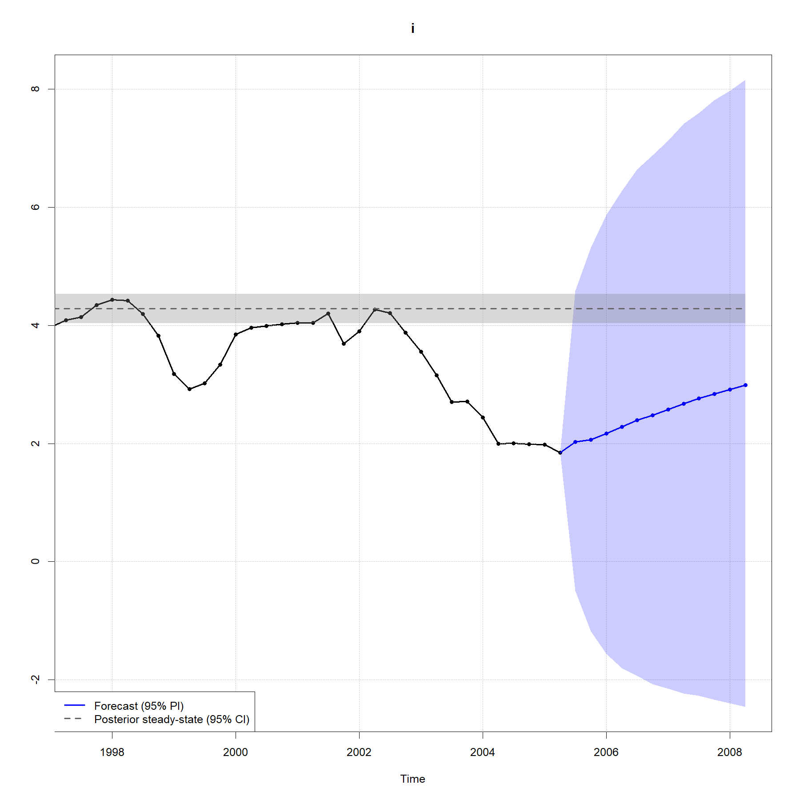
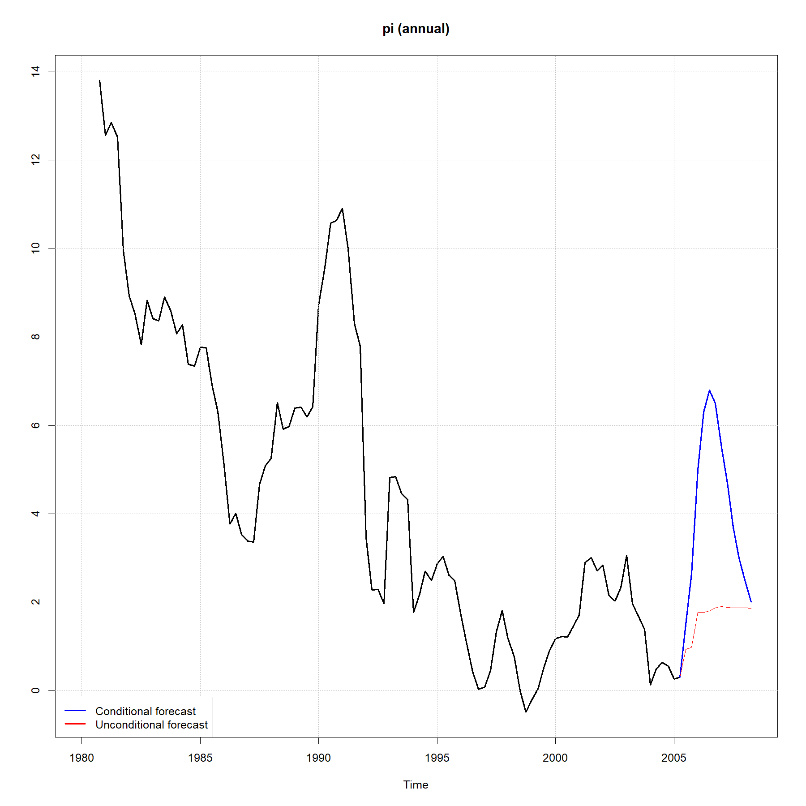
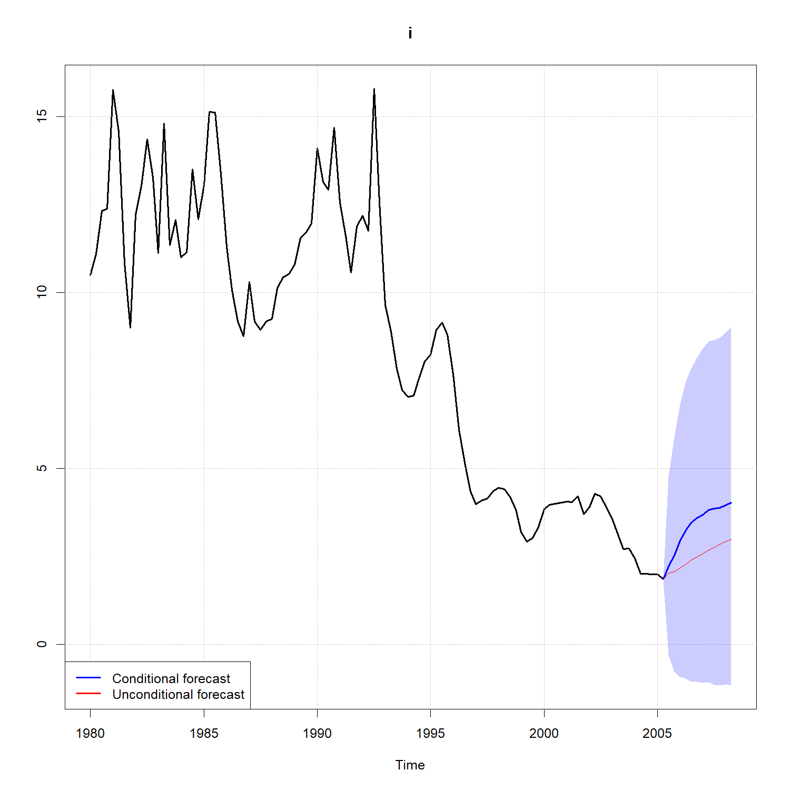
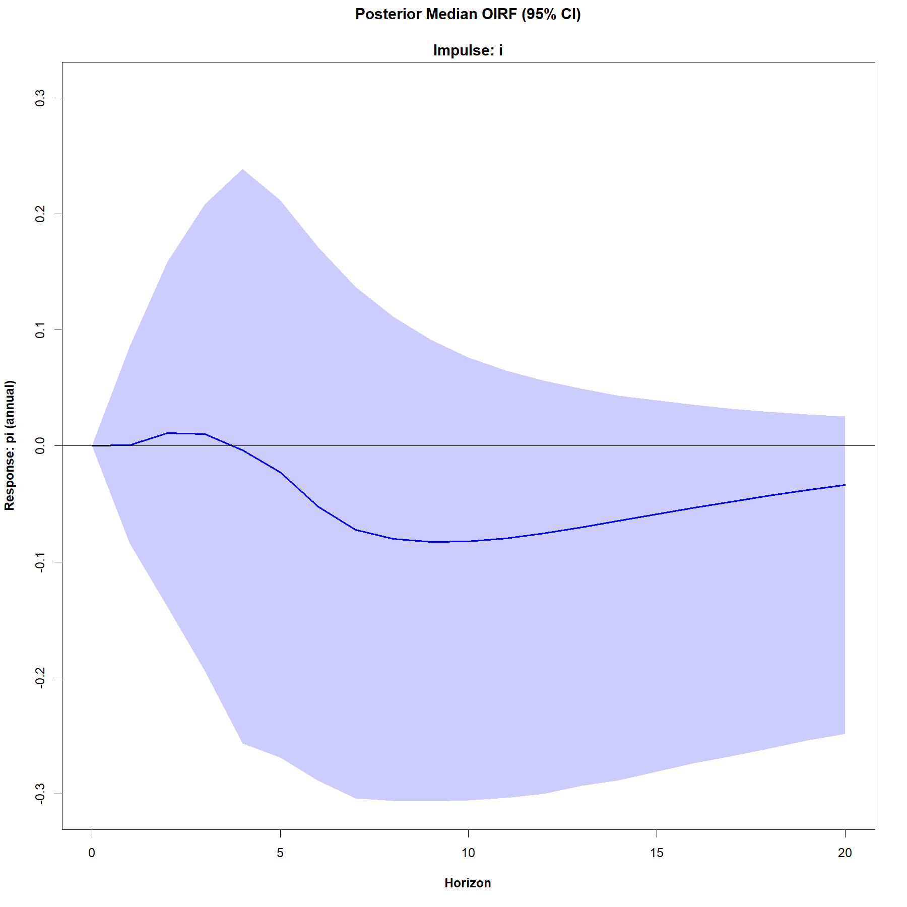
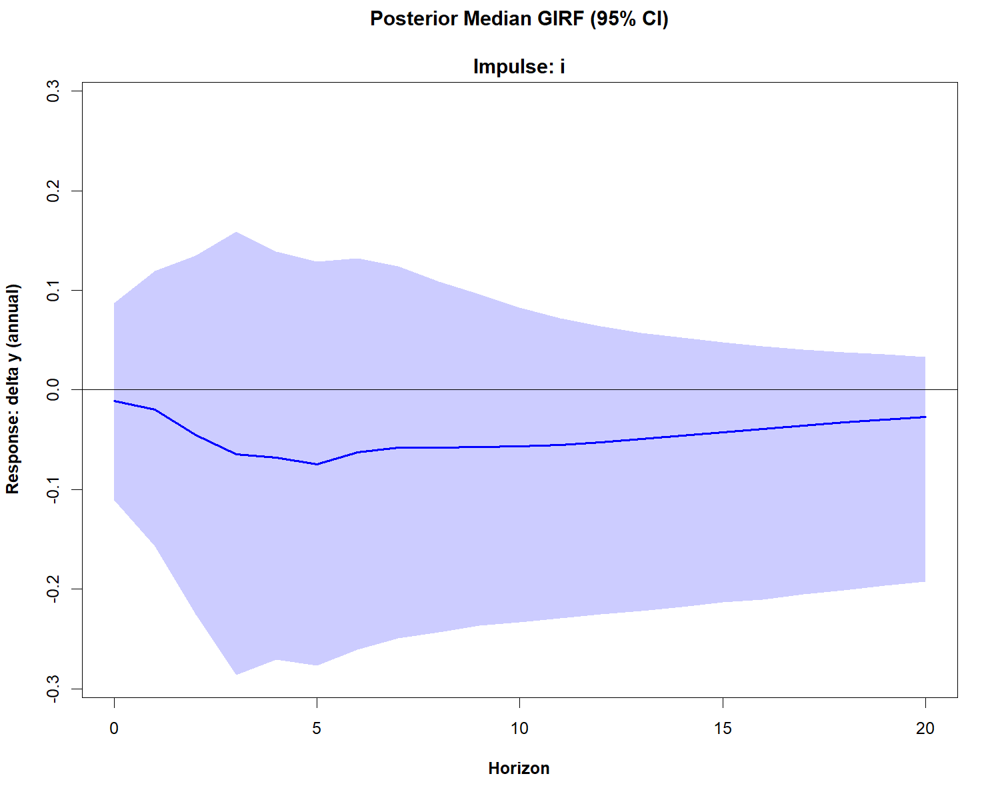

Here we estimate the original (homoscedastic - i.e. constant innovation covariance matrix $\Sigma_{u}$) steady-state BVAR model from Section 4.1 of Villani (2009). See `?bvar` for details on the model.

First, let us attach the package and load the data.


``` r
library(SteadyStateBVAR)
data("Villani2009")
yt <- Villani2009
```
The data set contains quarterly data for Sweden over the time period 1980Q1–2005Q4. The seven variables are: trade-weighted measures of foreign GDP growth $(\Delta y_f)$, CPI inflation $(\pi_f)$ and the 3-month interest rate $(i_f)$, the corresponding domestic variables ($\Delta y$, $\pi$ and $i$), and the level of the real exchange rate defined as $q=s+p_f-p$, where $p_f$ and $p$ are the foreign and domestic CPI levels (in logs) and $s$ is the (log of the) trade-weighted nominal exchange rate. As such, we have

$$
y_t=
\begin{pmatrix}
\Delta y_f \\
\pi_f \\
i_f \\
\Delta y \\
\pi \\
i \\
q
\end{pmatrix}
$$

Also, we will leave out the last two observations, so the user can compare the forecasts produced here to the last forecasts seen in Figures 1-3 in Villani (2009) to verify that this implementation works correctly.


``` r
yt <- ts(yt[1:102, ], start = start(yt), frequency = frequency(yt))
plot.ts(yt)
```


Also, let us create the bvar object which we will use throughout here.


``` r
bvar_obj <- bvar(data = yt)
```

To model the Swedish financial crisis at the beginning of the 90s and the subsequent shift in monetary policy to inflation targeting and flexible exchange rate, $d_t$ (deterministic variables at time $t$) includes a constant term and a dummy for the pre-crisis period, i.e.


$$
d_{t}' =
\begin{cases}
\begin{pmatrix}1 & 1\end{pmatrix} & \text{if } t \le 1992Q4 \\
\begin{pmatrix}1 & 0\end{pmatrix} & \text{if } t > 1992Q4
\end{cases}
$$


``` r
breakpoint <- which(time(yt) == 1992.75)
dum_var <- c(rep(1,breakpoint), rep(0,nrow(yt)-breakpoint))
```

To formulate a prior on $\Psi$, note that the specification of $d_t$ implies the following parametrization of the steady state:


$$
\mu_t =
\begin{cases}
\psi_1 + \psi_2 & \text{if } t \le 1992Q4 \\
\psi_1 & \text{if } t > 1992Q4
\end{cases}
$$


where $\psi_i$ denotes the $i$:th column of $\Psi$. We are now ready to set up the model. Although it is not mentioned which lag length is used in Villani (2009), we assume $p=4$.


``` r
bvar_obj <- setup(bvar_obj,
                  p=4,
                  deterministic = "constant_and_dummy",
                  dummy = dum_var)
```

Now let us specify the priors. We first consider $\beta$ (Minnesota prior). We choose the same values for the hyperparameters as in Villani (2009), i.e. an overall tightness of $\lambda_1=0.2$, a cross-equation tightness of $\lambda_2=0.5$, and a lag decay rate of $\lambda_3=1$. We then specify the prior means for the first own lags of the variables. We follow Villani (2009), and as such for variables in growth rates, we set the prior mean to $0$. For variables in levels, we set the prior mean to $0.9$.


``` r
lambda_1 <- 0.2
lambda_2 <- 0.5
lambda_3 <- 1.0

#fol_pm = first own lag prior means
fol_pm=c(0,   #delta y_f
         0,   #pi_f
         0.9, #i_f
         0,   #delta y
         0,   #pi
         0.9, #i
         0.9  #q
         )
```

Now moving on to $\Psi$, i.r. the steady-state priors, we set them according to the 95\% prior probability intervals (normal distribution) in Table I in Villani (2009). We first note that for our data here, the growth rate variables ($\Delta y_f, \pi_f, \Delta y, \pi$) are specified in terms of quarterly rates of change/quarter-on-quarter growth, i.e. for a variable $x$ which is on a quarterly frequency (`freq=4`), the quarterly growth rate is $100(\ln (x_t) - \ln x_{t-1})$. The 95% prior probability intervals in Table I are specified in terms of annualized quarterly growth rates $400(\ln (x_t) - \ln x_{t-1})$.

The `ppi()` function is useful here. Simply input the desired 95\% prior probability interval (normal distribution) on the annualized scale with `annualized_growthrate=TRUE` with the correct frequency `freq`, and the function returns the corresponding prior mean and variance on the original scale (quarter-on-quarter growth). Of course, we could also just annualize our data beforehand, and set `annualized_growthrate=FALSE`.


``` r
#psi_1 = Psi col 1
#psi_2 = Psi col 2

theta_Psi <- 
  c(
  ppi( 2.00,  3.00, interval=0.95, annualized_growthrate=TRUE, freq=4)$mean, #psi_1: delta y_f
  ppi( 1.50,  2.50, interval=0.95, annualized_growthrate=TRUE, freq=4)$mean, #psi_1: pi_f
  ppi( 4.50,  5.50, interval=0.95                                    )$mean, #psi_1: i_f
  ppi( 2.00,  2.50, interval=0.95, annualized_growthrate=TRUE, freq=4)$mean, #psi_1: delta y
  ppi( 1.70,  2.30, interval=0.95, annualized_growthrate=TRUE, freq=4)$mean, #psi_1: pi
  ppi( 4.00,  4.50, interval=0.95                                    )$mean, #psi_1: i
  ppi( 3.85,  4.00, interval=0.95                                    )$mean, #psi_1: q
  ppi(-1.00,  1.00, interval=0.95, annualized_growthrate=TRUE, freq=4)$mean, #psi_2: delta y_f
  ppi( 1.50,  2.50, interval=0.95, annualized_growthrate=TRUE, freq=4)$mean, #psi_2: pi_f
  ppi( 1.50,  2.50, interval=0.95                                    )$mean, #psi_2: i_f
  ppi(-1.00,  1.00, interval=0.95, annualized_growthrate=TRUE, freq=4)$mean, #psi_2: delta y
  ppi( 4.30,  5.70, interval=0.95, annualized_growthrate=TRUE, freq=4)$mean, #psi_2: pi
  ppi( 3.00,  5.50, interval=0.95                                    )$mean, #psi_2: i
  ppi(-0.50,  0.50, interval=0.95                                    )$mean  #psi_2: q
  )

Omega_Psi <- 
  diag(
  c(
  ppi( 2.00,  3.00, interval=0.95, annualized_growthrate=TRUE, freq=4)$var, #psi_1: delta y_f
  ppi( 1.50,  2.50, interval=0.95, annualized_growthrate=TRUE, freq=4)$var, #psi_1: pi_f
  ppi( 4.50,  5.50, interval=0.95                                    )$var, #psi_1: i_f
  ppi( 2.00,  2.50, interval=0.95, annualized_growthrate=TRUE, freq=4)$var, #psi_1: delta y
  ppi( 1.70,  2.30, interval=0.95, annualized_growthrate=TRUE, freq=4)$var, #psi_1: pi
  ppi( 4.00,  4.50, interval=0.95                                    )$var, #psi_1: i
  ppi( 3.85,  4.00, interval=0.95                                    )$var, #psi_1: q
  ppi(-1.00,  1.00, interval=0.95, annualized_growthrate=TRUE, freq=4)$var, #psi_2: delta y_f
  ppi( 1.50,  2.50, interval=0.95, annualized_growthrate=TRUE, freq=4)$var, #psi_2: pi_f
  ppi( 1.50,  2.50, interval=0.95                                    )$var, #psi_2: i_f
  ppi(-1.00,  1.00, interval=0.95, annualized_growthrate=TRUE, freq=4)$var, #psi_2: delta y
  ppi( 4.30,  5.70, interval=0.95, annualized_growthrate=TRUE, freq=4)$var, #psi_2: pi
  ppi( 3.00,  5.50, interval=0.95                                    )$var, #psi_2: i
  ppi(-0.50,  0.50, interval=0.95                                    )$var  #psi_2: q
  )
  )
```

Finally for $\Sigma_u$ we will use the noninformative Jeffreys prior $\left|\Sigma_u \right|^{-(k+1)/2}$, as done in Villani (2009). Now we simply pass everything to the `priors()` function.


``` r
bvar_obj <- priors(bvar_obj,
                   lambda_1,
                   lambda_2,
                   lambda_3,
                   fol_pm,
                   theta_Psi,
                   Omega_Psi,
                   Jeffreys=TRUE)
```

We can plot our steady-state priors now after we have passed them to `priors()`
                                     

``` r
par(mfrow=c(3,3))
steady_state_priors_plot(bvar_obj, interval = 0.95, growth_rate_idx = c(1,2,4,5))
par(mfrow=c(1,1))
```


Continuing, as in Villani (2009), we incorporate the assumption that Sweden is a small economy and therefore unlikely to affect the foreign economy by restricting the upper-right submatrix of $\Pi_\ell$ for $\ell =1,\dots,p$ or equivalently restricting the bottom-left submatrix of $\Pi_\ell'$ to the zero matrix. This technique is called "block exogeneity" (Dieppe, Legrand, and van Roye, 2016). In essence we treat the foreign economy as exogenous to the domestic economy, although it is not exogenous in the strict sense (Karlsson, 2013).


``` r
p <- bvar_obj$setup$p
k <- bvar_obj$setup$k
kf <- 3 #first 3 variables are foreign in yt

restriction_matrix <- matrix(1, k*p, k)

for(i in 1:p){
  rows <- ((i-1)*k + kf + 1) : (i*k)
  cols <- 1:kf
  restriction_matrix[rows, cols] <- 0
}
```
We simply pass our $(kp \times k)$ restriction matrix to the `restrict_beta()` function:


``` r
bvar_obj <- restrict_beta(bvar_obj, restriction_matrix)
#> Restrictions applied using restriction matrix:
#> 
#>              delta y_f pi_f i_f delta y pi i q
#> delta y_f.l1         1    1   1       1  1 1 1
#> pi_f.l1              1    1   1       1  1 1 1
#> i_f.l1               1    1   1       1  1 1 1
#> delta y.l1           0    0   0       1  1 1 1
#> pi.l1                0    0   0       1  1 1 1
#> i.l1                 0    0   0       1  1 1 1
#> q.l1                 0    0   0       1  1 1 1
#> delta y_f.l2         1    1   1       1  1 1 1
#> pi_f.l2              1    1   1       1  1 1 1
#> i_f.l2               1    1   1       1  1 1 1
#> delta y.l2           0    0   0       1  1 1 1
#> pi.l2                0    0   0       1  1 1 1
#> i.l2                 0    0   0       1  1 1 1
#> q.l2                 0    0   0       1  1 1 1
#> delta y_f.l3         1    1   1       1  1 1 1
#> pi_f.l3              1    1   1       1  1 1 1
#> i_f.l3               1    1   1       1  1 1 1
#> delta y.l3           0    0   0       1  1 1 1
#> pi.l3                0    0   0       1  1 1 1
#> i.l3                 0    0   0       1  1 1 1
#> q.l3                 0    0   0       1  1 1 1
#> delta y_f.l4         1    1   1       1  1 1 1
#> pi_f.l4              1    1   1       1  1 1 1
#> i_f.l4               1    1   1       1  1 1 1
#> delta y.l4           0    0   0       1  1 1 1
#> pi.l4                0    0   0       1  1 1 1
#> i.l4                 0    0   0       1  1 1 1
#> q.l4                 0    0   0       1  1 1 1
#> 
#> 1 indicates that the parameter is free
#> 0 indicates that the parameter is restricted to zero
```

The function tells us which autoregressive parameters in $\beta$ we restrict to zero. 

Now we are almost ready to fit (estimate) the model. When estimating the model, we are at the same time generating draws from the joint predictive distribution.
To accomplish the latter, we need the forecast horizon $H$, and also a matrix containing the deterministic variables ($d_t$) for the future periods

$$
d_{\text{pred}}=\begin{bmatrix}d_{T+1}' \\
\vdots\\
d_{T+H}'
\end{bmatrix}
$$

Since the deterministic variables are i) a constant and ii) a dummy indicating whether $t \leq 1992Q4$, we simply set

$$
d_{T+1}'=\ldots=d_{T+H}'=\begin{pmatrix} 1 & 0 \end{pmatrix}
$$


``` r
d_pred <- cbind(rep(1, 12), 0)
```

However, `fit()` automatically creates `d_pred`, so we do not need to bother with it.

For the estimation, let us choose 4 markov chains, with each having 4000 iterations, and where 2000 of those 4000 are warmup/burn-in iterations.


``` r
bvar_obj <- fit(bvar_obj,
                H = 12,
                iter = 10000,
                warmup = 2500,
                chains = 4,
                cores = 4)
#> NOTE: d_pred not supplied
#> it is assumed that the dummy stays at its last observed value (0) for all 12 forecast periods.
#> ------------------------------------------------------------
#> Forecast horizon:
#> 12
#> 
#> Future deterministic variables (d_pred):
#>      constant dummy
#> h=1         1     0
#> h=2         1     0
#> h=3         1     0
#> h=4         1     0
#> h=5         1     0
#> h=6         1     0
#> h=7         1     0
#> h=8         1     0
#> h=9         1     0
#> h=10        1     0
#> h=11        1     0
#> h=12        1     0
#> ------------------------------------------------------------
#> Estimating Stan model:
#> steady_state_bvar_homoscedastic_jeffreys_prior
#> 
#> Also generating draws from the joint predictive distribution
#> 
#> ...
#> SAMPLING FINISHED
```

Let us look at the elementwise posterior means of $\beta$, $\Psi$, and $\Sigma_u$.


``` r
summary(bvar_obj)
#> Posterior mean estimates
#> ------------------------
#> 
#> 
#> beta
#> --------------------------------------------------------------------------------              
#>                delta y_f  pi_f   i_f delta y    pi     i     q
#>   delta y_f.l1      0.18  0.03 -0.01    0.12  0.07 -0.12  0.00
#>   pi_f.l1          -0.02  0.32  0.25    0.12 -0.07  0.01  0.00
#>   i_f.l1            0.00  0.04  0.92   -0.04  0.06  0.05  0.00
#>   delta y.l1        0.00  0.00  0.00    0.23 -0.09 -0.10  0.00
#>   pi.l1             0.00  0.00  0.00    0.00  0.08  0.06  0.00
#>   i.l1              0.00  0.00  0.00    0.00  0.02  0.76  0.00
#>   q.l1              0.00  0.00  0.00    1.21  3.96  0.73  0.93
#>   delta y_f.l2      0.03 -0.01  0.09    0.02 -0.02  0.10  0.00
#>   pi_f.l2           0.01  0.02  0.04    0.00 -0.03 -0.15  0.00
#>   i_f.l2           -0.02 -0.01 -0.01    0.00  0.04  0.07  0.00
#>   delta y.l2        0.00  0.00  0.00    0.11 -0.01  0.15  0.00
#>   pi.l2             0.00  0.00  0.00    0.01 -0.04 -0.05  0.00
#>   i.l2              0.00  0.00  0.00   -0.01  0.01  0.04  0.00
#>   q.l2              0.00  0.00  0.00    0.56 -0.39  0.30 -0.04
#>   delta y_f.l3      0.01 -0.01  0.00    0.02 -0.01  0.00  0.00
#>   pi_f.l3          -0.02  0.06 -0.01    0.00  0.08  0.02  0.00
#>   i_f.l3            0.00  0.00  0.02    0.00  0.00  0.03  0.00
#>   delta y.l3        0.00  0.00  0.00    0.06  0.01 -0.02  0.00
#>   pi.l3             0.00  0.00  0.00    0.00  0.02 -0.02  0.00
#>   i.l3              0.00  0.00  0.00    0.01  0.00  0.01  0.00
#>   q.l3              0.00  0.00  0.00   -0.14 -0.03 -0.59  0.00
#>   delta y_f.l4      0.03 -0.01  0.00   -0.01  0.03  0.02  0.00
#>   pi_f.l4           0.00  0.16 -0.03    0.00  0.01  0.02  0.00
#>   i_f.l4            0.00  0.00 -0.02    0.00  0.00  0.03  0.00
#>   delta y.l4        0.00  0.00  0.00   -0.08  0.01  0.03  0.00
#>   pi.l4             0.00  0.00  0.00    0.00  0.06 -0.01  0.00
#>   i.l4              0.00  0.00  0.00    0.00 -0.01  0.00  0.00
#>   q.l4              0.00  0.00  0.00   -0.15 -0.07 -0.17 -0.01
#> --------------------------------------------------------------------------------
#> 
#> 
#> Psi
#> --------------------------------------------------------------------------------           
#>             [,1]  [,2]
#>   delta y_f 0.58  0.08
#>   pi_f      0.50  0.46
#>   i_f       4.95  2.02
#>   delta y   0.58 -0.03
#>   pi        0.49  1.15
#>   i         4.29  4.46
#>   q         3.92 -0.10
#> --------------------------------------------------------------------------------
#> 
#> 
#> Sigma_u
#> --------------------------------------------------------------------------------           
#>             delta y_f  pi_f  i_f delta y    pi     i     q
#>   delta y_f      0.15 -0.01 0.01    0.07 -0.01  0.00  0.00
#>   pi_f          -0.01  0.09 0.05    0.01  0.13  0.04  0.00
#>   i_f            0.01  0.05 0.52    0.01  0.18  0.11  0.00
#>   delta y        0.07  0.01 0.01    0.19 -0.05 -0.01  0.00
#>   pi            -0.01  0.13 0.18   -0.05  0.60  0.12  0.00
#>   i              0.00  0.04 0.11   -0.01  0.12  1.56 -0.01
#>   q              0.00  0.00 0.00    0.00  0.00 -0.01  0.00
#> --------------------------------------------------------------------------------
```

We can access the elementwise posterior means or medians with `bvar_obj$fit$posterior_means`/`bvar_obj$fit$posterior_medians` if needed.

Note that `bvar_obj$fit$stan` is an object of class `stanfit`.


``` r
(stanfit <- bvar_obj$fit$stan)
#> Inference for Stan model: steady_state_bvar_homoscedastic_jeffreys_prior.
#> 4 chains, each with iter=10000; warmup=2500; thin=1; 
#> post-warmup draws per chain=7500, total post-warmup draws=30000.
#> 
#>                  mean se_mean    sd   2.5%    25%    50%    75%  97.5% n_eff Rhat
#> beta[1,1]        0.18    0.00  0.09   0.00   0.12   0.18   0.24   0.36 46437    1
#> beta[1,2]        0.03    0.00  0.05  -0.07   0.00   0.03   0.06   0.13 51134    1
#> beta[1,3]       -0.01    0.00  0.13  -0.27  -0.10  -0.01   0.08   0.24 48873    1
#> beta[1,4]        0.12    0.00  0.08  -0.05   0.06   0.12   0.18   0.28 46125    1
#> beta[1,5]        0.07    0.00  0.14  -0.20  -0.02   0.07   0.17   0.34 46822    1
#> beta[1,6]       -0.12    0.00  0.24  -0.60  -0.28  -0.12   0.04   0.36 53181    1
#> beta[1,7]        0.00    0.00  0.01  -0.02  -0.01   0.00   0.00   0.01 51711    1
#> beta[2,1]       -0.02    0.00  0.09  -0.20  -0.08  -0.02   0.04   0.16 46565    1
#> beta[2,2]        0.32    0.00  0.08   0.16   0.26   0.32   0.37   0.47 43254    1
#> beta[2,3]        0.25    0.00  0.17  -0.08   0.14   0.25   0.36   0.58 47631    1
#> beta[2,4]        0.12    0.00  0.11  -0.09   0.05   0.12   0.19   0.33 46512    1
#> beta[2,5]       -0.07    0.00  0.20  -0.46  -0.20  -0.07   0.06   0.31 40654    1
#> beta[2,6]        0.01    0.00  0.32  -0.61  -0.20   0.01   0.22   0.63 46556    1
#> beta[2,7]        0.00    0.00  0.01  -0.01   0.00   0.00   0.01   0.02 53638    1
#> beta[3,1]        0.00    0.00  0.03  -0.06  -0.03   0.00   0.02   0.05 42785    1
#> beta[3,2]        0.04    0.00  0.02   0.00   0.03   0.04   0.05   0.08 45146    1
#> beta[3,3]        0.92    0.00  0.08   0.77   0.87   0.92   0.97   1.07 43902    1
#> beta[3,4]       -0.04    0.00  0.04  -0.11  -0.06  -0.04  -0.01   0.03 39187    1
#> beta[3,5]        0.06    0.00  0.06  -0.06   0.01   0.06   0.10   0.18 40928    1
#> beta[3,6]        0.05    0.00  0.11  -0.16  -0.02   0.05   0.12   0.26 44827    1
#> beta[3,7]        0.00    0.00  0.00   0.00   0.00   0.00   0.00   0.01 49028    1
#> beta[4,1]        0.00    0.00  0.00   0.00   0.00   0.00   0.00   0.00 31058    1
#> beta[4,2]        0.00    0.00  0.00   0.00   0.00   0.00   0.00   0.00 29828    1
#> beta[4,3]        0.00    0.00  0.00   0.00   0.00   0.00   0.00   0.00 31297    1
#> beta[4,4]        0.23    0.00  0.09   0.06   0.17   0.23   0.29   0.40 41963    1
#> beta[4,5]       -0.09    0.00  0.12  -0.32  -0.17  -0.09  -0.01   0.14 44335    1
#> beta[4,6]       -0.10    0.00  0.20  -0.50  -0.24  -0.10   0.04   0.30 47813    1
#> beta[4,7]        0.00    0.00  0.00  -0.01   0.00   0.00   0.00   0.01 46199    1
#> beta[5,1]        0.00    0.00  0.00   0.00   0.00   0.00   0.00   0.00 31001    1
#> beta[5,2]        0.00    0.00  0.00   0.00   0.00   0.00   0.00   0.00 30683    1
#> beta[5,3]        0.00    0.00  0.00   0.00   0.00   0.00   0.00   0.00 31239    1
#> beta[5,4]        0.00    0.00  0.04  -0.08  -0.02   0.00   0.03   0.08 47281    1
#> beta[5,5]        0.08    0.00  0.09  -0.09   0.02   0.08   0.13   0.24 42800    1
#> beta[5,6]        0.06    0.00  0.12  -0.18  -0.02   0.06   0.14   0.30 48919    1
#> beta[5,7]        0.00    0.00  0.00  -0.01   0.00   0.00   0.00   0.00 45843    1
#> beta[6,1]        0.00    0.00  0.00   0.00   0.00   0.00   0.00   0.00 31237    1
#> beta[6,2]        0.00    0.00  0.00   0.00   0.00   0.00   0.00   0.00 30926    1
#> beta[6,3]        0.00    0.00  0.00   0.00   0.00   0.00   0.00   0.00 30853    1
#> beta[6,4]        0.00    0.00  0.02  -0.04  -0.01   0.00   0.01   0.04 44614    1
#> beta[6,5]        0.02    0.00  0.04  -0.05   0.00   0.02   0.04   0.09 42491    1
#> beta[6,6]        0.76    0.00  0.08   0.60   0.70   0.76   0.82   0.93 42999    1
#> beta[6,7]        0.00    0.00  0.00   0.00   0.00   0.00   0.00   0.00 38203    1
#> beta[7,1]        0.00    0.00  0.00   0.00   0.00   0.00   0.00   0.00 31063    1
#> beta[7,2]        0.00    0.00  0.00   0.00   0.00   0.00   0.00   0.00 31569    1
#> beta[7,3]        0.00    0.00  0.00   0.00   0.00   0.00   0.00   0.00 30378    1
#> beta[7,4]        1.21    0.00  0.87  -0.50   0.61   1.21   1.79   2.91 41110    1
#> beta[7,5]        3.96    0.01  1.44   1.10   3.00   3.97   4.94   6.76 43331    1
#> beta[7,6]        0.73    0.01  2.59  -4.35  -1.01   0.73   2.46   5.86 40475    1
#> beta[7,7]        0.93    0.00  0.08   0.78   0.88   0.93   0.98   1.09 41342    1
#> beta[8,1]        0.03    0.00  0.07  -0.11  -0.02   0.03   0.08   0.17 52115    1
#> beta[8,2]       -0.01    0.00  0.03  -0.07  -0.03  -0.01   0.01   0.05 53869    1
#> beta[8,3]        0.09    0.00  0.08  -0.07   0.04   0.09   0.15   0.25 52231    1
#> beta[8,4]        0.02    0.00  0.05  -0.07  -0.01   0.02   0.06   0.12 54920    1
#> beta[8,5]       -0.02    0.00  0.09  -0.19  -0.07  -0.02   0.04   0.15 55269    1
#> beta[8,6]        0.10    0.00  0.15  -0.20   0.00   0.10   0.20   0.39 57522    1
#> beta[8,7]        0.00    0.00  0.00  -0.01   0.00   0.00   0.00   0.01 51892    1
#> beta[9,1]        0.01    0.00  0.06  -0.12  -0.03   0.01   0.05   0.13 53699    1
#> beta[9,2]        0.02    0.00  0.07  -0.11  -0.02   0.02   0.07   0.15 48306    1
#> beta[9,3]        0.04    0.00  0.11  -0.18  -0.03   0.04   0.12   0.27 54674    1
#> beta[9,4]        0.00    0.00  0.07  -0.14  -0.05   0.00   0.05   0.14 52031    1
#> beta[9,5]       -0.03    0.00  0.12  -0.27  -0.11  -0.03   0.05   0.21 48704    1
#> beta[9,6]       -0.15    0.00  0.21  -0.56  -0.29  -0.15  -0.01   0.26 52641    1
#> beta[9,7]        0.00    0.00  0.00  -0.01   0.00   0.00   0.01   0.01 52058    1
#> beta[10,1]      -0.02    0.00  0.02  -0.06  -0.03  -0.02   0.00   0.03 49784    1
#> beta[10,2]      -0.01    0.00  0.02  -0.04  -0.02  -0.01   0.00   0.02 50792    1
#> beta[10,3]      -0.01    0.00  0.07  -0.15  -0.06  -0.01   0.04   0.14 46083    1
#> beta[10,4]       0.00    0.00  0.03  -0.05  -0.02   0.00   0.02   0.05 51493    1
#> beta[10,5]       0.04    0.00  0.05  -0.05   0.01   0.04   0.07   0.13 52451    1
#> beta[10,6]       0.07    0.00  0.08  -0.09   0.02   0.07   0.12   0.22 50919    1
#> beta[10,7]       0.00    0.00  0.00   0.00   0.00   0.00   0.00   0.00 48089    1
#> beta[11,1]       0.00    0.00  0.00   0.00   0.00   0.00   0.00   0.00 30939    1
#> beta[11,2]       0.00    0.00  0.00   0.00   0.00   0.00   0.00   0.00 30631    1
#> beta[11,3]       0.00    0.00  0.00   0.00   0.00   0.00   0.00   0.00 30677    1
#> beta[11,4]       0.11    0.00  0.07  -0.02   0.07   0.11   0.16   0.25 54711    1
#> beta[11,5]      -0.01    0.00  0.08  -0.16  -0.06  -0.01   0.04   0.14 54121    1
#> beta[11,6]       0.15    0.00  0.13  -0.11   0.06   0.15   0.24   0.41 54940    1
#> beta[11,7]       0.00    0.00  0.00  -0.01   0.00   0.00   0.00   0.01 54673    1
#> beta[12,1]       0.00    0.00  0.00   0.00   0.00   0.00   0.00   0.00 31039    1
#> beta[12,2]       0.00    0.00  0.00   0.00   0.00   0.00   0.00   0.00 31006    1
#> beta[12,3]       0.00    0.00  0.00   0.00   0.00   0.00   0.00   0.00 29843    1
#> beta[12,4]       0.01    0.00  0.02  -0.04  -0.01   0.01   0.03   0.06 53035    1
#> beta[12,5]      -0.04    0.00  0.07  -0.18  -0.09  -0.04   0.00   0.09 51523    1
#> beta[12,6]      -0.05    0.00  0.08  -0.20  -0.10  -0.05   0.00   0.10 53949    1
#> beta[12,7]       0.00    0.00  0.00   0.00   0.00   0.00   0.00   0.00 42484    1
#> beta[13,1]       0.00    0.00  0.00   0.00   0.00   0.00   0.00   0.00 29044    1
#> beta[13,2]       0.00    0.00  0.00   0.00   0.00   0.00   0.00   0.00 30541    1
#> beta[13,3]       0.00    0.00  0.00   0.00   0.00   0.00   0.00   0.00 30790    1
#> beta[13,4]      -0.01    0.00  0.01  -0.04  -0.02  -0.01   0.00   0.02 52512    1
#> beta[13,5]       0.01    0.00  0.03  -0.04   0.00   0.01   0.03   0.06 51775    1
#> beta[13,6]       0.04    0.00  0.07  -0.10  -0.01   0.04   0.09   0.18 48664    1
#> beta[13,7]       0.00    0.00  0.00   0.00   0.00   0.00   0.00   0.00 35948    1
#> beta[14,1]       0.00    0.00  0.00   0.00   0.00   0.00   0.00   0.00 30406    1
#> beta[14,2]       0.00    0.00  0.00   0.00   0.00   0.00   0.00   0.00 29957    1
#> beta[14,3]       0.00    0.00  0.00   0.00   0.00   0.00   0.00   0.00 30975    1
#> beta[14,4]       0.56    0.00  0.65  -0.72   0.11   0.56   1.00   1.83 50286    1
#> beta[14,5]      -0.39    0.01  1.15  -2.63  -1.16  -0.39   0.38   1.88 48302    1
#> beta[14,6]       0.30    0.01  1.98  -3.60  -1.05   0.32   1.65   4.20 48260    1
#> beta[14,7]      -0.04    0.00  0.08  -0.19  -0.09  -0.04   0.01   0.11 44416    1
#> beta[15,1]       0.01    0.00  0.05  -0.10  -0.03   0.01   0.05   0.11 51267    1
#> beta[15,2]      -0.01    0.00  0.02  -0.05  -0.03  -0.01   0.00   0.03 59928    1
#>  [ reached 'max' / getOption("max.print") -- omitted 1259 rows ]
#> 
#> Samples were drawn using NUTS(diag_e) at Thu Sep 10 01:50:25 2026.
#> For each parameter, n_eff is a crude measure of effective sample size,
#> and Rhat is the potential scale reduction factor on split chains (at 
#> convergence, Rhat=1).
```

As such, we can do the usual `rstan` inference on our fitted model. Let us plot the posterior draws of the post-crisis steady-state $\mu_{t,i}$ of inflation
at t = 102, i.e. $\mu_{t=102, i=5}$ Note that the index in the code is 98 because we have 102 observations where the first $p=4$ are lost due to effective sample size $T=N-p$.


``` r
rstan::plot(stanfit, pars=c("mu[98,5]"), plotfun="hist")
#> `stat_bin()` using `bins = 30`. Pick better value `binwidth`.
```


We need to multiply the steady-state coefficient by 4 to obtain the annualized rate.


``` r
posterior <- rstan::extract(stanfit)
hist(4*posterior$mu[,98,5], col="darkred", breaks=30, xlab="annualized steady-state of inflation (post 1992Q4)")
abline(v=mean(4*posterior$mu[,98,5]), col="lightgreen")
```


We can also look at the model forecasts directly with `rstan`. Remember that we left out the last two observations/quarters, so let us look at our forecasts of the domestic interest rate and compare them with the actual values.


``` r
(Villani2009[103:104,6]) #true values
#> [1] 1.478503 1.563795

rstan::plot(stanfit,
            pars=c("y_pred[1,6]", "y_pred[2,6]"),
            show_density = TRUE,
            ci_level = 0.95,
            fill_color = "blue")
#> ci_level: 0.95 (95% intervals)
#> outer_level: 0.95 (95% intervals)
```


So the model overshot a bit, but the true values are within the 68\% prediction interval. Now let us plot the forecasts along with the historical data. We will choose a 68\% prediction interval ("pi") and the mean of the predictive distribution as the point forecast. For variables in quarter-on-quarter growth rates, we transform the historical data and predictions to yearly growth rates with 'growth_rate_idx' where we specify the index of the growth rate variables in $y_t$. Note that this is not annualization, but we are now computing $100(\ln x_t - \ln x_{t-4})$, i.e. the annual growth rate, by summing up to fourth differences.


``` r
fcst <- forecast(bvar_obj,
                 pi = 0.95,
                 fcst_type = "mean",
                 growth_rate_idx = c(4,5),
                 plot_idx = c(4,5,6),
                 ss = TRUE,
                 ss_type = "mean",
                 ss_ci = 0.95,
                 show_all = FALSE)
```



For further inspection, we can print the point forecasts


``` r
print(fcst$forecast)
#>       delta y_f      pi_f      i_f  delta y        pi        i        q
#>  [1,] 0.6232309 0.5242887 2.826523 2.776007 0.9288749 2.031242 3.994740
#>  [2,] 0.6441053 0.4494223 3.023024 3.050973 0.9651777 2.051130 3.990940
#>  [3,] 0.6373686 0.4260083 3.166580 3.352142 1.7636922 2.146748 3.986330
#>  [4,] 0.6348143 0.4983103 3.275169 3.432423 1.7665549 2.251704 3.980970
#>  [5,] 0.6343813 0.4512704 3.397471 3.380542 1.7973297 2.369160 3.976022
#>  [6,] 0.6365850 0.4317153 3.505037 3.301506 1.8696717 2.451179 3.971736
#>  [7,] 0.6295738 0.4270615 3.595429 3.199789 1.8967162 2.548256 3.967720
#>  [8,] 0.6284451 0.4377247 3.677926 3.111044 1.8795492 2.651419 3.963862
#>  [9,] 0.6222429 0.4331940 3.759785 3.031630 1.8830658 2.732759 3.960474
#> [10,] 0.6204177 0.4323858 3.831147 2.959403 1.8857227 2.809352 3.957685
#> [11,] 0.6191520 0.4300933 3.888903 2.908657 1.8737300 2.887377 3.955187
#> [12,] 0.6161729 0.4367273 3.950198 2.860801 1.8668790 2.956900 3.952621
```


We can also perform conditional forecasting by following Algorithm 3.3.1 in Dieppe, Legrand, and van Roye (2016). Note that for the structural shocks, identification is based on the Cholesky factorisation. Also, please note the limitations of this method, see the detailed discussion in Section 5.4 of Dieppe, Legrand, and van Roye (2016).

Now suppose we are interested in the forecasts of the domestic interest rate $i$ conditional on a scenario where domestic inflation $\pi$ gets really high (post COVID type scenario). Economic theory says the short interest rate should rise.

First we set up our conditions/scenarios, i.e., which variables, which horizons, and which values the variables will take during those horizons. Our conditions are that $\pi$ will follow a specified path, at forecast horizons $h=1,\dots,H=12$.


``` r
conditions <- data.frame(
              var        = rep(5,12),
              horizon    = rep(1:12),
              value      = c(1.0,1.5,2.0,1.8, #Note: QoQ scale for inflation here
                             1.5,1.2,1.0,1.0,
                             rep(0.5,4))
              )
```

We then do the conditional forecasting. We again select a 95\% PI (prediction interval) and the mean of the predictive distribution as the point forecast.


``` r
cond_fcst <- conditional_forecast(bvar_obj,
                                  conditions,
                                  pi=0.95,
                                  fcst_type = "mean",
                                  plot_idx = c(5,6),
                                  growth_rate_idx = c(5))
```



The short interest rate rises more dramatically compared to the unconditional case. Makes sense.  

Now for some impulse response analysis. We can choose between the orthogonalized impulse response function (OIRF) and the generalized impulse response function (GIRF). Similar to forecasting, we can choose either the mean or the median (the default is the median), and we can also transform the IRFs for the quarter-on-quarter growth rate variables to the annual/yearly scale.


``` r
irf <- IRF(bvar_obj,H=20,response=5,impulse=6,type="median",method="OIRF",ci=0.95,growth_rate_idx=5)
```



``` r
irf <- IRF(bvar_obj,H=20,response=4,impulse=6,type="median",method="GIRF",ci=0.95,growth_rate_idx=4)
```




## References

Dieppe, A., Legrand, R., and van Roye, B. (2016). The BEAR toolbox. *Working Paper Series*, No. 1934. European Central Bank.

Karlsson, S. (2013). Forecasting with Bayesian vector autoregression. 
In: Elliott, G. and Timmermann, A. (eds), *Handbook of Economic Forecasting*. Elsevier B.V., Vol. 2, Part B, pp. 791–897.

Villani, M. (2009). Steady-state priors for vector autoregressions. *Journal of Applied Econometrics*, 24(4), pp. 630-650. 
