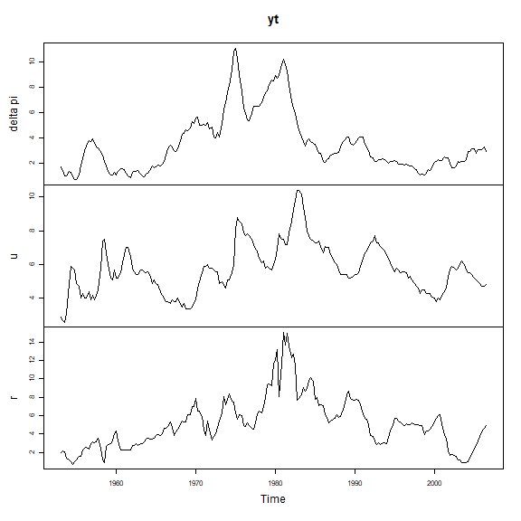
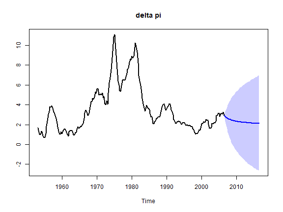
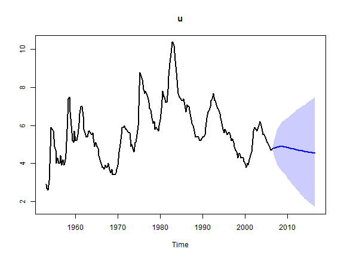
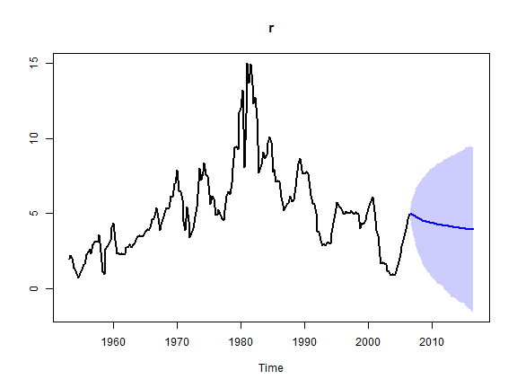
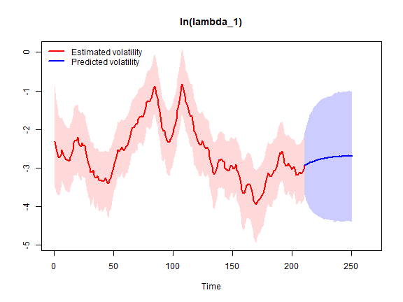
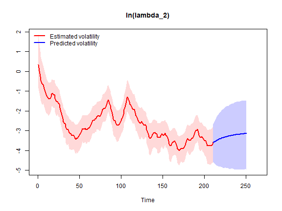
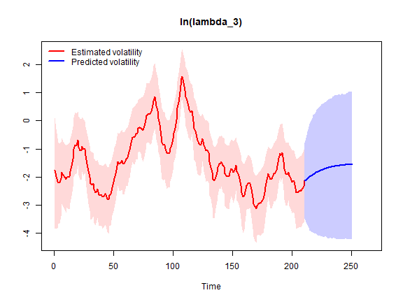
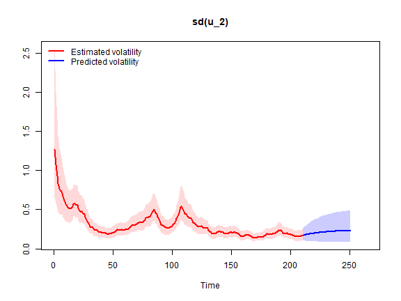
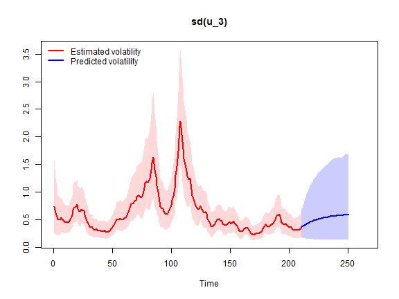
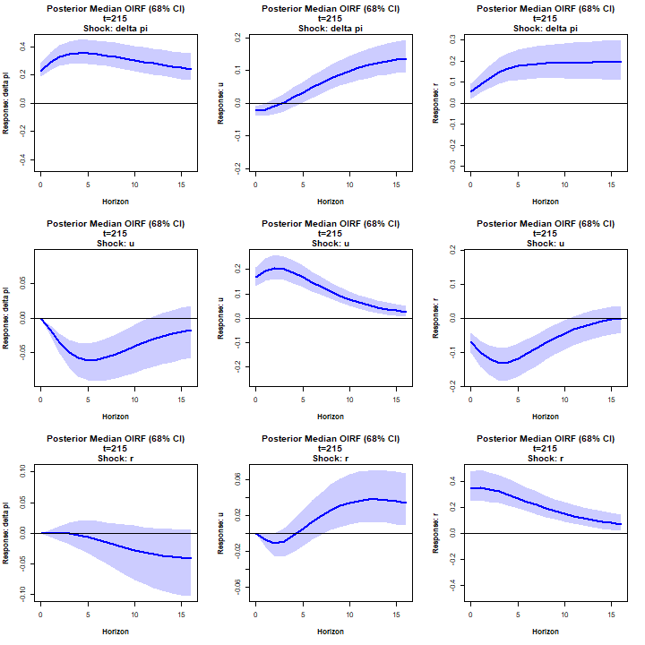

Here we estimate the steady-state BVAR model with Random Walk stochastic volatility from Clark (2011), which is an extension of the original homoscedastic steady-state BVAR model (Villani, 2009). See `?bvar` for details.

We will use a quarterly US data set from Koop and Korobilis (2010) on the inflation rate $\Delta \pi_t$ (the annual percentage change in a chain-weighted GDP price index), the unemployment rate $u_t$ (seasonally adjusted civilian unemployment rate, all civilian workers aged 16 years or older) and the interest rate $r_t$ (yield on the three-month Treasury bill rate). The sample is 1953Q1-2006Q3 and we have

$$
y_t = 
\begin{pmatrix} \Delta \pi_t \\
u_t \\
r_t
\end{pmatrix}
$$

First, let's load the package, then import and plot the data.


``` r
library(SteadyStateBVAR)
data("KoopKorobilis2010")
yt <- KoopKorobilis2010
plot.ts(yt)
```



Let's create the bvar object which we will use throughout here.


``` r
bvar_obj <- bvar(data = yt)
```

We choose 4 lags and only a constant as the deterministic variable.


``` r
bvar_obj <- setup(bvar_obj,
                  p=4,
                  deterministic = "constant")
```

We set the overall tightness to $\lambda_1 = 0.20$, cross-equation tightness to $\lambda_2 = 0.50$ and the lag decay rate to $\lambda_3 = 1.00$. For the prior means on the first own lags, we set them to $0.6$ for $\Delta \pi_t$ and $0.9$ for $u_t$ and $r_t$. Note that the prior mean on the first own lag of inflation is set to $0.6$ instead of $0$ to reflect some degree of persistence in the series (even though it is a growth rate variable).


``` r
lambda_1 <- 0.20
lambda_2 <- 0.50
lambda_3 <- 1.00

fol_pm=c(0.6, # delta pi
         0.9,  #u
         0.9)  #R
```

Now, for the steady-state coefficients we use some toy values (lets pretend that they are expert based).
Remember that we only have a constant now, so $q=1$ and therefore $\Psi$ only has one column $\psi_1=\Psi$. Since $d_t = 1 \ \forall \ t$, we have $\Psi d_t = \mu_t$ which simplifies to $\Psi = \mu$ and as such we can directly interpret $\Psi$ as the unconditional mean.


``` r
theta_Psi <- 
  c(
  ppi(1.90, 2.10, interval=0.95)$mean,   #Psi: delta pi
  ppi(3.80, 4.50, interval=0.95)$mean,   #Psi: u
  ppi(2.60, 3.90, interval=0.95)$mean    #Psi: r
  )

Omega_Psi <- 
  diag(
  c(
  ppi(1.90, 2.10, interval=0.95)$var,    #Psi: delta pi
  ppi(3.80, 4.50, interval=0.95)$var,    #Psi: u
  ppi(2.60, 3.90, interval=0.95)$var     #Psi: r
  )
  )
```

Now we need to specify our stochastic volatility priors. See `?priors` for more information about the prior specification.


``` r
k <- bvar_obj$setup$k
n_free_params_A <- bvar_obj$setup$n_free_params_A

SV_priors_RW <- list(
                     theta_A             =  rep(0, n_free_params_A),
                     Omega_A             =  diag(10, n_free_params_A),
                     mu_log_lambda_0     =  rep(0, k),
                     sigma2_log_lambda_0 =  rep(10, k),
                     alpha_phi           =  rep(5, k),
                     beta_phi            = (rep(5, k) - 1) * rep(0.1, k)
                     )
```

Let's put everything into the `priors()` function.


``` r
bvar_obj <- priors(bvar_obj,
                   lambda_1 = lambda_1,
                   lambda_2 = lambda_2,
                   lambda_3 = lambda_3,
                   first_own_lag_prior_mean =fol_pm,
                   theta_Psi = theta_Psi,
                   Omega_Psi = Omega_Psi,
                   SV = TRUE,
                   SV_type = "RW",
                   SV_priors = SV_priors_RW)
```

Now we can fit the model


``` r
bvar_obj <- fit(bvar_obj,
                H = 40,
                d_pred = matrix(rep(1,40)),
                iter = 12500,
                warmup = 2500,
                chains = 2,
                cores = 2)
#> Warning: There were 2 chains where the estimated Bayesian Fraction of Missing Information was low. See
#> https://mc-stan.org/misc/warnings.html#bfmi-low
#> Warning: Examine the pairs() plot to diagnose sampling problems
```
Now lets see the posterior means


``` r
summary(bvar_obj, stat="mean", t = 215) #t = 215 for covariance matrix
#> Posterior mean estimates
#> ------------------------
#> 
#> 
#> beta
#> --------------------------------------------------------------------------------             
#>               delta pi     u     r
#>   delta pi.l1     1.24  0.02  0.11
#>   u.l1           -0.11  1.15 -0.18
#>   r.l1           -0.01 -0.01  1.04
#>   delta pi.l2    -0.14  0.00 -0.04
#>   u.l2            0.04 -0.12  0.09
#>   r.l2            0.00  0.01 -0.08
#>   delta pi.l3    -0.08  0.01  0.01
#>   u.l3            0.03 -0.09  0.02
#>   r.l3            0.00  0.02  0.01
#>   delta pi.l4    -0.04  0.00 -0.04
#>   u.l4            0.02 -0.02  0.08
#>   r.l4            0.00  0.01 -0.04
#> --------------------------------------------------------------------------------
#> 
#> 
#> Psi
#> --------------------------------------------------------------------------------          
#>            [,1]
#>   delta pi 1.99
#>   u        4.29
#>   r        3.52
#> --------------------------------------------------------------------------------
#> 
#> 
#> Sigma_u,t (t = 215)
#> --------------------------------------------------------------------------------
#>          delta pi     u     r
#> delta pi     0.09 -0.01  0.02
#> u           -0.01  0.02 -0.01
#> r            0.02 -0.01  0.12
#> --------------------------------------------------------------------------------
#> 
#> 
#> A
#> --------------------------------------------------------------------------------          
#>            delta pi    u r
#>   delta pi     1.00 0.00 0
#>   u            0.10 1.00 0
#>   r           -0.15 0.49 1
#> --------------------------------------------------------------------------------
#> 
#> 
#> phi
#> --------------------------------------------------------------------------------
#> delta pi        u        r 
#>     0.06     0.09     0.11 
#> --------------------------------------------------------------------------------
```
We can forecast


``` r
forecast(bvar_obj, ci = 0.95, show_all = TRUE)
```



Let us plot the log volatility estimates and predictions


``` r
stochastic_volatility_plot(bvar_obj, ci = 0.95, vol = "log_lambda")
```



Let us plot the estimates and predictions of the implied innovation standard deviations


``` r
stochastic_volatility_plot(bvar_obj, vol = "sd")
```



We can also produce orthogonalized IRFs


``` r
IRF(bvar_obj, method = "OIRF", t=215, ci=0.68) #latest t
```




## References

Clark, T. E. (2011). Real-Time Density Forecasts from Bayesian Vector Autoregressions
with Stochastic Volatility. *Journal of Business \& Economic Statistics*. 29(3), pp. 327–341.

Koop, G. and Korobilis, D. (2010). Bayesian Multivariate Time Series Methods for Empirical Macroeconomics. *Foundations and Trends in Econometrics*. 3(4), pp. 267-358. 

Villani, M. (2009). Steady-state priors for vector autoregressions. *Journal of Applied Econometrics*. 24(4), pp. 630-650. 
