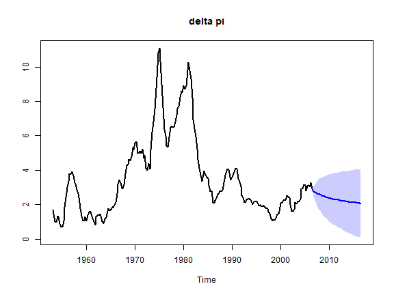
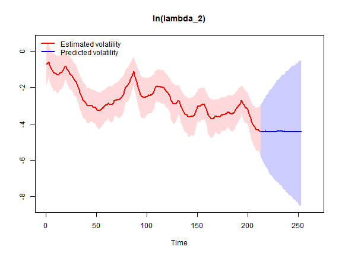
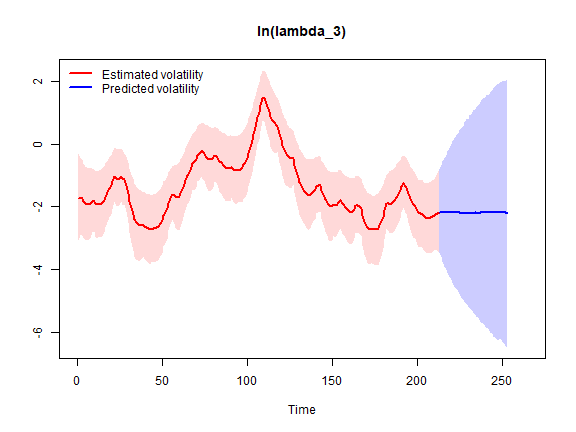
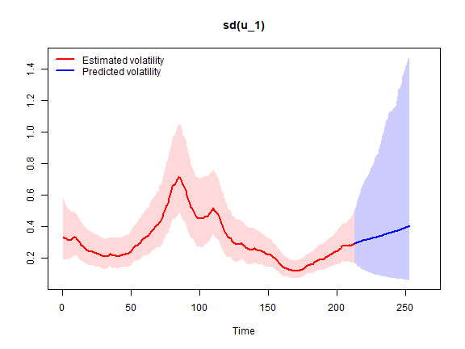
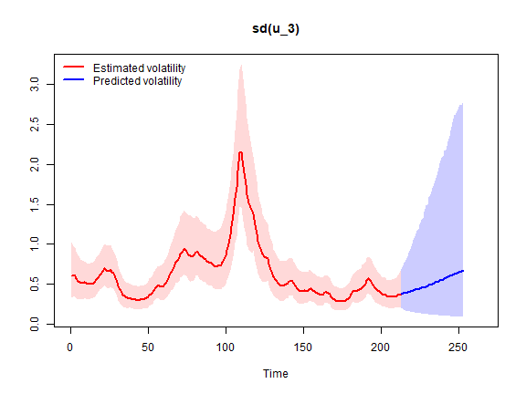

Here we estimate the steady-state BVAR model with Random Walk stochastic volatility from Clark (2011), which is an extension of the original homoscedastic steady-state BVAR model (Villani, 2009). See `?bvar` for details.

We will estimate the model on a quarterly US data set from Koop and Korobilis (2010) on the inflation rate $\Delta \pi_t$ (the annual percentage change in a chain-weighted GDP price index), the unemployment rate $u_t$ (seasonally adjusted civilian unemployment rate, all civilian workers aged 16 years or older) and the interest rate $r_t$ (yield on the three-month Treasury bill rate). The sample is 1953Q1-2006Q3 and we have the data vector

$$
y_t = 
\begin{pmatrix} \Delta \pi_t \\
u_t \\
r_t
\end{pmatrix}
$$

First, let's load the package, then import and plot the data.


``` r
library(SteadyStateBVAR)
data("KoopKorobilis2010")
yt <- KoopKorobilis2010
plot.ts(yt)
```


Let's create the bvar object which we will use throughout here.


``` r
bvar_obj <- bvar(data = yt)
```

We choose 2 lags and only a constant as the deterministic variable.


``` r
bvar_obj <- setup(bvar_obj,
                  p=2,
                  deterministic = "constant")
```

We set the overall tightness to $\lambda_1 = 0.20$, cross-equation tightness to $\lambda_2 = 0.50$ and the lag decay rate to $\lambda_3 = 1.00$. For the prior means on the first own lags, we set them to $0.6$ for $\Delta \pi_t$ and $0.9$ for $u_t$ and $r_t$. Note that the prior mean on the first own lag of inflation is set to $0.6$ instead of $0$ to reflect some degree of persistence in the series (even though it is a growth rate variable).


``` r
lambda_1 <- 0.20
lambda_2 <- 0.50
lambda_3 <- 1.00

fol_pm=c(0.6, # delta pi
         0.9,  #u
         0.9)  #R
```

Now, for the steady-state coefficients we use some toy values (let us pretend that they are expert based).
Remember that we only have a constant now, so $q=1$ and therefore $\Psi$ only has one column $\psi_1=\Psi$. Since $d_t = 1 \ \forall \ t$, we have $\Psi d_t = \mu_t$ which simplifies to $\Psi = \mu$ and as such we can directly interpret $\Psi$ as the unconditional mean, i.e. the steady state.


``` r
theta_Psi <- 
  c(
  ppi(1.90, 2.10, interval=0.95)$mean,   #Psi: delta pi
  ppi(3.80, 4.50, interval=0.95)$mean,   #Psi: u
  ppi(2.60, 3.90, interval=0.95)$mean    #Psi: r
  )

Omega_Psi <- 
  diag(
  c(
  ppi(1.90, 2.10, interval=0.95)$var,    #Psi: delta pi
  ppi(3.80, 4.50, interval=0.95)$var,    #Psi: u
  ppi(2.60, 3.90, interval=0.95)$var     #Psi: r
  )
  )
```

Now we need to specify our stochastic volatility priors. See `?priors` for more information about the prior specification.


``` r
k <- bvar_obj$setup$k
n_free_params_A <- bvar_obj$setup$n_free_params_A

SV_priors_RW <- list(
                     theta_A             =  rep(0, n_free_params_A),
                     Omega_A             =  diag(10, n_free_params_A),
                     mu_log_lambda_0     =  rep(0, k),
                     sigma2_log_lambda_0 =  rep(10, k),
                     alpha_phi           =  rep(5, k),
                     beta_phi            = (rep(5, k) - 1) * rep(0.1, k)
                    )
```

Let's put everything into the `priors()` function.


``` r
bvar_obj <- priors(bvar_obj,
                   lambda_1 = lambda_1,
                   lambda_2 = lambda_2,
                   lambda_3 = lambda_3,
                   first_own_lag_prior_mean =fol_pm,
                   theta_Psi = theta_Psi,
                   Omega_Psi = Omega_Psi,
                   SV = TRUE,
                   SV_type = "RW",
                   SV_priors = SV_priors_RW)
```

Now we can fit the model. Note that we can use arguments from `rstan::sampling()` such as `control` where we can tweak `max_treedepth` and `adapt_delta`.


``` r
bvar_obj <- fit(bvar_obj,
                H = 40,
                d_pred = matrix(rep(1, 40)),
                iter = 4000,
                warmup = 1000,
                chains = 2,
                cores = 2,
                control = list(max_treedepth = 14, adapt_delta = 0.95))
```

Now let's see the posterior means


``` r
summary(bvar_obj, stat="mean", t = 215) #t = 215 for covariance matrix
#> Posterior mean estimates
#> ------------------------
#> 
#> 
#> beta
#> --------------------------------------------------------------------------------             
#>               delta pi     u     r
#>   delta pi.l1     1.26  0.01  0.15
#>   u.l1           -0.09  1.17 -0.16
#>   r.l1            0.00 -0.01  1.04
#>   delta pi.l2    -0.27  0.02 -0.10
#>   u.l2            0.07 -0.23  0.17
#>   r.l2            0.00  0.02 -0.11
#> --------------------------------------------------------------------------------
#> 
#> 
#> Psi
#> --------------------------------------------------------------------------------          
#>            [,1]
#>   delta pi 2.00
#>   u        4.28
#>   r        3.50
#> --------------------------------------------------------------------------------
#> 
#> 
#> Sigma_u,t (t = 215)
#> --------------------------------------------------------------------------------
#>          delta pi     u     r
#> delta pi     0.09 -0.01  0.03
#> u           -0.01  0.02 -0.01
#> r            0.03 -0.01  0.16
#> --------------------------------------------------------------------------------
#> 
#> 
#> A
#> --------------------------------------------------------------------------------          
#>            delta pi   u r
#>   delta pi     1.00 0.0 0
#>   u            0.12 1.0 0
#>   r           -0.22 0.5 1
#> --------------------------------------------------------------------------------
#> 
#> 
#> phi
#> --------------------------------------------------------------------------------
#> delta pi        u        r 
#>     0.06     0.09     0.11 
#> --------------------------------------------------------------------------------
```
You can always look at the `stanfit` object `bvar_obj$fit$stan` directly if you want. Note that
the `z`'s below are not parameters per se, they are simply used in a reparameterization trick to sample
the log volatilities more efficiently.


``` r
print(bvar_obj$fit$stan)
#> Inference for Stan model: steady_state_bvar_RW_stochastic_volatility.
#> 2 chains, each with iter=4000; warmup=1000; thin=1; 
#> post-warmup draws per chain=3000, total post-warmup draws=6000.
#> 
#>                        mean se_mean    sd  2.5%   25%   50%   75%  97.5% n_eff Rhat
#> beta[1,1]              1.26    0.00  0.06  1.15  1.22  1.26  1.30   1.37  8137    1
#> beta[1,2]              0.01    0.00  0.04 -0.06 -0.01  0.01  0.04   0.09  8420    1
#> beta[1,3]              0.15    0.00  0.08 -0.01  0.09  0.15  0.20   0.31  7867    1
#> beta[2,1]             -0.09    0.00  0.03 -0.16 -0.12 -0.09 -0.07  -0.02  8730    1
#> beta[2,2]              1.17    0.00  0.06  1.05  1.13  1.17  1.21   1.28  6795    1
#> beta[2,3]             -0.16    0.00  0.08 -0.31 -0.21 -0.16 -0.11  -0.01  7065    1
#> beta[3,1]              0.00    0.00  0.02 -0.03 -0.01  0.00  0.01   0.04  9138    1
#> beta[3,2]             -0.01    0.00  0.02 -0.04 -0.02 -0.01  0.00   0.02  9293    1
#> beta[3,3]              1.04    0.00  0.06  0.92  1.00  1.04  1.08   1.16  7233    1
#> beta[4,1]             -0.27    0.00  0.06 -0.38 -0.31 -0.27 -0.24  -0.16  8084    1
#> beta[4,2]              0.02    0.00  0.04 -0.06 -0.01  0.02  0.04   0.09  8613    1
#> beta[4,3]             -0.10    0.00  0.08 -0.26 -0.16 -0.10 -0.05   0.05  8264    1
#> beta[5,1]              0.07    0.00  0.03  0.01  0.05  0.07  0.09   0.14  8971    1
#> beta[5,2]             -0.23    0.00  0.05 -0.33 -0.27 -0.23 -0.19  -0.12  6719    1
#> beta[5,3]              0.17    0.00  0.07  0.03  0.12  0.17  0.22   0.31  7705    1
#> beta[6,1]              0.00    0.00  0.02 -0.03 -0.01  0.00  0.01   0.03  9263    1
#> beta[6,2]              0.02    0.00  0.02 -0.01  0.01  0.02  0.03   0.05  9283    1
#> beta[6,3]             -0.11    0.00  0.06 -0.22 -0.15 -0.11 -0.07   0.01  7256    1
#> Psi[1,1]               2.00    0.00  0.05  1.90  1.96  2.00  2.03   2.10 16829    1
#> Psi[2,1]               4.28    0.00  0.18  3.94  4.16  4.28  4.40   4.62 12903    1
#> Psi[3,1]               3.50    0.00  0.33  2.85  3.28  3.50  3.72   4.14 15496    1
#> z[1,1]                -0.72    0.00  0.18 -1.04 -0.84 -0.73 -0.60  -0.34 10271    1
#> z[1,2]                -0.22    0.00  0.19 -0.59 -0.35 -0.23 -0.10   0.17 10004    1
#> z[1,3]                -0.55    0.00  0.23 -0.98 -0.71 -0.56 -0.41  -0.09  9724    1
#> z[2,1]                -0.20    0.01  0.98 -2.06 -0.88 -0.20  0.48   1.72 13045    1
#> z[2,2]                 0.13    0.01  1.03 -1.90 -0.56  0.13  0.82   2.13 13266    1
#> z[2,3]                 0.05    0.01  0.97 -1.82 -0.62  0.05  0.71   1.99 11303    1
#> z[3,1]                -0.07    0.01  0.97 -1.92 -0.75 -0.08  0.61   1.84 14752    1
#> z[3,2]                 0.20    0.01  0.99 -1.71 -0.48  0.20  0.89   2.13 12545    1
#> z[3,3]                -0.02    0.01  0.99 -1.97 -0.67 -0.03  0.65   1.93 13927    1
#> z[4,1]                -0.12    0.01  0.96 -2.05 -0.74 -0.13  0.53   1.77 13718    1
#> z[4,2]                -0.50    0.01  0.94 -2.38 -1.13 -0.49  0.13   1.37 15852    1
#> z[4,3]                -0.26    0.01  0.95 -2.09 -0.92 -0.26  0.38   1.63 16373    1
#> z[5,1]                -0.02    0.01  0.95 -1.87 -0.68 -0.02  0.63   1.83 15787    1
#> z[5,2]                -0.52    0.01  0.93 -2.39 -1.14 -0.51  0.09   1.31 17415    1
#> z[5,3]                -0.19    0.01  0.97 -2.08 -0.85 -0.21  0.48   1.75 15728    1
#> z[6,1]                -0.01    0.01  0.95 -1.88 -0.64  0.00  0.63   1.85 14263    1
#> z[6,2]                -0.37    0.01  0.94 -2.23 -1.02 -0.36  0.27   1.48 16169    1
#> z[6,3]                -0.09    0.01  0.96 -1.95 -0.74 -0.09  0.55   1.78 15052    1
#> z[7,1]                 0.10    0.01  0.99 -1.82 -0.59  0.10  0.77   2.04 15807    1
#> z[7,2]                -0.24    0.01  0.96 -2.13 -0.89 -0.25  0.40   1.63 16609    1
#> z[7,3]                -0.02    0.01  0.95 -1.87 -0.67 -0.02  0.61   1.87 15938    1
#> z[8,1]                 0.24    0.01  0.99 -1.71 -0.44  0.24  0.92   2.16 14935    1
#> z[8,2]                -0.28    0.01  0.97 -2.18 -0.95 -0.28  0.40   1.60 14638    1
#> z[8,3]                 0.08    0.01  0.96 -1.83 -0.54  0.08  0.71   1.96 16937    1
#> z[9,1]                 0.22    0.01  0.97 -1.68 -0.43  0.21  0.87   2.09 15485    1
#> z[9,2]                -0.15    0.01  0.94 -1.96 -0.78 -0.15  0.48   1.70 16942    1
#> z[9,3]                 0.23    0.01  0.95 -1.63 -0.40  0.24  0.87   2.05 11703    1
#> z[10,1]               -0.20    0.01  0.98 -2.06 -0.87 -0.20  0.47   1.70 14469    1
#> z[10,2]               -0.12    0.01  0.95 -1.97 -0.75 -0.12  0.51   1.78 15745    1
#> z[10,3]               -0.05    0.01  0.92 -1.87 -0.67 -0.04  0.56   1.80 14994    1
#> z[11,1]               -0.16    0.01  0.94 -2.03 -0.78 -0.16  0.47   1.66 17350    1
#> z[11,2]               -0.13    0.01  1.00 -2.14 -0.81 -0.14  0.53   1.82 15645    1
#> z[11,3]               -0.17    0.01  0.96 -2.05 -0.81 -0.18  0.45   1.74 12976    1
#> z[12,1]               -0.36    0.01  0.97 -2.31 -1.01 -0.37  0.30   1.54 13927    1
#> z[12,2]               -0.04    0.01  0.95 -1.94 -0.68 -0.04  0.60   1.80 16130    1
#> z[12,3]               -0.11    0.01  0.97 -2.03 -0.77 -0.10  0.55   1.81 15041    1
#> z[13,1]               -0.29    0.01  0.97 -2.16 -0.96 -0.29  0.38   1.62 16032    1
#> z[13,2]                0.12    0.01  0.94 -1.69 -0.54  0.12  0.76   1.92 13035    1
#> z[13,3]                0.05    0.01  0.97 -1.86 -0.61  0.05  0.71   1.94 16884    1
#> z[14,1]               -0.35    0.01  0.96 -2.21 -1.00 -0.36  0.31   1.51 13747    1
#> z[14,2]                0.16    0.01  0.96 -1.73 -0.51  0.17  0.83   2.01 14512    1
#> z[14,3]                0.03    0.01  0.94 -1.83 -0.59  0.02  0.66   1.89 15433    1
#> z[15,1]               -0.26    0.01  0.97 -2.19 -0.90 -0.26  0.39   1.64 15059    1
#> z[15,2]                0.09    0.01  0.94 -1.71 -0.57  0.08  0.74   1.88 13866    1
#> z[15,3]                0.12    0.01  0.95 -1.71 -0.52  0.12  0.76   1.97 15446    1
#> z[16,1]               -0.19    0.01  0.96 -2.08 -0.87 -0.19  0.47   1.67 13616    1
#> z[16,2]                0.16    0.01  0.95 -1.69 -0.48  0.17  0.81   2.05 13567    1
#> z[16,3]                0.25    0.01  0.96 -1.67 -0.39  0.25  0.90   2.14 13790    1
#> z[17,1]               -0.18    0.01  0.97 -2.09 -0.84 -0.19  0.48   1.73 16587    1
#> z[17,2]                0.19    0.01  0.95 -1.67 -0.45  0.20  0.83   2.04 13476    1
#> z[17,3]                0.32    0.01  0.94 -1.50 -0.32  0.32  0.95   2.18 15858    1
#> z[18,1]               -0.29    0.01  0.94 -2.09 -0.92 -0.29  0.35   1.53 14176    1
#> z[18,2]                0.31    0.01  0.96 -1.61 -0.33  0.30  0.95   2.21 14234    1
#> z[18,3]                0.42    0.01  0.94 -1.45 -0.20  0.42  1.03   2.28 15325    1
#> z[19,1]               -0.18    0.01  0.96 -2.04 -0.82 -0.17  0.46   1.68 13581    1
#> z[19,2]                0.43    0.01  0.95 -1.39 -0.22  0.43  1.09   2.31 15041    1
#> z[19,3]                0.37    0.01  0.94 -1.49 -0.27  0.37  1.00   2.21 15017    1
#> z[20,1]               -0.17    0.01  0.95 -2.00 -0.82 -0.17  0.48   1.66 15974    1
#> z[20,2]                0.07    0.01  0.94 -1.74 -0.58  0.06  0.71   1.94 12829    1
#> z[20,3]                0.33    0.01  0.94 -1.51 -0.29  0.33  0.96   2.16 11928    1
#> z[21,1]               -0.06    0.01  0.95 -1.93 -0.70 -0.06  0.58   1.80 16043    1
#> z[21,2]               -0.44    0.01  0.95 -2.32 -1.08 -0.45  0.19   1.40 14191    1
#> z[21,3]                0.38    0.01  0.97 -1.52 -0.26  0.36  1.06   2.25 15391    1
#> z[22,1]               -0.08    0.01  0.95 -1.95 -0.72 -0.08  0.55   1.84 14551    1
#> z[22,2]               -0.31    0.01  0.94 -2.17 -0.93 -0.31  0.34   1.52 14816    1
#> z[22,3]                0.52    0.01  0.95 -1.33 -0.13  0.51  1.19   2.37 14079    1
#> z[23,1]                0.00    0.01  0.98 -1.96 -0.65  0.01  0.64   1.91 16427    1
#> z[23,2]               -0.34    0.01  0.96 -2.20 -0.99 -0.34  0.30   1.54 15860    1
#> z[23,3]               -0.18    0.01  0.97 -2.07 -0.84 -0.17  0.47   1.73 14899    1
#> z[24,1]               -0.19    0.01  0.97 -2.09 -0.84 -0.18  0.47   1.65 14034    1
#> z[24,2]               -0.26    0.01  0.93 -2.10 -0.91 -0.26  0.39   1.56 14689    1
#> z[24,3]               -0.07    0.01  0.95 -1.94 -0.69 -0.06  0.56   1.77 17280    1
#> z[25,1]               -0.17    0.01  0.95 -2.03 -0.81 -0.18  0.47   1.68 13939    1
#> z[25,2]               -0.25    0.01  0.96 -2.13 -0.90 -0.26  0.40   1.62 13383    1
#> z[25,3]                0.08    0.01  0.93 -1.72 -0.53  0.08  0.70   1.92 14491    1
#> z[26,1]               -0.06    0.01  0.98 -1.96 -0.71 -0.07  0.61   1.80 14195    1
#> z[26,2]               -0.14    0.01  0.95 -2.00 -0.79 -0.13  0.50   1.73 14678    1
#> z[26,3]                0.20    0.01  0.94 -1.63 -0.44  0.20  0.83   2.03 16192    1
#> z[27,1]               -0.08    0.01  0.94 -1.95 -0.72 -0.07  0.56   1.76 15294    1
#>  [ reached 'max' / getOption("max.print") -- omitted 3759 rows ]
#> 
#> Samples were drawn using NUTS(diag_e) at Mon Jul 13 16:28:54 2026.
#> For each parameter, n_eff is a crude measure of effective sample size,
#> and Rhat is the potential scale reduction factor on split chains (at 
#> convergence, Rhat=1).
```

We can forecast


``` r
forecast(bvar_obj, pi = 0.68, show_all = TRUE)
```



Let us plot the log volatility estimates and predictions


``` r
stochastic_volatility_plot(bvar_obj, ci = 0.95, vol = "log_lambda")
```



Let us plot the estimates and predictions of the implied innovation standard deviations


``` r
stochastic_volatility_plot(bvar_obj, vol = "sd")
```



We can also produce orthogonalized IRFs


``` r
IRF(bvar_obj, method = "OIRF", t=215, ci=0.68) #latest t
```


## References

Clark, T. E. (2011). Real-time density forecasts from Bayesian vector autoregressions
with stochastic volatility. *Journal of Business \& Economic Statistics*, 29(3), pp. 327-341.

Koop, G. and Korobilis, D. (2010). Bayesian multivariate time series methods for empirical macroeconomics.
*Foundations and Trends in Econometrics*, 3(4), pp. 267-358. 

Villani, M. (2009). Steady-state priors for vector autoregressions. *Journal of Applied Econometrics*, 24(4), pp. 630-650. 
