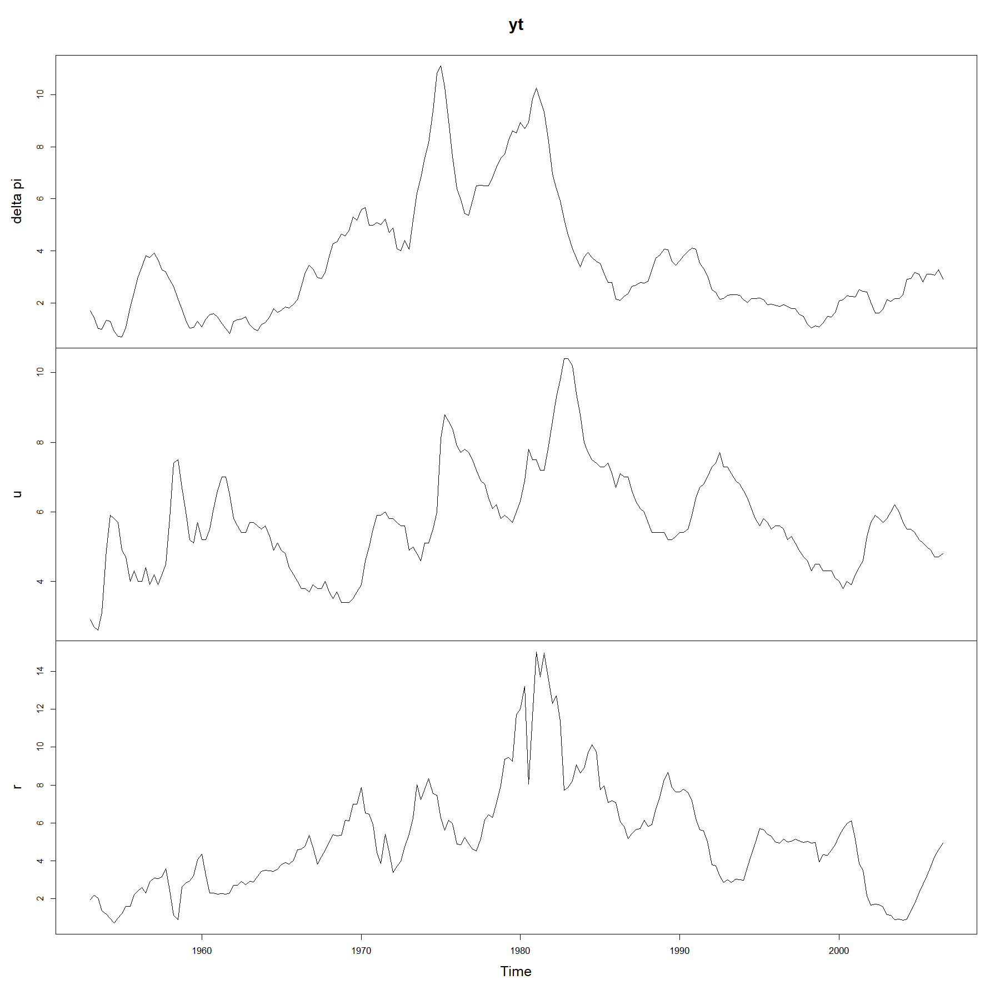
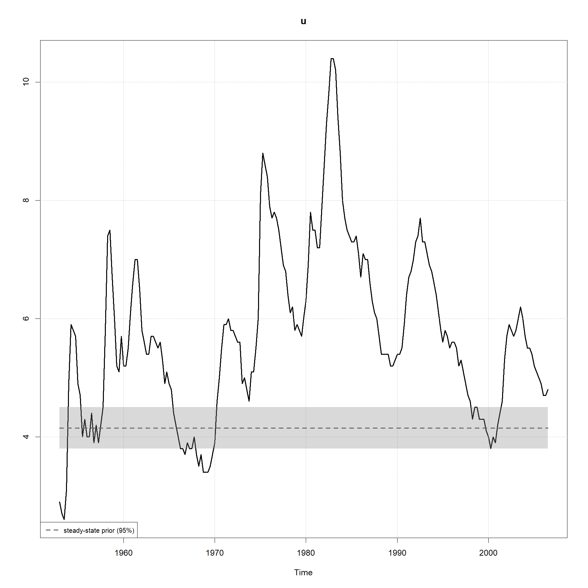
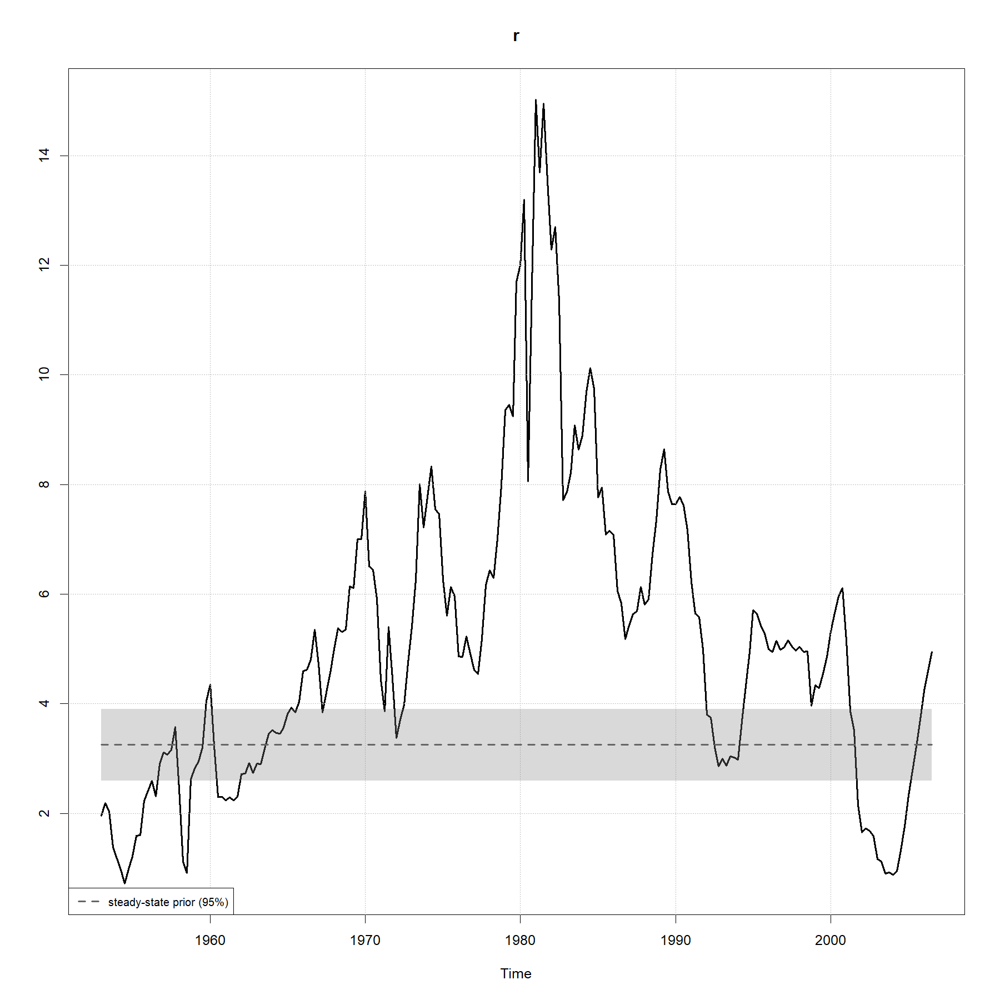
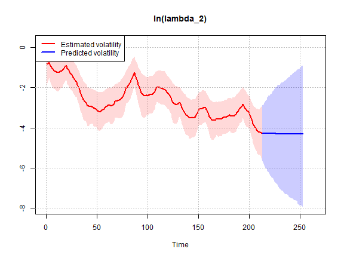
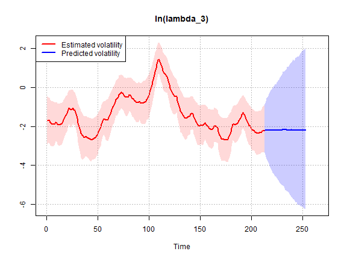
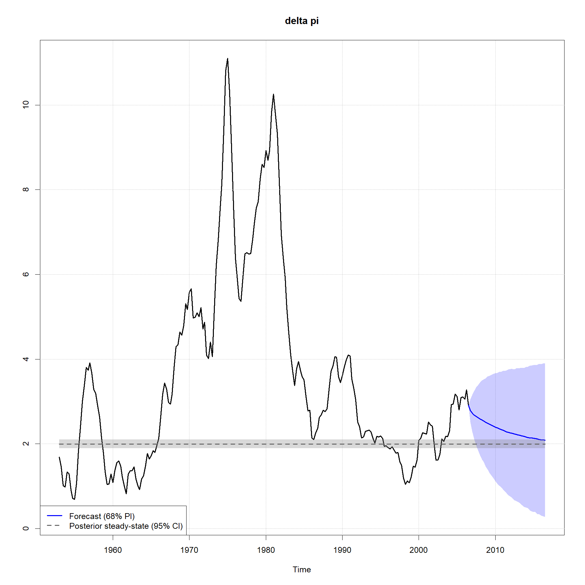
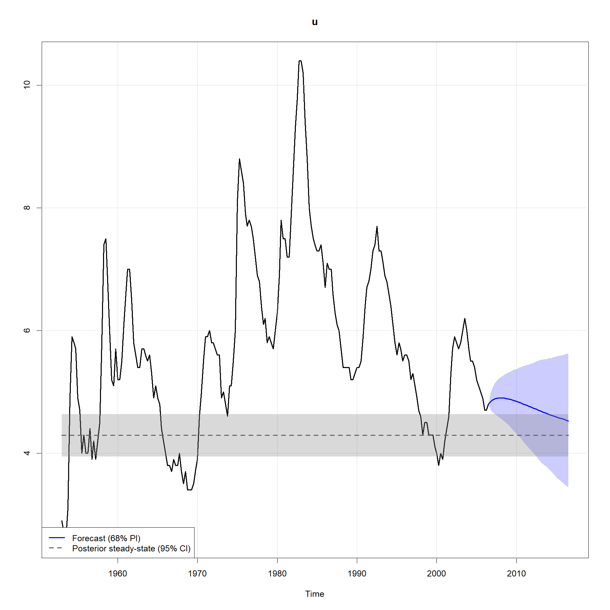
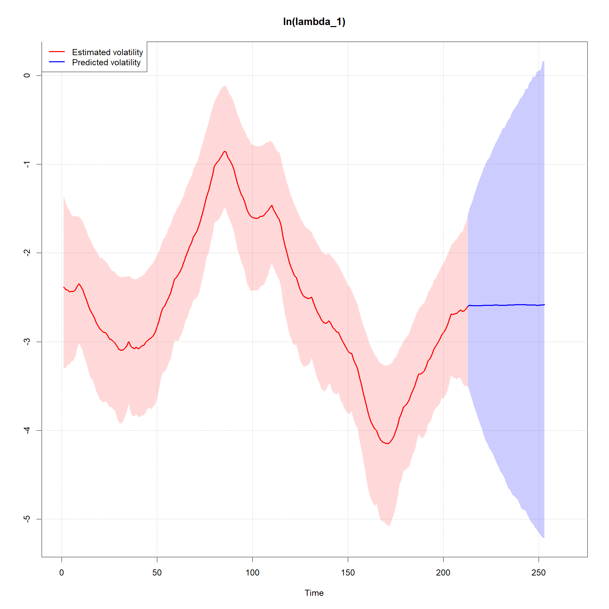

Here we estimate the steady-state BVAR model with Random Walk stochastic volatility from Clark (2011), which is an extension of the original homoscedastic steady-state BVAR model (Villani, 2009). See `?bvar` for details.

We will estimate the model on a quarterly US data set from Koop and Korobilis (2010) on the inflation rate $\Delta \pi_t$ (the annual percentage change in a chain-weighted GDP price index), the unemployment rate $u_t$ (seasonally adjusted civilian unemployment rate, all civilian workers aged 16 years or older) and the interest rate $r_t$ (yield on the three-month Treasury bill rate). The sample is 1953Q1-2006Q3 and we have the data vector

$$
y_t = 
\begin{pmatrix} \Delta \pi_t \\
u_t \\
r_t
\end{pmatrix}
$$

First, let's load the package, then import and plot the data.


``` r
library(SteadyStateBVAR)
data("KoopKorobilis2010")
yt <- KoopKorobilis2010
plot.ts(yt)
```



Let's create the bvar object which we will use throughout here.


``` r
bvar_obj <- bvar(data = yt)
```

We choose 2 lags and only a constant as the deterministic variable.


``` r
bvar_obj <- setup(bvar_obj,
                  p=2,
                  deterministic = "constant")
```

We set the overall tightness to $\lambda_1 = 0.20$, cross-equation tightness to $\lambda_2 = 0.50$ and the lag decay rate to $\lambda_3 = 1.00$. For the prior means on the first own lags, we set them to $0.6$ for $\Delta \pi_t$ and $0.9$ for $u_t$ and $r_t$. Note that the prior mean on the first own lag of inflation is set to $0.6$ instead of $0$ to reflect some degree of persistence in the series (even though it is a growth rate variable).


``` r
lambda_1 <- 0.20
lambda_2 <- 0.50
lambda_3 <- 1.00

fol_pm=c(0.6, # delta pi
         0.9,  #u
         0.9)  #R
```

Now, for the steady-state coefficients we use some toy values (let us pretend that they are expert based).
Remember that we only have a constant now, so $q=1$ and therefore $\Psi$ only has one column $\psi_1=\Psi$. Since $d_t = 1 \ \forall \ t$, we have $\Psi d_t = \mu_t$ which simplifies to $\Psi = \mu$ and as such we can directly interpret $\Psi$ as the unconditional mean, i.e. the steady state.


``` r
theta_Psi <- 
  c(
  ppi(1.90, 2.10, interval=0.95)$mean,   #Psi: delta pi
  ppi(3.80, 4.50, interval=0.95)$mean,   #Psi: u
  ppi(2.60, 3.90, interval=0.95)$mean    #Psi: r
  )

Omega_Psi <- 
  diag(
  c(
  ppi(1.90, 2.10, interval=0.95)$var,    #Psi: delta pi
  ppi(3.80, 4.50, interval=0.95)$var,    #Psi: u
  ppi(2.60, 3.90, interval=0.95)$var     #Psi: r
  )
  )
```

Now we need to specify our stochastic volatility priors. See `?priors` for more information about the prior specification. I take some inspiration from Clark (2011) below.


``` r
k <- bvar_obj$setup$k
n_free_params_A <- bvar_obj$setup$n_free_params_A
sigma2 <- diag(bvar_obj$setup$Sigma_AR)

SV_priors_RW <- list(
                     theta_A             =  rep(0, n_free_params_A),
                     Omega_A             =  diag(10, n_free_params_A),
                     mu_log_lambda_1     =  log(sigma2),
                     sigma2_log_lambda_1 =  rep(4, k),
                     alpha_phi           =  rep(3, k),
                     beta_phi            =  rep(1, k)
                    )
```

Here `sigma2` contains the residual variances from AR($p$) models (the same ones we used in the Minnesota prior).

Let's put everything into the `priors()` function.


``` r
bvar_obj <- priors(bvar_obj,
                   lambda_1 = lambda_1,
                   lambda_2 = lambda_2,
                   lambda_3 = lambda_3,
                   first_own_lag_prior_mean =fol_pm,
                   theta_Psi = theta_Psi,
                   Omega_Psi = Omega_Psi,
                   SV = TRUE,
                   SV_type = "RW",
                   SV_priors = SV_priors_RW)
```

Now we can fit the model. Note that we can use arguments from `rstan::sampling()` such as `control` where we can tweak `max_treedepth` and `adapt_delta`.


``` r
bvar_obj <- fit(bvar_obj,
                H = 40,
                d_pred = matrix(rep(1, 40)),
                iter = 4000,
                warmup = 1000,
                chains = 2,
                cores = 2,
                control = list(max_treedepth = 14, adapt_delta = 0.95))
```

Now let's see the posterior means


``` r
summary(bvar_obj, stat="mean", t = 215) #t = 215 for covariance matrix
#> Posterior mean estimates
#> ------------------------
#> 
#> 
#> beta
#> --------------------------------------------------------------------------------             
#>               delta pi     u     r
#>   delta pi.l1     1.25  0.01  0.15
#>   u.l1           -0.10  1.15 -0.16
#>   r.l1            0.00 -0.01  1.04
#>   delta pi.l2    -0.26  0.02 -0.10
#>   u.l2            0.07 -0.22  0.17
#>   r.l2            0.00  0.02 -0.10
#> --------------------------------------------------------------------------------
#> 
#> 
#> Psi
#> --------------------------------------------------------------------------------          
#>            [,1]
#>   delta pi 2.00
#>   u        4.27
#>   r        3.53
#> --------------------------------------------------------------------------------
#> 
#> 
#> Sigma_u,t (t = 215)
#> --------------------------------------------------------------------------------
#>          delta pi     u     r
#> delta pi     0.11 -0.01  0.03
#> u           -0.01  0.02 -0.01
#> r            0.03 -0.01  0.18
#> --------------------------------------------------------------------------------
#> 
#> 
#> A
#> --------------------------------------------------------------------------------          
#>            delta pi    u r
#>   delta pi     1.00 0.00 0
#>   u            0.11 1.00 0
#>   r           -0.20 0.48 1
#> --------------------------------------------------------------------------------
#> 
#> 
#> phi
#> --------------------------------------------------------------------------------
#> delta pi        u        r 
#>     0.13     0.19     0.20 
#> --------------------------------------------------------------------------------
```
You can always look at the `stanfit` object `bvar_obj$fit$stan` directly if you want. Note that
the `z`'s below are not parameters per se, they are simply used in a reparameterization trick to sample
the log volatilities more efficiently.


``` r
print(bvar_obj$fit$stan)
#> Inference for Stan model: steady_state_bvar_RW_stochastic_volatility.
#> 2 chains, each with iter=4000; warmup=1000; thin=1; 
#> post-warmup draws per chain=3000, total post-warmup draws=6000.
#> 
#>                        mean se_mean     sd   2.5%   25%   50%   75%  97.5% n_eff Rhat
#> beta[1,1]              1.25    0.00   0.06   1.14  1.21  1.25  1.29   1.37  3646    1
#> beta[1,2]              0.01    0.00   0.04  -0.07 -0.02  0.01  0.04   0.08  3634    1
#> beta[1,3]              0.15    0.00   0.08  -0.01  0.09  0.15  0.20   0.31  4144    1
#> beta[2,1]             -0.10    0.00   0.03  -0.16 -0.12 -0.10 -0.07  -0.03  4117    1
#> beta[2,2]              1.15    0.00   0.06   1.04  1.11  1.15  1.19   1.27  3047    1
#> beta[2,3]             -0.16    0.00   0.08  -0.31 -0.21 -0.16 -0.11  -0.01  3959    1
#> beta[3,1]              0.00    0.00   0.02  -0.03 -0.01  0.00  0.01   0.04  5005    1
#> beta[3,2]             -0.01    0.00   0.02  -0.04 -0.02 -0.01  0.00   0.02  4410    1
#> beta[3,3]              1.04    0.00   0.06   0.92  1.00  1.04  1.08   1.16  3941    1
#> beta[4,1]             -0.26    0.00   0.06  -0.38 -0.30 -0.26 -0.22  -0.15  3670    1
#> beta[4,2]              0.02    0.00   0.04  -0.05 -0.01  0.02  0.04   0.10  3645    1
#> beta[4,3]             -0.10    0.00   0.08  -0.26 -0.15 -0.10 -0.05   0.06  4153    1
#> beta[5,1]              0.07    0.00   0.03   0.01  0.05  0.07  0.10   0.14  4046    1
#> beta[5,2]             -0.22    0.00   0.05  -0.33 -0.25 -0.22 -0.18  -0.11  2878    1
#> beta[5,3]              0.17    0.00   0.07   0.02  0.12  0.17  0.22   0.31  4187    1
#> beta[6,1]              0.00    0.00   0.02  -0.03 -0.01  0.00  0.01   0.03  5137    1
#> beta[6,2]              0.02    0.00   0.02  -0.01  0.01  0.02  0.04   0.06  4606    1
#> beta[6,3]             -0.10    0.00   0.06  -0.22 -0.14 -0.10 -0.06   0.01  3943    1
#> Psi[1,1]               2.00    0.00   0.05   1.90  1.96  2.00  2.03   2.10 10380    1
#> Psi[2,1]               4.27    0.00   0.17   3.93  4.15  4.27  4.39   4.61  7971    1
#> Psi[3,1]               3.53    0.00   0.34   2.87  3.31  3.53  3.77   4.18  8227    1
#> z[1,1]                 0.00    0.00   0.31  -0.56 -0.22 -0.02  0.19   0.62  6126    1
#> z[1,2]                 0.63    0.01   0.35  -0.05  0.39  0.62  0.85   1.35  4379    1
#> z[1,3]                -0.65    0.01   0.39  -1.39 -0.91 -0.66 -0.39   0.12  4728    1
#> z[2,1]                -0.21    0.01   0.97  -2.10 -0.88 -0.21  0.45   1.67  9072    1
#> z[2,2]                 0.33    0.01   0.97  -1.57 -0.33  0.34  0.98   2.24  6143    1
#> z[2,3]                 0.05    0.01   0.96  -1.82 -0.59  0.06  0.70   1.92  8000    1
#> z[3,1]                -0.03    0.01   0.97  -1.89 -0.70 -0.02  0.64   1.82  7935    1
#> z[3,2]                 0.44    0.01   0.97  -1.48 -0.20  0.43  1.09   2.36  6823    1
#> z[3,3]                -0.07    0.01   0.97  -1.94 -0.72 -0.08  0.57   1.83  8600    1
#> z[4,1]                -0.14    0.01   0.97  -2.01 -0.80 -0.14  0.52   1.82  8272    1
#> z[4,2]                -0.49    0.01   0.91  -2.25 -1.11 -0.48  0.12   1.32  8702    1
#> z[4,3]                -0.34    0.01   0.93  -2.15 -0.95 -0.34  0.27   1.51  7695    1
#> z[5,1]                 0.02    0.01   0.96  -1.83 -0.62  0.01  0.67   1.92  7190    1
#> z[5,2]                -0.55    0.01   0.94  -2.39 -1.18 -0.54  0.08   1.29  9535    1
#> z[5,3]                -0.26    0.01   0.97  -2.18 -0.93 -0.25  0.42   1.57  7972    1
#> z[6,1]                 0.02    0.01   0.94  -1.81 -0.62  0.02  0.66   1.82  9505    1
#> z[6,2]                -0.38    0.01   0.95  -2.24 -1.02 -0.39  0.25   1.52  8810    1
#> z[6,3]                -0.16    0.01   0.94  -1.99 -0.78 -0.16  0.48   1.73  7718    1
#> z[7,1]                 0.16    0.01   0.97  -1.76 -0.48  0.16  0.82   2.03 10047    1
#> z[7,2]                -0.17    0.01   0.95  -2.03 -0.81 -0.15  0.47   1.70  9254    1
#> z[7,3]                -0.06    0.01   0.93  -1.89 -0.68 -0.05  0.57   1.77  8589    1
#> z[8,1]                 0.34    0.01   0.96  -1.54 -0.30  0.36  0.98   2.19  9085    1
#> z[8,2]                -0.26    0.01   0.94  -2.12 -0.91 -0.26  0.38   1.57  7923    1
#> z[8,3]                 0.10    0.01   0.94  -1.78 -0.54  0.09  0.73   1.96  8817    1
#> z[9,1]                 0.34    0.01   0.95  -1.55 -0.32  0.32  0.98   2.19  8662    1
#> z[9,2]                -0.06    0.01   0.95  -1.93 -0.71 -0.05  0.59   1.79  7298    1
#> z[9,3]                 0.30    0.01   0.96  -1.55 -0.34  0.30  0.93   2.16  8187    1
#> z[10,1]               -0.17    0.01   0.95  -2.05 -0.82 -0.16  0.47   1.70  8928    1
#> z[10,2]               -0.09    0.01   0.94  -1.94 -0.73 -0.09  0.55   1.75  8891    1
#> z[10,3]               -0.04    0.01   0.90  -1.80 -0.65 -0.04  0.55   1.76  8364    1
#> z[11,1]               -0.13    0.01   0.93  -1.96 -0.76 -0.13  0.50   1.70  7800    1
#> z[11,2]               -0.14    0.01   0.92  -1.96 -0.78 -0.14  0.49   1.63  8672    1
#> z[11,3]               -0.25    0.01   0.96  -2.13 -0.88 -0.24  0.40   1.60  8168    1
#> z[12,1]               -0.36    0.01   0.95  -2.27 -1.00 -0.36  0.27   1.51  9827    1
#> z[12,2]               -0.02    0.01   0.94  -1.83 -0.65 -0.02  0.60   1.83  9122    1
#> z[12,3]               -0.16    0.01   0.94  -2.00 -0.78 -0.14  0.47   1.67  9151    1
#> z[13,1]               -0.26    0.01   0.93  -2.08 -0.88 -0.26  0.37   1.60 10365    1
#> z[13,2]                0.19    0.01   0.95  -1.62 -0.46  0.18  0.84   2.09  9054    1
#> z[13,3]                0.05    0.01   0.92  -1.79 -0.55  0.05  0.67   1.85  8448    1
#> z[14,1]               -0.33    0.01   0.93  -2.16 -0.96 -0.34  0.29   1.52  8826    1
#> z[14,2]                0.23    0.01   0.92  -1.54 -0.40  0.22  0.85   2.06  8893    1
#> z[14,3]               -0.01    0.01   0.94  -1.82 -0.64  0.00  0.62   1.82  9084    1
#> z[15,1]               -0.22    0.01   0.96  -2.11 -0.86 -0.23  0.43   1.62  9308    1
#> z[15,2]                0.08    0.01   0.94  -1.74 -0.57  0.07  0.73   1.91  9163    1
#> z[15,3]                0.07    0.01   0.93  -1.69 -0.56  0.07  0.71   1.89 10481    1
#> z[16,1]               -0.13    0.01   0.96  -2.01 -0.78 -0.13  0.52   1.78 11165    1
#> z[16,2]                0.19    0.01   0.91  -1.62 -0.43  0.19  0.81   1.98  8938    1
#> z[16,3]                0.27    0.01   0.96  -1.63 -0.38  0.26  0.93   2.11  9194    1
#> z[17,1]               -0.14    0.01   0.97  -2.05 -0.80 -0.14  0.52   1.76  8768    1
#> z[17,2]                0.24    0.01   0.93  -1.59 -0.39  0.22  0.86   2.07  8955    1
#> z[17,3]                0.32    0.01   0.93  -1.50 -0.31  0.32  0.95   2.12  8950    1
#> z[18,1]               -0.30    0.01   0.93  -2.10 -0.95 -0.29  0.35   1.47  9560    1
#> z[18,2]                0.38    0.01   0.93  -1.45 -0.25  0.37  1.01   2.20  9452    1
#> z[18,3]                0.48    0.01   0.94  -1.33 -0.16  0.47  1.12   2.30  8666    1
#> z[19,1]               -0.13    0.01   0.96  -2.03 -0.76 -0.12  0.52   1.74  8604    1
#> z[19,2]                0.55    0.01   0.93  -1.24 -0.09  0.55  1.18   2.36  8132    1
#> z[19,3]                0.39    0.01   0.94  -1.50 -0.24  0.40  1.02   2.25  7232    1
#> z[20,1]               -0.14    0.01   0.93  -1.96 -0.79 -0.15  0.50   1.70  8592    1
#> z[20,2]                0.12    0.01   0.90  -1.67 -0.49  0.12  0.74   1.88  8093    1
#> z[20,3]                0.30    0.01   0.91  -1.44 -0.32  0.29  0.91   2.07  8190    1
#> z[21,1]                0.03    0.01   0.94  -1.82 -0.61  0.03  0.67   1.83  9314    1
#> z[21,2]               -0.49    0.01   0.92  -2.30 -1.11 -0.48  0.14   1.29  7119    1
#> z[21,3]                0.36    0.01   0.93  -1.48 -0.26  0.35  1.00   2.11  7995    1
#> z[22,1]               -0.02    0.01   0.93  -1.86 -0.64 -0.03  0.60   1.83  8227    1
#> z[22,2]               -0.26    0.01   0.92  -2.08 -0.87 -0.27  0.36   1.57  8349    1
#> z[22,3]                0.53    0.01   0.94  -1.25 -0.12  0.52  1.18   2.36  8029    1
#> z[23,1]                0.06    0.01   0.96  -1.82 -0.61  0.06  0.73   1.89  7506    1
#> z[23,2]               -0.29    0.01   0.92  -2.13 -0.90 -0.29  0.31   1.54  7595    1
#> z[23,3]               -0.26    0.01   0.93  -2.08 -0.88 -0.25  0.36   1.55  7524    1
#> z[24,1]               -0.18    0.01   0.94  -2.04 -0.81 -0.18  0.46   1.66  8178    1
#> z[24,2]               -0.19    0.01   0.92  -1.95 -0.83 -0.20  0.45   1.58  8926    1
#> z[24,3]               -0.10    0.01   0.94  -1.93 -0.73 -0.12  0.53   1.75  7797    1
#> z[25,1]               -0.19    0.01   0.94  -1.99 -0.82 -0.20  0.43   1.61  8421    1
#> z[25,2]               -0.19    0.01   0.94  -2.05 -0.82 -0.18  0.44   1.63  9324    1
#> z[25,3]                0.09    0.01   0.92  -1.71 -0.53  0.10  0.72   1.87  8588    1
#> z[26,1]               -0.03    0.01   0.93  -1.80 -0.67 -0.02  0.58   1.78  9180    1
#> z[26,2]               -0.01    0.01   0.91  -1.78 -0.61 -0.01  0.61   1.79  9716    1
#> z[26,3]                0.28    0.01   0.93  -1.51 -0.34  0.28  0.90   2.12  8007    1
#> z[27,1]               -0.06    0.01   0.97  -1.91 -0.71 -0.05  0.59   1.84  8711    1
#>  [ reached 'max' / getOption("max.print") -- omitted 3759 rows ]
#> 
#> Samples were drawn using NUTS(diag_e) at Mon Jul 27 04:37:24 2026.
#> For each parameter, n_eff is a crude measure of effective sample size,
#> and Rhat is the potential scale reduction factor on split chains (at 
#> convergence, Rhat=1).
```

We can forecast


``` r
forecast(bvar_obj, pi = 0.68, show_all = TRUE)
```



Let us plot the log volatility estimates and predictions


``` r
stochastic_volatility_plot(bvar_obj, ci = 0.95, vol = "log_lambda")
```



Let us plot the estimates and predictions of the implied innovation standard deviations


``` r
stochastic_volatility_plot(bvar_obj, vol = "sd")
```



We can also produce orthogonalized IRFs


``` r
IRF(bvar_obj, method = "OIRF", t=215, ci=0.68) #latest t
```




## References

Clark, T. E. (2011). Real-time density forecasts from Bayesian vector autoregressions
with stochastic volatility. *Journal of Business \& Economic Statistics*, 29(3), pp. 327–341.

Koop, G. and Korobilis, D. (2010). Bayesian multivariate time series methods for empirical macroeconomics.
*Foundations and Trends in Econometrics*, 3(4), pp. 267–358. 

Villani, M. (2009). Steady-state priors for vector autoregressions. *Journal of Applied Econometrics*, 24(4), pp. 630–650.
